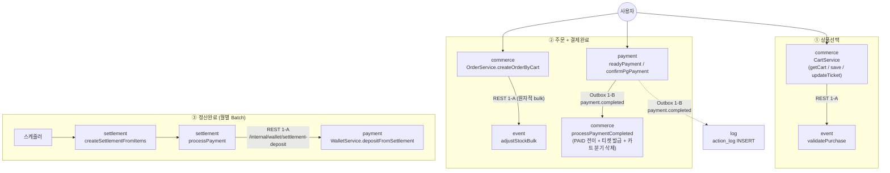

# DevTicket Service Overview

> 발표 Q&A 안전망. 멘토용 1차 진입점.
> 데이터 소스: `service-status.md` (구현 현황), `kafka-design.md §3` (이벤트 정식 표기), `api-overview.md` (API 표).

---

## 1. 프로젝트 개요

DevTicket은 **이커머스 티켓팅 MSA**다. 세미 프로젝트의 모놀리식 결제를 9개 모듈(`apigateway`, `member`, `event`, `commerce`, `payment`, `settlement`, `ai`, `log`, `admin`)로 분리하고, **AI 추천**(벡터 기반)과 **안정성 보장**(Outbox + Kafka 보상 흐름)을 추가한 것이 최종 확장점이다.

핵심 사용자 플로우는 ★ **상품선택 → 결제완료 → 정산완료**. 결제 이벤트 `payment.completed`는 Outbox 패턴(1-B)으로 Commerce / Log 모듈에 전달되며, 보상 흐름(환불 / 강제취소 / 재고복구)은 Kafka 단일 경로로 통합 진행 중이다 (§4 미결 사항 참조).

⚠ 확인 필요: PO 가이드(기획 중심 발표) 기준 "왜 만들었나 / 차별성"은 발표 자료 본체에서 별도 정의 예정.
이 문서는 "어떻게 만들었나"의 사실 정확성 보장에 집중.

---

## 2. 핵심 플로우 (★ 상품선택 → 결제완료 → 정산완료)

> 본 문서에서 ★는 "핵심 사용자 플로우(상품선택→결제완료→정산완료) 직접 항목 + 그 보상/실패 짝(`payment.failed`, `event.force-cancelled`, `refund.*` 등)"을 포함합니다. CLAUDE.md §4 표기 컨벤션을 ServiceOverview 한정으로 광의 해석.

### 단계별 전송 방식 요약

| 단계 | 호출 / 발행 | 수신 | Transport | 핵심 메서드 |
|---|---|---|---|---|
| ① 장바구니 담기 / 검증 | commerce → event | — | **REST 1-A** | event 측 `validatePurchase` |
| ② 주문 생성 / 재고 차감 | commerce → event | — | **REST 1-A** (원자적 bulk) | event 측 `adjustStockBulk` |
| ② 결제 준비 / PG 승인 | payment | — | **REST 1-A** (PG 외부 포함) | `readyPayment`, `confirmPgPayment` |
| ② 결제완료 후속 | payment | commerce, log | **Kafka 1-B (Outbox)** `payment.completed` | commerce 측 `processPaymentCompleted` |
| ③ 월별 정산서 생성 | 스케줄러 | settlement | (in-process) | `createSettlementFromItems` |
| ③ 정산금 → 판매자 예치금 | settlement → payment | — | **REST 1-A** | settlement 측 `processPayment`, payment 측 `depositFromSettlement` |

### ★ 핵심 플로우 외 — 보상 흐름 (Kafka 1-B)

| 트리거 | 토픽 (kafka-design §3 정식) | 수신 메서드 |
|---|---|---|
| 결제 실패 → 재고 복구 | `payment.failed` | event 측 `restoreStockForPaymentFailed` |
| 주문 취소 → 재고 복구 | `order.cancelled` | event 측 `restoreStockForOrderCancelled` |
| 이벤트 강제취소 → 환불 fanout | `event.force-cancelled` | commerce 측 `RefundFanoutService.processEventForceCancelled` |
| 환불 후 재고 복구 | `refund.stock.restore` | event 측 `handleRefundStockRestore` |

> **부수 흐름 — `action.log` (1-C Kafka fire-and-forget)**
> 모든 모듈에서 사용자 행동/시스템 이벤트를 log 모듈로 비동기 전송.
> 핵심 플로우와 분리되어 있으며 손실 허용. 자세한 설계는 `docs/kafka/actionLog.md` 참조.

---

## 3. 모듈별 구현 현황

### commerce (★ 상품선택 / 결제완료 후속 / 환불 saga 시작)

- **상태**: 🟡 (HIGH 16건 1줄 요약 완료. 마커 1건 잔존 — stub 1; dead REST 2건은 b9be8434로 정리 완료)
- **책임**: 장바구니 / 주문 / 티켓 도메인. 결제완료 후속 처리(PAID 전이 + 티켓 발급 + 카트 분기 삭제). 환불 saga 시작점(RefundFanoutService).
- **★ 핵심 메서드** (service-status.md HIGH 16건 인용):
  - 장바구니 — CartService: `getCart`, `clearCart`, `updateTicket`, `deleteTicket`
  - 주문 — OrderService: `createOrderByCart`, `getOrderStatus`, `getOrderDetail`, `cancelOrder`
  - 결제완료 consumer — OrderService: `processPaymentCompleted`, `processPaymentFailed`
  - Stub ⚠ — OrderService: `processStockDeducted` (kafka-design §3 line 83 비활성)
  - 티켓 — TicketService: `getTicketList`, `getTicketDetail`, `createTicket`
- **발행 이벤트** (kafka-design §3 line 70):
  - 1-B: `ticket.issue-failed`, `refund.requested`(fanout, payload에 `totalOrderTickets` 추가 — e3d316ac), `refund.order.done`/`failed`, `refund.ticket.done`/`failed`
  - ⚠ 1-B: `order.cancelled` (코드 활성 — `OrderExpirationCancelService.java:53`. kafka-design §3 line 70 미등재 — 드리프트, 패턴 C)
  - 1-B 비활성: `order.created` (kafka-design §3 line 82 — REST 전환됨)
  - 1-C: `action.log` (CART_ADD / CART_REMOVE)
- **수신 이벤트** (kafka-design §3 line 70, 처리 내용 요약):
  - 1-B `payment.completed` ★ → `processPaymentCompleted`: PAID 전이 + 티켓 발급 + 카트 분기 삭제
  - 1-B `payment.failed` ★ → `processPaymentFailed`: FAILED 전이
  - 1-B `event.force-cancelled` → `RefundFanoutService.processEventForceCancelled`: 대상 PAID 주문에 `refund.requested` fanout
  - 1-B `refund.completed` → `RefundOrderService.processRefundCompleted`
  - 1-B `refund.order.cancel` / `refund.ticket.cancel` / `refund.order.compensate` / `refund.ticket.compensate` → 환불 saga 보상 처리
  - 1-B `ticket.issue-failed` → 티켓 발급 실패 처리
  - 1-B 비활성: `stock.deducted`, `stock.failed` (kafka-design §3 line 83-84)
- **의존 모듈**:
  - 호출(REST): event(`validatePurchase`, `adjustStockBulk`, `getBulkEventInfo`, `getSingleEventInfo`, `getEventsBySellerForSettlement`), member(`getMemberInfo` — TicketService.getParticipantList)
  - 피호출(REST): payment(`getOrderInfo` 정상 + 환불 saga 폴백 안전망 431b9fe9, `getOrderItemByTicketId`, `getOrderTickets`), settlement(commerce가 `getSettlementData` 응답 제공 — TicketService.getSettlementData)
- **⚠ 미결 (모듈 누적 1건)**:
  - `OrderService.processStockDeducted`: stock.deducted 비활성 stub
- **✅ 정리 완료**:
  - dead REST 2건 — `completeOrder` (`/internal/orders/{orderId}/payment-completed`) + `failOrder` (`/internal/orders/{orderId}/payment-failed`) endpoint 및 동기 처리 메서드 제거(b9be8434). 결제 완료/실패는 Kafka(`payment.completed`/`payment.failed`) 일원화.

---

### payment (★ 결제완료)

- **상태**: 🟡 (HIGH 5건 1줄 요약 완료. Impl 전용 3건만 잔존 — dead client는 ea44e72, processBatchRefund stub은 22762f2로 정리 완료)
- **책임**: 결제 처리(PG / WALLET / WALLET_PG 복합 분기) + 환불 처리 + 지갑(예치금) 관리(충전·출금·정산금 입금·환불 복구)
- **★ 핵심 메서드** (service-status.md HIGH 5건):
  - 결제 — PaymentService: `readyPayment`, `confirmPgPayment`, `failPgPayment`
  - 지갑 — WalletService: `processWalletPayment`, `depositFromSettlement`
- **발행 이벤트** (kafka-design §3 line 72, line 85-86 / 88 / 92-94):
  - 1-B Outbox: `payment.completed` ★, `payment.failed` ★, `refund.completed`, `refund.order.cancel`, `refund.ticket.cancel`, `refund.stock.restore`, `refund.order.compensate`, `refund.ticket.compensate`
- **수신 이벤트** (kafka-design §3 line 72 + 코드 변경 반영):
  - 1-B `refund.completed` → `WalletService.restoreBalance`: 예치금 복구
  - 1-B `event.sale-stopped`, `ticket.issue-failed`, `refund.requested`, `refund.order.done`/`failed`, `refund.ticket.done`/`failed`, `refund.stock.done`/`failed`: Refund Saga Orchestrator 보상 흐름
  - ⚠ `event.force-cancelled` 직접 수신 제거 (22762f2). 강제취소 fan-out은 commerce `RefundFanoutService` → `refund.requested` → payment Refund Saga 경로로 일원화. kafka-design §3 line 72 갱신 필요 (드리프트, 패턴 C)
- **의존 모듈 (호출)**:
  - commerce: `getOrderInfo` (RefundSagaOrchestrator 폴백 안전망 — 정상 트래픽에선 호출 안 됨, 431b9fe9), `getOrdersByEvent` (active)
  - 외부: PG (Toss `pgPaymentClient`)
  - ✅ 정리됨 (ea44e72): `completePayment`, `failOrder` dead client 제거. WalletServiceImpl의 CommerceInternalClient 의존성도 동반 제거
  - ✅ 단순화 (ea7f7cc9): RefundSagaOrchestrator의 `getOrderInfo` 동기 호출 제거 — `RefundRequestedEvent.totalOrderTickets` 자체완결로 대체
- **의존 모듈 (피호출)**:
  - settlement: `POST /internal/wallet/settlement-deposit` → `depositFromSettlement`
- **⚠ 미결**:
  - `WalletServiceImpl` 전용 메서드 3건 (`claimChargeForRecovery`, `revertTopending`, `applyRecoveryResult`): 인터페이스 외 노출 — dto-doc-standard.md "Impl 전용" 분류 적용 필요.
  - ✅ 정리됨: dead client 2건(ea44e72), processBatchRefund TODO(22762f2), RefundSagaOrchestrator commerce 동기 호출 정상 경로 제거(ea7f7cc9 + 431b9fe9 폴백 안전망 잔존).

---

### settlement (★ 정산완료)

- **상태**: 🟡 (Spring Batch 전환 완료 — 마커 1건; 컨트롤러명 `SettlementAdminController` 변경, 신규 API 3건)
- **책임**: 정산서 생성 (Spring Batch — `DailySettlementJob` 일별 정산대상 수집 + `MonthlySettlementJob` 월별 정산서 생성, e521f682) + 정산 지급 트리거(판매자 예치금 입금 REST 호출).
- **★ 핵심 메서드**:
  - SettlementAdminService: `createSettlementFromItems` (월별 Batch — 신규), `processPayment`, `getMonthlyRevenue` (36b33e9b 신규)
  - SettlementInternalService: `runSettlement` ⚠ Legacy (직접 호출 경로는 주석 처리, `runSettlement` 컨트롤러는 신규 경로 위임)
  - SettlementService: `fetchSettlementData`
  - BatchController (b368f4af): `launchDailyJob`, `launchMonthlyJob` — `JobOperator` 기반 수동 실행
- **신규 API** (모두 `/api/admin/settlements/**`):
  - `GET /revenues/{yearMonth}` — 관리자 월별 수익 조회 (36b33e9b)
  - `POST /batch/daily` — 일별 정산대상 수집 배치 수동 실행 (b368f4af)
  - `POST /batch/monthly` — 월별 정산서 생성 배치 수동 실행 (b368f4af)
- **발행 이벤트**: 없음 (kafka-design §3 표 line 70-73에 settlement 행 없음 — Kafka producer 0건).
- **수신 이벤트**: 없음 (Kafka consumer 0건).
- **의존 모듈** (전부 REST):
  - 호출(REST): commerce(`getSettlementData`, `getTicketSettlementData`), event(`getEndedEventsByDate`, `getEventsBySellerForSettlement`), member(`getSellerIds` — Legacy `runSettlement` 경로에서), payment(`POST /internal/wallet/settlement-deposit` → payment 측 `depositFromSettlement`)
  - 피호출(REST): admin(`SettlementInternalClient` → `/internal/settlements`, `/internal/settlements/run` — settlement 측 path는 `/api/admin/settlements/**`이라 운영 라우팅 정합성 별도 확인 필요)
- **⚠ 미결 (모듈 누적 1건, 패턴 A)**:
  - `SettlementInternalService.runSettlement`: Legacy 경로 — 컨트롤러는 신규 경로(`createSettlementFromItems`)로 위임 전환됨(36b33e9b)이나 Legacy 서비스 코드 자체는 잔존. admin `AdminSettlementService.runSettlement`이 동일 Legacy 호출.

---

### event (★ 상품선택 / 재고 관리 / 강제취소 발행자)

- **상태**: 🟡 (HIGH 10건 1줄 초안 작성됨. service-status.md에는 미등재 — 도구 issue, `docs/standards/docs-parser-standard.md` 참조. 마커 2건)
- **책임**: 이벤트(상품) 도메인 관리(등록·조회·수정·강제취소) + 재고(단건/일괄 차감/복구) + 이벤트 상태 자동 전환 스케줄러(DRAFT→ON_SALE→SALE_ENDED→ENDED, acb0d0f6) + ES 검색 인덱싱(ES 장애 시 DB 폴백, b15482d3) + Kafka 발행(강제취소 / 판매중지 / 보상 saga 일부) + Kafka 소비(결제 실패 / 주문 취소 / 환불 → 재고 복구).
- **EventStatus enum**: DRAFT, ON_SALE, SOLD_OUT, SALE_ENDED, **ENDED**(신규, 행사 종료), CANCELLED, FORCE_CANCELLED. ENDED는 추천 제외(914f87ac) + 환불 보상 재고 복구 시 정책적 스킵(0f441eb5).
- **★ 핵심 메서드** (어제 1줄 초안 10건 인용 — service-status.md 미등재):
  - 외부 API — EventService: `getEvent`, `getEventList`, `forceCancel` ★ (`event.force-cancelled` 발행자)
  - 내부 API — EventInternalService: `validatePurchase`, `deductStock` ⚠, `restoreStock` ⚠, `adjustStockBulk`
  - Kafka consumer:
    - StockRestoreService: `restoreStockForPaymentFailed`
    - OrderCancelledService: `restoreStockForOrderCancelled`
    - RefundStockRestoreService: `handleRefundStockRestore`
- **발행 이벤트** (kafka-design §3 line 71):
  - 1-B: `event.force-cancelled` ★, `event.sale-stopped`, `refund.stock.done`, `refund.stock.failed`
  - 1-C: `action.log` (VIEW / DETAIL_VIEW / DWELL_TIME)
  - 1-B 비활성: `stock.deducted`, `stock.failed` (kafka-design §3 line 83-84 — REST 전환됨)
- **수신 이벤트** (코드 기준 — kafka-design §3 line 71과 일부 차이):
  - 1-B `payment.failed` ★ → `restoreStockForPaymentFailed`: 정렬-비관락 후 재고 일괄 복구
  - 1-B `order.cancelled` → `restoreStockForOrderCancelled`: 동일 ⚠ kafka-design §3 line 71에 미등재 (코드 활성, 발표 후 회고 트랙)
  - 1-B `refund.completed` → `recordRefundCompleted`: 통계 기록
  - 1-B `refund.stock.restore` → `handleRefundStockRestore`: 환불 보상 재고 복구
- **의존 모듈 (호출)**:
  - member: `getNickname` (EventService.getEvent — 판매자 닉네임 조회)
  - 외부: OpenAI (embedding), Elasticsearch (이벤트 검색 인덱싱)
- **의존 모듈 (피호출)**:
  - commerce: `validatePurchase`, `adjustStockBulk`, `getBulkEventInfo`, `getSingleEventInfo`, `getEventsBySellerForSettlement`
  - admin: `forceCancel` (`POST /internal/events/{eventId}/force-cancel`)
  - settlement: `getEndedEventsByDate`, `getEventsBySellerForSettlement`
  - ⚠ 호출자 0건: `deductStock`, `restoreStock` 단건 REST (commerce는 `adjustStockBulk`만 사용)
- **⚠ 미결 (모듈 누적 2건, 둘 다 패턴 A)**:
  - `EventInternalService.deductStock`: 단건 REST 엔드포인트 활성, 현재 호출자 0건 (active path는 `adjustStockBulk`)
  - `EventInternalService.restoreStock`: 동일
  - **추가 발견 (이번 라운드)**: kafka-design §3 표 line 71에 `order.cancelled` 컨슈머 누락 (코드는 활성). commerce 측 line 70 producer 누락도 동일. 발표 후 회고 트랙으로 이관.

---

### member (인증 / 회원 / 판매자 신청)

- **상태**: 🟢 (HIGH 1건 1줄 초안 작성됨. service-status.md 미등재. 마커 0건)
- **책임**: 회원·인증·판매자 신청 도메인. 외부 인증(JWT 발급 / OAuth) + 내부 모듈에 멤버 정보 제공(REST). Kafka 미발행/미수신.
- **★ 핵심 메서드** (어제 1줄 초안 1건 인용):
  - InternalMemberService: `getSellerIds` ★ (settlement.runSettlement Legacy 경로 진입점)
- **발행 이벤트**: 없음 (kafka-design §3 표 line 70-73에 member 행 없음).
- **수신 이벤트**: 없음.
- **의존 모듈 (호출)**:
  - 외부: OAuth providers (Google, Kakao 등 — apigateway가 위임 후 member에서 토큰 검증 / 가입)
- **의존 모듈 (피호출)**:
  - apigateway: `internalOAuthSignUpOrLogin` (OAuth flow 콜백)
  - commerce: `getMemberInfo` (TicketService.getParticipantList — 참가자 닉네임/이메일)
  - event: `getNickname` (EventService.getEvent — 판매자 닉네임)
  - admin: `searchMembers`, `updateMemberStatus`, `updateMemberRole`, `getSellerApplications`, `decideSellerApplication`
  - settlement: `getSellerIds` (Legacy `runSettlement` 경로)
  - ai: `getUserTechStacks` (추천 보조)
- **⚠ 미결**: 없음 (member 자체 메서드에 마커 없음. settlement.runSettlement Legacy 마커는 settlement / admin 측에 박혀 있음).

---

### admin (관리자 대시보드)

- **상태**: 🟡 (HIGH 2건 1줄 요약 완료. 마커 1건 — settlement Legacy 동반 패턴 A)
- **책임**: 관리자 대시보드 — 이벤트 / 판매자 신청 / 정산 / 사용자 / 기술스택 관리. **공통 패턴: "다른 모듈 REST 호출 + AdminActionHistory(audit log) 저장"** — 모든 변경 액션이 동일 구조 (코드: `AdminEventServiceImpl.forceCancel`, `AdminSettlementServiceImpl.runSettlement` 등).
- **★ 핵심 메서드** (service-status.md HIGH 2건):
  - AdminEventService: `forceCancel` ★ (event 측 `forceCancel` 호출 → `event.force-cancelled` 간접 트리거). PATCH 호출 시 `X-User-Id`(2642e7fe) + `X-User-Role`(af824777) 헤더 전달, 호출 method/body 정정 완료(3b940227, 검증 테스트 9fb62971).
  - AdminSettlementService: `runSettlement` ⚠ Legacy (settlement 측 Legacy 경로 동반)
- **발행 이벤트**: 없음 (kafka-design §3 표에 admin 행 없음. admin은 Kafka 비참여, REST 트리거만).
- **수신 이벤트**: 없음.
- **의존 모듈 (호출)**:
  - event: `forceCancel` (`PATCH /internal/events/{eventId}/force-cancel`, `RestClientEventInternalClientImpl`)
  - settlement: `runSettlement` (`POST /internal/settlements/run` ⚠ Legacy), `getSettlements` (`GET /internal/settlements`)
  - member: `searchMembers`, `updateMemberStatus`, `updateMemberRole`, `getSellerApplications`, `decideSellerApplication`
- **의존 모듈 (피호출)**: 없음 (admin은 외부 진입점, 내부 모듈은 admin을 호출하지 않음).
- **⚠ 미결 (모듈 누적 1건, 패턴 A)**:
  - `AdminSettlementService.runSettlement`: settlement 측 Legacy 경로 동반 호출. settlement 컨트롤러는 신규 경로(`createSettlementFromItems`)로 위임 전환됨(36b33e9b)이나 admin 호출 endpoint는 그대로라 정리 후 admin client 갱신 필요.

---

### ai (★ 외 — 추천 트랙)

- **상태**: 🟡 (HIGH 0건 — ★ 핵심 플로우 외. MEDIUM 3건 미처리 — `recommendByUserVector`, `recommendByColdStart`, `searchKnn`)

> 🟡 사유: MEDIUM 3건(`recommendByUserVector` / `recommendByColdStart` / `searchKnn`) 1줄 요약 미처리. ★ 외 트랙이라 우선순위 낮음.
- **책임**: 벡터 기반 추천 (사용자 선호 벡터 / 콜드스타트 / KNN). 발표 자료 차별점 항목 중 하나.
- **발행/수신 이벤트**: 없음 (kafka-design §3 표에 ai 행 없음).
- **의존 모듈 (호출)**: member(`getUserTechStacks`), 외부(벡터 DB, OpenAI embedding).
- **⚠ 미결**: 없음.

---

### log (별도 스택)

- **상태**: 🟢 (Fastify/TypeScript 별도 스택. `fastify-log/` 디렉토리. service-status.md 정당 누락 — Java 자동 생성기 범위 외)
- **책임**: `action.log` 수신·저장·조회 + `payment.completed` 수신 → PURCHASE 직접 INSERT.
- **수신 이벤트** (kafka-design §3 line 73):
  - 1-C `action.log`: 전 모듈에서 발행 (CART_ADD/REMOVE/VIEW/DETAIL_VIEW/DWELL_TIME 등)
  - 1-B `payment.completed`: 결제 완료 PURCHASE 액션 직접 INSERT
- **참조**: `docs/kafka/actionLog.md`
- **⚠ 미결**: 없음.

---

### apigateway

- **상태**: 🟢 (Service 클래스 부재, filter chain 전용. service-status.md 정당 누락)
- **책임**: JWT 검증 + 라우팅 + Rate Limit + OAuth 진입점. 비즈니스 로직 없음.
- **주요 컴포넌트**: `JwtAuthenticationFilter`, `RateLimitFilter`, `RoleAuthorizationFilter`, `InternalApiBlockFilter`, `OAuthSuccessHandler/FailureHandler` (모두 `infrastructure/security` / `infrastructure/oauth`).
- **발행/수신 이벤트**: 없음.
- **의존 모듈 (호출)**: member(`internalOAuthSignUpOrLogin` — OAuth 콜백 위임). 그 외는 라우팅 대상 모듈로 단순 전달.
- **⚠ 미결**: 없음.

---

### §3 모듈 9개 상태 요약 (한눈)

| 모듈 | 상태 | ★ 플로우 위치 | HIGH 처리 | 마커 |
|---|---|---|---|---|
| commerce | 🟡 | 상품선택 + 결제완료 후속 + 환불 saga 시작 | 16/16 (service-status.md) | B 3 |
| event | 🟡 | 상품 / 재고 / 강제취소 발행 | 10/10 (1줄 초안만, service-status.md 미등재) | A 2 + C 1 (드리프트 인라인) |
| payment | 🟡 | 결제완료 | 5/5 (service-status.md) | (commerce 측 dead client 짝) |
| settlement | 🟡 | 정산완료 | 4/4 (service-status.md) | A 1 |
| admin | 🟡 | 트리거 진입점 | 2/2 (service-status.md) | A 1 |
| member | 🟢 | 인증 (전 모듈 의존) | 1/1 (1줄 초안만) | 0 |
| ai | 🟡 | ★ 외 (추천 트랙) | 0 (HIGH 없음, MEDIUM 미처리) | 0 |
| log | 🟢 | 별도 스택 | 정당 누락 | 0 |
| apigateway | 🟢 | 진입 게이트 | 정당 누락 (Service 부재) | 0 |

**총 HIGH 처리**: 38/38 (1줄 요약 또는 초안). **마커 누적**: 8건 (A 4 + B 3 + C 1).

---

## 4. ⚠ 미결 사항 / 시스템 한계

### 4-0. 개요

P5 문서화 작업(2026-04-27 ~ 04-28) 중 `service-status.md` 1줄 요약 큐레이션 + 호출 체인 grep 분석을 통해 **⚠ 마커 8건** 발견. `event-schema-standard.md §⚠ 마커 사용 구분` 기준으로 3개 패턴 분류 후 처리 방향 정리.

| 패턴 | 정의 | 건수 | 다루는 위치 |
|---|---|---|---|
| **A** | 정상 동작하나 추가 컨텍스트 필요 (후행 ⚠) | 4 | §4-1, §4-3 |
| **B** | stub / deprecated / 비활성 (`⚠ 확인 필요:`) | 3 | §4-1, §4-2 |
| **C** | 문서-코드 드리프트 (신규 카테고리) | 1 | §4-4 |

8건 모두 발표 후 회고 트랙으로 처리 예정. 발표 시에는 "분석 후 정리 진행 중"으로 솔직히 인정하되 사실 정확성 보장.

---

### 4-1. dead REST path (4건 — B 2 + A 2)

> *count 정정: 검토 단계에서 "B 3 + A 2 = 5"로 분류됐으나 그중 1건(`processStockDeducted`)은 Kafka handler stub이라 §4-2로 분리. 실제 dead REST는 4건.*

**메서드**:
- commerce: `OrderService.failOrder`, `OrderService.completeOrder` — Payment 측에서 호출 0건 (실제 통지는 Outbox/Kafka)
- event: `EventInternalService.deductStock`, `EventInternalService.restoreStock` — commerce 측에서 호출 0건 (`adjustStockBulk`로 일원화)
- (짝, ✅ 정리 완료): payment 측 `CommerceInternalClient.completePayment`, `failOrder` — **ea44e72로 제거**. 추가 발견(commit msg): `failOrder`는 client `POST` vs controller `@PatchMapping`으로 빌드 시점부터 깨진 상태였음 (드리프트 패턴 C 사례)

**근거**: `kafka-impl-plan.md §678`, 호출처 grep 0건 (commerce·event 양측 모두 검증).

**해결 계획 (진행 상황)**: 6개 dead 코드 중 **payment 측 2건은 ea44e72로 정리 완료**. 남은 4건(commerce REST 2 + event REST 2) 한 PR로 정리 예정. 호출자 0건이므로 영향 범위 없음 — deprecation 단계 생략 가능.

**발표 시 설명**: "이중 경로로 보였으나 분석 결과 dead code였습니다. payment 측 client 2건은 정리 완료(ea44e72), commerce/event 측 4건은 정리 예정. 결제 통지는 Outbox/Kafka로, 재고는 일괄 REST로 일원화되어 있습니다."

---

### 4-2. Stub — Kafka 비활성 토픽 잔존 핸들러 (1건 — B 1)

**메서드**: `commerce / OrderService.processStockDeducted`

**현황**: 메서드 본체가 `isDuplicate` 체크만 수행 후 종료. `kafka-design.md §3 line 83-84`에 `stock.deducted` / `stock.failed` 토픽 비활성 명시 (REST 전환됨).

**배경**: 초기 Kafka choreography 설계 → 동시성 및 부분 실패 처리 단순화를 위해 동기 REST(`adjustStockBulk`)로 전환. Consumer handler 메서드만 잔존.

**해결 계획**: 메서드 제거 또는 `@Deprecated` + 비활성 주석 명시. KafkaTopics 상수도 함께 정리 검토.

**발표 시 설명**: "재고 차감을 Kafka 비동기에서 REST 동기로 전환하면서 남은 stub입니다. Saga 단순화 트레이드오프의 결과로, 정리 예정입니다."

---

### 4-3. Legacy 정산 경로 (2건 — A 2)

**메서드**:
- `settlement / SettlementInternalService.runSettlement` (Commerce 직접 호출 방식)
- `admin / AdminSettlementService.runSettlement` (위 메서드 위임 호출)

**현황**: 코드 주석(`SettlementInternalServiceImpl.java:96`)에 "정산서 생성 (Commerce 직접 호출 방식 - Legacy)" 명시. 신규 경로 `createSettlementFromItems`(SettlementItem 기반 월별 Batch)와 동시 활성.

**해결 계획**: Legacy 경로 deprecation 후 제거. admin 진입점도 신규 경로로 라우팅 변경.

**발표 시 설명**: "정산 로직을 더 가볍게 리팩토링 중입니다. SettlementItem 기반 월별 Batch로 대체 진행 중이며, 발표 후 Legacy 제거 예정입니다."

---

### 4-4. 문서-코드 드리프트 (1건 — C 1, 신규 카테고리)

**대상**: `order.cancelled` 토픽

**현황**:
- 코드 활성: `commerce / OrderExpirationCancelService.java:53` 발행 → `event / OrderCancelledConsumer` 수신 → `OrderCancelledService.restoreStockForOrderCancelled` 처리. 통합 테스트(`OrderCancelledKafkaIntegrationTest`) 활성.
- 문서 미등재: `kafka-design.md §3 line 70`(commerce producer) / line 71(event consumer) 양쪽 표 모두에서 누락.

**발견 경위**: §3 event 모듈 작성 중 event 수신 이벤트를 kafka-design §3 line 71과 대조하다 누락 확인.

**해결 계획**: `kafka-design.md §3` 표 line 70-71에 `order.cancelled` 추가. `event-schema-standard.md`에 패턴 C 정식 등록(현재 비공식 카테고리). 발표 후 회고 트랙.

**발표 시 설명**: "문서 정리 중 코드와 횡단 설계 문서 간 드리프트를 발견했습니다. 코드는 정상 동작하며, 문서 갱신만 필요합니다."

---

### 4-5. 시스템 한계 (마커 8건 외)

> **출처**: `requirements-check.md §4 ⚠1~⚠4` (검증일 2026-04-27, 모듈별 controller / service / repository / 매니페스트 직접 확인 결과). 이 4건은 ServiceOverview 마커 8건과 별개의 시스템 한계로, 인벤토리·api-overview에서 직접 확인됨.

| ID | 항목 | 현황 | 후속 액션 |
|---|---|---|---|
| ⚠1 | 기술스택 K8s HPA | HPA 매니페스트 부재. `kubectl scale --replicas=1` manual 운영 | ai 모듈용 HPA yaml 1개 추가 |
| ⚠2 | 외부 API 호환성 | apigateway path는 그대로 유지(`/api/payments/**` 등). 응답 DTO 형식 직접 diff 미수행 | 세미 코드와 응답 스키마 비교 1회 |
| ⚠3 | #11 동시성 보장 | 비관적/낙관적 락 + Kafka 보상 트랜잭션 다층 방어로 **코드 구조는 보장**. payment 모듈은 동시성 테스트 활성(`WalletChargeConcurrencyIntegrationTest`, `RefundPgTicketConcurrencyIntegrationTest`). **event 모듈 재고 차감 동시성 테스트만 0건** | event 모듈 재고 차감 동시성 테스트 추가 |
| ⚠4 | settlement Legacy | `SettlementItemProcessor.java:19` 하드코드 `FEE_RATE = 0.05` 잔존 (현재 비활성) | §4-3 Legacy 경로 제거 시 함께 정리 |

**발표 시 설명** (4건 묶음):
- ⚠1: "AI 모듈은 manual scale로 운영 중. HPA yaml 추가 예정입니다."
- ⚠2: "외부 path는 그대로 유지하되 응답 DTO 직접 비교는 발표 시연으로 대체합니다."
- ⚠3: "재고 초과 방지는 비관적/낙관적 락 + Kafka 보상으로 다층 방어. payment 모듈은 동시성 테스트 활성, event 모듈 재고 차감 동시성 테스트는 발표 후 추가."
- ⚠4: "정산 Legacy 코드(FEE_RATE 하드코드)는 §4-3 Legacy 경로 정리 시 함께 제거 예정."

> **사용자 검토 메모** ⚠: 검토 단계에서 원래 4개 후보 항목(`review-service` / `AutoConfirmScheduler ShedLock` / `결제 시 회원 활성 검증` / `gateway settlement 라우트`)이 제시되었으나, P5 데이터 소스 및 전체 repo grep 결과 **0 hit**. "직접 확인된 것만" 원칙에 따라 `requirements-check.md §4`의 검증된 4건으로 대체 적용. 원래 4개의 출처(다른 planning doc 등)를 알고 계시면 알려주시면 즉시 override 합니다.

---

## 5. 발표 Q&A 대비

> 본 §5는 P5 책임의 **사실 정확성 안전망**이다. 발표 자료 본체의 "왜 / 차별성" 영역(PO 가이드 차별점·고민 흐름 등)과 **분리**되며, 멘토 Q&A 시 사실 답변 대조용으로 사용한다.
> 답변은 §3 모듈별 구현 현황 + §4 미결 사항을 인용하며, **새 정보 생성 금지**. 멘토가 발표 자료 본체에서 다룬 PO 영역을 깊이 파고들 경우, 본 §5에는 답변이 없을 수 있음 — 그 경우 PO/발표자에게 위임.

| # | 예상 질문 | 답변 (§3 / §4 인용) | 가능성 |
|---|---|---|---|
| Q1 | "결제 통지에 'dead REST path'라는 표현이 있는데, 무엇이 dead인가요?" | §4-1 — commerce 측 `OrderService.failOrder` / `completeOrder` REST + payment 측 `CommerceInternalClient.completePayment` / `failOrder` 4건. 호출자 0건 (kafka-impl-plan §678 + grep). **payment 측 2건은 ea44e72로 정리 완료**, commerce 측 2건은 정리 예정. 실제 통지는 Outbox/Kafka `payment.completed` / `payment.failed` 단일 경로로 일원화. | 높음 |
| Q2 | "재고 차감을 동기 REST로 전환한 이유는?" | §4-2 — 초기 Kafka choreography(`stock.deducted` / `stock.failed`)는 동시성 + 부분 실패 처리가 복잡. `adjustStockBulk` REST 단일 호출로 원자성 보장(kafka-design §3 line 83-84). `processStockDeducted` Kafka handler는 stub로 잔존, 발표 후 정리. | 높음 |
| Q3 | "정산 경로가 두 개로 보이는데 어떻게 다른가요?" | §4-3 — Legacy(`runSettlement`): Commerce 직접 호출 방식. 신규(`createSettlementFromItems`): SettlementItem 기반 월별 Batch. admin 진입점도 Legacy 호출 중. 발표 후 Legacy 제거 + admin 라우팅 신규 경로로 변경 예정. | 높음 |
| Q4 | "결제완료 후 PAID 전이 + 티켓 발급은 어떤 트랜잭션 경계에 있나요?" | §3 commerce — `OrderService.processPaymentCompleted`(`payment.completed` 수신): PAID 전이 + 티켓 발급 + 카트 분기 삭제를 **단일 `@Transactional`** 안에서 처리. 티켓 발급 실패 시 Order CANCELLED + `ticket.issue-failed` Outbox 발행. | 높음 |
| Q5 | "PG 외부 호출 실패는 어떻게 보상하나요?" | §3 payment — `confirmPgPayment` 실패 → `failPgPayment` 호출 → `payment.failed` Outbox 발행. WALLET_PG 복합 결제는 예치금 복구(`restoreForWalletPgFail`). 재고는 event.`restoreStockForPaymentFailed`가 `payment.failed` 수신 후 정렬-비관락 일괄 복구. | 중간 |
| Q6 | "AI 모듈이 다운되면 결제 흐름은 영향을 받나요?" | §3 ai 섹션 + `requirements-check.md §1 #10` — commerce / payment 모듈에서 ai 의존성 grep 0건. AI 호출 단일 지점 `EventRecommendationService.getRecommendations` → `AiClient` try-catch로 빈 List 폴백. 추천 UI만 비고 구매 흐름 무영향. | 중간 |
| Q7 | "동시 구매 시 재고 초과는 어떻게 막나요?" | §3 event + §4-5 ⚠3 — 비관적 락(`@Lock(PESSIMISTIC_WRITE)` on `findByEventIdWithLock`) + 낙관적 락(`@Version`) + Kafka 보상(`payment.failed` → `restoreStockForPaymentFailed`). payment 모듈 동시성 테스트 활성(`WalletChargeConcurrencyIntegrationTest` 등), event 모듈 재고 차감 동시성 테스트는 추가 예정. | 낮음 |
| Q8 | "이 시스템의 기술적 차별성을 한 줄로 요약하면?" | **(i)** Outbox 패턴 + Saga 보상 흐름으로 결제·환불 비즈니스 트랜잭션의 원자성 보장 (§3 commerce / payment 1-B 발행 — `payment.completed`, `payment.failed`, `refund.*` 시리즈). **(ii)** Kafka 1-B 분류 + 멱등성 3중 방어선(`MessageDeduplicationService.isDuplicate` + `processed_message` 테이블 + 도메인 `canTransitionTo` 상태 검증)으로 동시 결제 정합성 처리 (§3 commerce.processPaymentCompleted Step1-4). **(iii)** ⚠ 마커 시스템(§4-0 패턴 A/B/C)으로 코드와 문서의 사실 정확성까지 추적 (마커 8건 발견 + §4-1~4-4 정리 계획). | — |

**Q8 발표자 가이드 ⚠ (inline)**:
- 본 답변은 PO 가이드 "기술 스택 나열 ❌" 함정에 해당하지 않음 ("왜 이 기술인가" 맥락이라 정당)
- 단, 발표자는 위 답변 (i)(ii)(iii)을 **그대로 인용하지 말고 자기 언어로 변형 권장** — 멘토가 "왜 그렇게 만들었나" 후속 질문 시 자연스러운 흐름 유지를 위해
- 차별성 답변 자체는 발표 자료 본체 PO 영역. 본 §5 Q8은 "사실 인용 가능 베이스라인"이지 "발표 대본"이 아님

**Q&A 운영 메모**:
- §5 답변은 모두 §3/§4에서 직접 인용 — 새 사실 만들지 않음
- 멘토가 본 §5 범위를 넘어선 PO/기획 질문(왜 만들었나 / 시장 차별성 등)을 할 경우, 발표 자료 본체에서 정의된 답변을 발표자가 책임
- 본 §5 외 추가 Q&A 후보가 있으면 §3/§4 인용 가능 여부 확인 후 추가 (추측 금지)
