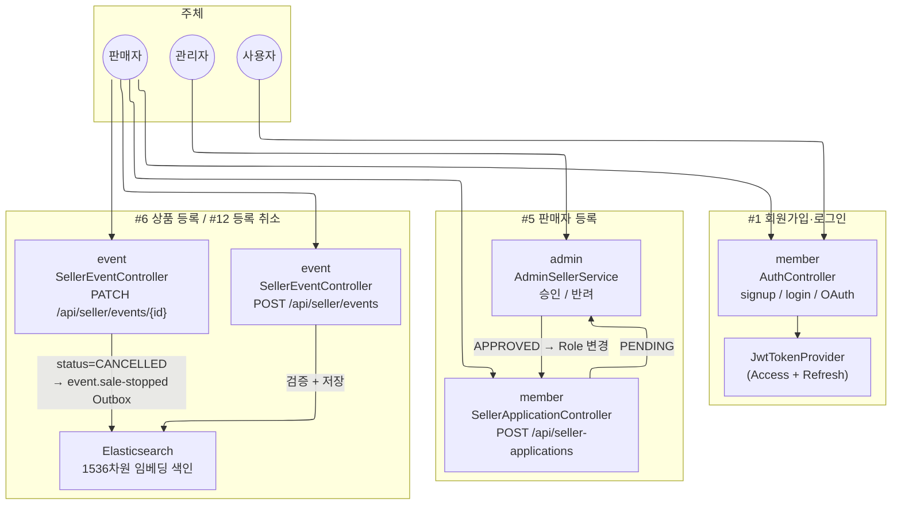
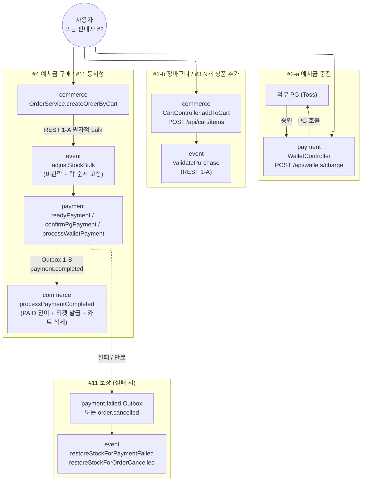
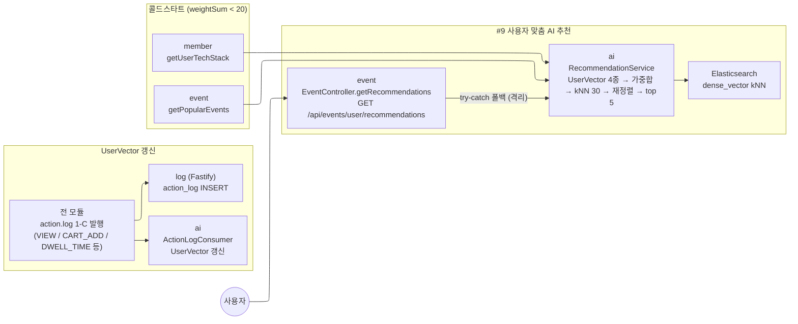
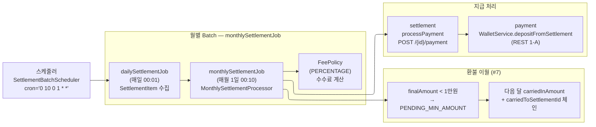

# DevTicket Service Overview

> **시스템 전체 설계를 한눈에 볼 수 있도록 정리한 통합 문서.**
>
> 깊이 추적 시: [`requirements-check.md`](skills/requirements-check.md) · [`api/api-overview.md`](api/api-overview.md) · [`dto/dto-overview.md`](dto/dto-overview.md) · [`skills/kafka-design.md`](skills/kafka-design.md) · `modules/{module}.md`

---

## 1. 프로젝트 개요

**DevTicket** — IT 컨퍼런스/세미나 티켓팅 이커머스 MSA.

### 1-1. 한 줄 정의

판매자가 IT 행사 티켓을 등록·판매하고, 사용자가 예치금/PG 결제로 구매하며, AI가 사용자별 맞춤 이벤트를 추천하는 시스템.

### 1-2. 세미 → 최종 확장점

세미와 최종 모두 **MSA 구조**. 차이는 모듈 간 통신 방식과 부가 기능.

| 영역 | 세미 (MSA, REST 동기) | 최종 (MSA, Kafka 비동기 추가) |
|---|---|---|
| 모듈 간 통신 | REST 동기 호출만 | REST 1-A + Kafka Outbox 1-B + 1-C fire-and-forget 분류 |
| 결제 통지 | 동기 REST | `payment.completed` Outbox 패턴 (afterCommit + 스케줄러 fallback) |
| 추천 모듈 | 없음 | `ai` 독립 모듈 (벡터 기반 kNN) 신설 |
| 환불 처리 | 없음 / 동기 처리 | Refund Saga Orchestrator + Kafka 보상 흐름 |
| 안정성 | TX 단일 실패 시 정합성 깨짐 | Outbox + 멱등성 3중 방어선 + Saga 보상 |
| 정산 | 즉시 처리 | Spring Batch 월별 + 환불 이월 체인 (`PENDING_MIN_AMOUNT`) |

### 1-3. 9 모듈 구성

```
사용자 ──▶ apigateway ──▶ 8 백엔드 모듈
                          │
                          ├── member       (인증 / 회원 / 판매자 신청)
                          ├── event        (상품 / 재고 / ES 검색)
                          ├── commerce     (장바구니 / 주문 / 티켓)
                          ├── payment      (결제 / 환불 / 예치금)
                          ├── settlement   (정산서 Batch / 지급)
                          ├── admin        (관리자 진입점)
                          ├── ai           (추천 — internal 전용, 외부 미노출)
                          └── log          (Fastify/TS, 행동 로그 — 모든 모듈에서 비동기 전송)
```

### 1-4. 포트 매핑

| 포트 | 모듈 | 포트 | 모듈 |
|---|---|---|---|
| 8080 | apigateway (외부 진입) | 8085 | settlement |
| 8081 | member | 8086 | log (Fastify) |
| 8082 | event | 8087 | admin |
| 8083 | commerce | 8088 | ai |
| 8084 | payment | | |

---

## 2. 요구사항 + 기술 요구사항

### 2-1. 기능 요구사항 (세미 11개) — 전부 🟢

| # | 요구사항 | 핵심 모듈 | 핵심 진입점 |
|---|---|---|---|
| 1 | 회원가입 / 로그인 | member | `POST /api/auth/signup`, `POST /api/auth/login` |
| 2-a | 예치금 서버 저장 | payment | `Wallet` Entity + `chargeBalanceAtomic` / `useBalanceAtomic` |
| 2-b | 장바구니 서버 저장 | commerce | `Cart` Entity (user_id 1:1) |
| 3 | 장바구니 N개 추가 | commerce | `POST /api/cart/items` |
| 4 | 장바구니 → 예치금 구매 | commerce + payment | `POST /api/orders` → `payment.completed` Outbox |
| 5 | 판매자 등록 (신청·승인) | member + admin | `POST /api/seller-applications` |
| 6 | 판매자 상품 등록 | event | `POST /api/seller/events` (검증 + ES 색인) |
| 7 | 매월 정산 (수수료·이월) | settlement | `monthlySettlementJob` Batch (`@Scheduled cron="0 10 0 1 * *"`) |
| 8 | 판매자도 구매 가능 | commerce | UserRole 분기 없음 (의도적) |
| 9 | 사용자 맞춤 AI 추천 | ai | `POST /internal/ai/recommendation` |
| 11 | 동시 구매 시 재고 초과 방지 | event | 비관적 락 + 낙관적 락 + Kafka 보상 |
| 12 | 판매자 상품 등록 취소 | event | `PATCH /api/seller/events/{id}` (status=CANCELLED) |

### 2-2. 기술 요구사항 (필수 6개)

| 항목 | 상태 | 핵심 구현 |
|---|---|---|
| ElasticSearch 상품 검색 | 🟢 | event `EventService.getEventList` ES 우선 + JPA 재조회 + dense_vector kNN |
| Kubernetes AI 자동 배포·스케일링 | 🟡 | k3s on AWS (`cd-*-aws.yml`) + Actuator/Prometheus. **HPA 도입 보류** |
| MSA + API Gateway | 🟢 | apigateway (Spring Cloud Gateway) — 8 백엔드 라우트 |
| 트래픽 분산 + 보안 (JWT, OAuth) | 🟢 | apigateway `JwtAuthenticationFilter` + Spring Security OAuth2 (Google) |
| 벡터DB 문서 검색 | 🟢 | ES `dense_vector` dims=1536 cosine + OpenAI 임베딩 |
| 사용자 맞춤형 AI 추천 | 🟢 | UserVector 4종 가중합 → kNN 30 → cosine 재정렬 → top 5 |

### 2-3. 기능 요구사항 흐름 다이어그램

11개 기능 요구사항을 4개 흐름으로 분리.

#### A. 회원·판매자·상품 (#1 / #5 / #6 / #12)



#### B. 예치금·장바구니·구매·동시성 (#2-a / #2-b / #3 / #4 / #8 / #11)



#### C. AI 맞춤 추천 (#9)



#### D. 매월 정산 (#7)



### 2-4. 보상 흐름

§4 Kafka 토픽 카탈로그의 §4-5 (보상 시나리오 — 실패 → 복구 매핑) · §4-6 (동일 트랜잭션 내 보상) 참조.

---

## 3. 모듈별 기능

### 3-1. member (인증·회원·판매자)

- **책임**: 회원가입/로그인 + JWT 발급 + OAuth(Google) + 판매자 신청 + 회원/판매자 정보 조회
- **외부 API**: `/api/auth/{signup,login,reissue,social,google-signup}`, `/api/members/me`, `/api/seller-applications`, `/api/users/{userId}/tech-stacks`
- **내부 API**: `/internal/members/{userId}/tech-stacks` (ai 호출), `/internal/members/{userId}/info` (event 등 호출)
- **Kafka**: 미참여
- **의존**: 외부 — Google OAuth · 내부 — admin이 호출 (회원/판매자 관리)
- **요구사항 매핑**: #1 회원가입/로그인 · #5 판매자 등록

### 3-2. event (상품·재고·검색)

- **책임**: 이벤트(상품) 등록/조회/수정/강제취소 + 재고 차감/복구 + 상태 자동 전환 스케줄러 + ES 검색·임베딩
- **EventStatus**: `DRAFT` → `ON_SALE` → `SOLD_OUT`/`SALE_ENDED` → `ENDED`, 추가로 `CANCELLED` (Action B 판매중지) / `FORCE_CANCELLED` (Action A 강제취소+환불)
- **외부 API**: `/api/events`, `/api/events/{id}`, `/api/events/user/recommendations`, `/api/seller/events/**`, `/api/seller/images/upload`
- **내부 API**: `/internal/events/{id}` (단건), `/bulk` (일괄), `/validate-purchase`, `/stock-adjustments` ★ (락 순서 고정), `/{id}/force-cancel` (admin/payment 호출), `/popular` (ai 호출)
- **Kafka 발행**: `event.force-cancelled` (Action A) · `event.sale-stopped` (Action B, 컨슈머 0건) · `refund.stock.done/failed` · `action.log` (VIEW/DETAIL_VIEW/DWELL_TIME)
- **Kafka 수신**: `payment.failed` (재고 복구) · `order.cancelled` (재고 복구) · `refund.completed` (`RefundCompletedService.recordRefundCompleted` — dedup 마킹·모니터링 로깅. `cancelledQuantity` 누적은 payment `OrderRefund.applyRefund`에서 처리) · `refund.stock.restore` (환불 보상 재고 복구)
- **동시성 방어**: 비관적 락 (`@Lock(PESSIMISTIC_WRITE)`) + 낙관적 락 (`@Version`) + bulk 호출 시 락 순서 고정
- **의존**: REST 호출 — member, ai, OpenAI, Elasticsearch, S3 / REST 피호출 — commerce, admin, payment, settlement, ai
- **요구사항 매핑**: #6 상품 등록 · #11 동시성 방지 · #12 등록 취소 · ElasticSearch · 벡터DB

### 3-3. commerce (장바구니·주문·티켓)

- **책임**: 장바구니 N건 + 주문 생성/재고 차감 + 결제완료 후속(PAID 전이+티켓 발급) + 환불 saga 시작점
- **외부 API**: `/api/cart/**`, `/api/orders`, `/api/orders/{id}/{status,cancel}`, `/api/tickets/**`, `/api/seller/events/{id}/participants`
- **내부 API**: `/internal/orders/{id}` · `/orders/settlement-data` · `/order-items/by-ticket/{ticketId}` · `/orders/{id}/tickets` (환불 산정용) · `/tickets/{id}/refund-completed`
- **Kafka 발행**: `ticket.issue-failed` · `refund.requested` (fanout, 13 필드 포함 `totalOrderTickets`) · `refund.order.done/failed` · `refund.ticket.done/failed` · `order.cancelled` · `action.log` (CART_ADD/REMOVE)
- **Kafka 수신**: `payment.completed` ★ (PAID 전이 + 티켓 발급 + 카트 분기 삭제) · `payment.failed` ★ (FAILED 전이) · `event.force-cancelled` (PAID 주문 fanout) · `refund.completed` · Refund Saga 시리즈
- **주요 패턴**: Outbox afterCommit 직접 발행 + 스케줄러 fallback · `cart_hash` 멱등성 (eventId+quantity, unitPrice 미포함)
- **요구사항 매핑**: #3 장바구니 · #4 구매 · #8 판매자 구매 · #11 보상 consumer

### 3-4. payment (결제·환불·예치금)

- **책임**: PG/WALLET/WALLET_PG 복합 결제 + Refund Saga Orchestrator + 지갑(예치금) 관리
- **외부 API**: `/api/payments/**` · `/api/wallets/**` (충전/잔액/거래내역) · `/api/seller/events/{id}/cancel` (cancelSellerEvent) · `/api/admin/events/{id}/cancel` (cancelAdminEvent)
- **내부 API**: `/internal/wallet/settlement-deposit` (settlement 호출 — 정산금 입금)
- **Kafka 발행**: `payment.completed` ★ · `payment.failed` ★ · `refund.completed` · `refund.order.cancel` · `refund.ticket.cancel` · `refund.stock.restore` · `refund.order.compensate` · `refund.ticket.compensate`
- **Kafka 수신**: `refund.completed` (`WalletEventConsumer` dedup 마킹 전용 — 잔액 복구는 Orchestrator가 `refund.stock.done` 수신 후 `WalletService.restoreBalance` 직접 호출) · `ticket.issue-failed` · `refund.requested` · Saga done/failed 시리즈. (`event.force-cancelled` / `event.sale-stopped`는 직접 구독 안 함 — fan-out 책임은 commerce `RefundFanoutService`)
- **결제 수단 분기**: WALLET (예치금만), PG (Toss), WALLET_PG (예치금 차감 + PG 보충 — `walletAmount + pgAmount = amount`)
- **Refund Saga**: `RefundSagaOrchestrator` — refund.requested 수신 → SagaState ORDER_CANCELLING → TICKET_CANCELLING → STOCK_RESTORING → COMPLETED
- **요구사항 매핑**: #4 결제 · #2-a 예치금 · #7 정산 지급

### 3-5. settlement (정산서·지급)

- **책임**: 일별 정산대상 수집 + 월별 정산서 생성 + 지급 트리거 (예치금 입금)
- **외부 API**: `/api/admin/settlements` (관리자 조회/실행/세부/취소/지급/월별수익) · `/api/seller/settlements` (판매자 조회)
- **내부 API**: `/internal/settlements/**` · `/internal/batch/{daily,monthly}` (수동 실행)
- **Kafka**: 미참여
- **Spring Batch**: `SettlementBatchScheduler` — `dailySettlementJob` (매일 00:01) + `monthlySettlementJob` (매월 1일 00:10, `@Scheduled cron="0 10 0 1 * *"`)
- **수수료**: `FeePolicy` 엔티티 (`fee_policy` 테이블, FeeType.PERCENTAGE, BigDecimal feeValue)
- **이월 처리**: `finalAmount < 10,000` → `PENDING_MIN_AMOUNT` 상태 + 다음 달 `carriedInAmount` 합산 + `carriedToSettlementId` 체인
- **의존**: REST 호출 — commerce(getSettlementData), event(getEndedEventsByDate, getBulkEventInfo — 정산 응답 `eventTitle` 보강용), member, payment(depositFromSettlement)
- **요구사항 매핑**: #7 매월 정산 (수수료·환불 이월)

### 3-6. ai (추천 시스템)

- **책임**: 사용자 맞춤 이벤트 추천 (벡터 기반 kNN)
- **외부 API**: 없음 (`@RequestMapping("internal/ai")`로 internal만 노출)
- **내부 API**: `POST /internal/ai/recommendation` ★ (event 호출)
- **Kafka 수신**: `action.log` (UserVector 갱신 — `ActionLogConsumer`)
- **알고리즘 (정상 흐름)**: UserVector 4종(`preference`/`cart`/`recent`/`negative`) → 가중합 (0.5/0.3/0.2) → 정규화 → kNN 30개 → cosine 재정렬 (0.45/0.25/0.25/-0.15) → top 5
- **알고리즘 (콜드스타트)**: `weightSum < 20` 임계 → 회원 테크스택 평균 임베딩 → kNN 5개 → 부족 시 인기 이벤트(`/internal/events/popular`) 보충
- **의존**: REST 호출 — member(테크스택), event(인기 이벤트), log(recentVector 조회), OpenAI(임베딩), Elasticsearch(kNN)
- **격리 (설계원칙)**: commerce/payment에 ai 의존성 0건. 호출 단일 지점 `EventRecommendationService.aiClient` try-catch 폴백 → 빈 List 반환
- **요구사항 매핑**: #9 AI 추천 · 사용자 맞춤형 AI 추천 시스템 · 벡터DB

### 3-7. log (별도 스택)

⚠ **Fastify/TypeScript 별도 스택** (`fastify-log/` 디렉토리). 나머지 8개는 Java/Spring Boot.

- **책임**: 사용자 행동 로그 수집 + recentVector 조회 응답
- **외부 API**: 없음
- **내부 API (Fastify routes)**: `GET /health`, `GET /internal/logs/actions` ★ (ai 전용, `X-Internal-Service: ai` 헤더 필수, 5000건 상한)
- **Kafka 수신**: `action.log` (1-C fire-and-forget — CART_ADD/REMOVE/VIEW/DETAIL_VIEW/DWELL_TIME 등 INSERT) · `payment.completed` (1-B Outbox — PURCHASE 액션 INSERT)
- **요구사항 매핑**: #9 AI 추천 입력 · AI 격리

### 3-8. admin (관리자 진입점)

- **책임**: 회원/판매자/이벤트/정산/TechStack 통합 관리
- **공통 패턴**: "다른 모듈 REST 호출 + AdminActionHistory(audit log) 저장" — admin은 Kafka 비참여, REST 트리거 + audit 기록만
- **외부 API**: `/api/admin/dashboard` · `/api/admin/users/**` · `/api/admin/seller-applications/**` · `/api/admin/events/**` (`/{id}/force-cancel` 포함) · `/api/admin/settlements/**` · `/api/admin/techstacks/**`
- **내부 API**: `/internal/admin/tech-stacks` (ai 호출 — 임베딩 조회)
- **Kafka**: 미참여 (자체 도메인 이벤트는 Spring `@EventListener` 기반 in-process)
- **TechStack ES 동기화**: `TechStackEsEventListener` (생성/수정/삭제 → ES 동기화)
- **의존**: REST 호출 — event(forceCancel), member, settlement, payment / 외부 — OpenAI(임베딩), Elasticsearch
- **요구사항 매핑**: #5 판매자 승인 · #7 정산 트리거 · #12 강제취소

### 3-9. apigateway (라우팅·게이트)

- **책임**: 라우팅 + JWT 검증 + OAuth 진입점 + 헬스 체크
- **외부 API**: `GET /health` (라우팅 헬스 체크)
- **라우팅 (Spring Cloud Gateway)**: 8개 백엔드 모듈 (member/event/commerce/payment/settlement/log/admin/ai) — payment 우선순위 배치 (seller/admin event-cancel 라우팅)
- **인증**: `JwtAuthenticationFilter` (JWT 파싱 → `X-User-Id`/`X-User-Email`/`X-User-Role` 헤더 주입) — 토큰 발급은 member, 검증은 apigateway
- **OAuth**: Spring Security OAuth2 + Google 클라이언트 (`OAuthSuccessHandler`/`OAuthFailureHandler`)
- **요구사항 매핑**: MSA + API Gateway · 트래픽 분산 + 보안 (JWT/OAuth)

---

## 4. Kafka 토픽 카탈로그

> 토픽 이름은 [`skills/kafka-design.md`](skills/kafka-design.md) §3 정식 표기. 분류는 [`skills/kafka-sync-async-policy.md`](skills/kafka-sync-async-policy.md) — 1-A(REST 동기) / 1-B(Outbox) / 1-C(fire-and-forget).

### 4-1. 결제 흐름 토픽

| 토픽 | 분류 | Producer | Consumer | 용도 |
|---|---|---|---|---|
| `payment.completed` ★ | 1-B Outbox | payment | commerce(PAID 전이+티켓 발급), log(PURCHASE INSERT) | 결제 완료 통지 |
| `payment.failed` ★ | 1-B Outbox | payment | commerce(FAILED 전이), event(재고 복구) | 결제 실패 통지 |
| `ticket.issue-failed` | 1-B Outbox | commerce | payment(Saga 진입) | 티켓 발급 실패 → 환불 saga |

### 4-2. 환불 / Saga 토픽

| 토픽 | 분류 | Producer | Consumer | 용도 |
|---|---|---|---|---|
| `refund.requested` | 1-B Outbox (fanout) | commerce(RefundFanout) | payment(Saga 시작) | 환불 요청 (이벤트 강제취소 fan-out) |
| `refund.order.cancel` / `done` / `failed` | 1-B Outbox | payment(Orchestrator) / commerce(응답) | 상호 | Saga Step1 — Order 취소 |
| `refund.ticket.cancel` / `done` / `failed` | 1-B Outbox | payment(Orchestrator) / commerce(응답) | 상호 | Saga Step2 — Ticket 취소 |
| `refund.stock.restore` / `done` / `failed` | 1-B Outbox | payment(Orchestrator) / event(응답) | 상호 | Saga Step3 — 재고 복구 |
| `refund.order.compensate` / `refund.ticket.compensate` | 1-B Outbox | payment(Orchestrator) | commerce | Saga 보상 (앞 단계 롤백) |
| `refund.completed` | 1-B Outbox | payment(Orchestrator) | commerce(`RefundOrderService.processRefundCompleted` 통계 기록), event(`RefundCompletedService.recordRefundCompleted` dedup·모니터링), payment(`WalletEventConsumer` dedup 마킹 전용) | Saga 마지막 단계 — 잔액 복구·`cancelledQuantity` 누적은 Saga 본체에서 직접 처리 |

### 4-3. 이벤트 / 재고 토픽

| 토픽 | 분류 | Producer | Consumer | 용도 |
|---|---|---|---|---|
| `event.force-cancelled` | 1-B Outbox | event | commerce(RefundFanout) | Action A 강제취소 (환불 동반) — admin/payment 호출 |
| `event.sale-stopped` | 1-B Outbox | event | (0건 — 향후 audit) | Action B 판매 중지 (환불 없음) |
| `order.cancelled` | 1-B Outbox | commerce | event(재고 복구) | 주문 만료/취소 |

### 4-4. 행동 로그 (1-C fire-and-forget)

| 토픽 | 분류 | Producer | Consumer | 용도 |
|---|---|---|---|---|
| `action.log` | 1-C | 모든 모듈 (`ActionLogKafkaPublisher`) | log(INSERT), ai(UserVector 갱신) | 사용자 행동 로그 |

### 4-5. 보상 시나리오 (실패 → 복구 매핑)

위 §4-1~§4-3 토픽이 어떤 실패 시나리오에서 어떻게 트리거되는지 정리.

#### A. 결제 실패 / 만료 → 재고 복구

| 시나리오 | 트리거 토픽 | 수신 메서드 | 비고 |
|---|---|---|---|
| 결제 실패 (#11 보상) | `payment.failed` | event `restoreStockForPaymentFailed` | PG 승인 실패 + 내부 검증 실패 |
| Order 만료 (PAYMENT_PENDING 30분) | `payment.failed` (reason=ORDER_TIMEOUT) | event `restoreStockForPaymentFailed` | `OrderExpirationScheduler` 가 발행 |
| 사용자 주문 취소 (PAID 전) | `order.cancelled` | event `restoreStockForOrderCancelled` | `OrderService.cancelOrder` (PAID 차단) |

#### B. 환불 Saga (진입점 2가지)

| 진입 트리거 | 케이스 | 진입 메시지 |
|---|---|---|
| `ticket.issue-failed` 수신 | 단건 환불 — 티켓 발급 실패 | commerce 발행 → payment(Saga) 수신 |
| `event.force-cancelled` → fanout | 일괄 환불 — 이벤트 강제취소 | event 발행 → commerce `RefundFanoutService` → `refund.requested` fan-out per orderId |

**Saga 단계별 흐름** (payment `RefundSagaOrchestrator` 지휘):

| Step | 명령 토픽 | 응답 토픽 | 보상(롤백) 토픽 | 처리 |
|---|---|---|---|---|
| 1. Order 취소 | `refund.order.cancel` | `refund.order.done` / `refund.order.failed` | (없음) | commerce — Order 환불 처리 |
| 2. Ticket 취소 | `refund.ticket.cancel` | `refund.ticket.done` / `refund.ticket.failed` | `refund.order.compensate` | commerce — Ticket 환불 처리 |
| 3. 재고 복구 | `refund.stock.restore` | `refund.stock.done` / `refund.stock.failed` | `refund.ticket.compensate` | event — 재고 복구 (CANCELLED/ENDED는 cancelledQuantity 누적 후 스킵) |
| 4. 완료 | `refund.completed` | (Saga 종단) | (없음) | Orchestrator가 Step3(`refund.stock.done`) 수신 직후 paymentMethod 분기로 PG 취소 / `WalletService.restoreBalance` 직접 호출 → `refund.completed` 발행. commerce·event Consumer는 dedup 마킹·통계 기록 |

**보상(롤백) 동작**:
- Step2 실패 → `refund.order.compensate` → commerce가 Order 환불 롤백
- Step3 실패 → `refund.ticket.compensate` → commerce가 Ticket 환불 롤백

#### C. 환불 완료 후속

| 시나리오 | 처리 시점 | 처리 메서드 | 비고 |
|---|---|---|---|
| 예치금 복구 (WALLET / WALLET_PG) | Saga Step3 (`refund.stock.done` 수신) | `RefundSagaOrchestrator.completeRefund` → `WalletService.restoreBalance` 직접 호출 | `refund.completed` 토픽 수신 경로가 아니라 Saga 본체에서 처리 |
| `cancelledQuantity` 카운터 누적 | Saga 진행 중 | payment `OrderRefund.applyRefund` | event Consumer는 dedup 마킹·모니터링만 (`RefundCompletedService.recordRefundCompleted`) |
| 환불 완료 후속 (commerce/event) | `refund.completed` 수신 | commerce `RefundOrderService.processRefundCompleted` (통계) / event `RefundCompletedService` (dedup 마킹) / payment `WalletEventConsumer` (dedup 마킹 전용) | 모든 Consumer가 본체 비즈니스 로직 없이 dedup·로깅 |

### 4-6. 동일 트랜잭션 내 보상 (Kafka 미사용)

Kafka 토픽이 아닌 in-process 보상 — 같은 `@Transactional` 안에서 즉시 롤백.

| 시나리오 | 처리 메서드 | 비고 |
|---|---|---|
| WALLET_PG 결제 실패 → 예치금 복구 | payment `WalletService.restoreForWalletPgFail` | PG 단계 실패 시 사전 차감한 예치금 즉시 복구 |
| 주문 저장 실패 → 재고 복구 | commerce `OrderService.compensateStock` | createOrderByCart 도중 예외 발생 시 차감한 재고 즉시 복구 |

> 부수 흐름 — `action.log` (1-C fire-and-forget): 모든 모듈에서 사용자 행동/시스템 이벤트를 log 모듈로 비동기 전송. 자세한 설계는 [`skills/actionLog.md`](skills/actionLog.md).

---

## 5. 공통 패턴 / 횡단 설계

### 5-1. Outbox afterCommit 패턴 (1-B 발행)

모든 1-B 토픽은 동일 패턴:

1. **afterCommit 직접 발행 — 정상 경로** (`OutboxAfterCommitPublisher`)
   - 비즈니스 `@Transactional` 안에서 Outbox row PENDING 저장 → 커밋 직후 `afterCommit` 훅이 별도 executor 스레드로 발행 → `OutboxEventProducer.publish` → `REQUIRES_NEW` TX로 row SENT 전이
   - 단계 예외는 throw 하지 않고 `warn` 로그만 — 비즈니스 TX 영향 없음

2. **OutboxScheduler fallback — 보완 경로**
   - executor reject / Kafka 장애 / `markSent` 실패 / 프로세스 다운 시 PENDING row 잔존 → 스케줄러가 흡수
   - 중복 발행은 consumer 측 `X-Message-Id` dedup 으로 무해화

### 5-2. 멱등성 3중 방어선 (Consumer)

| 방어선 | 구현 |
|---|---|
| L1 — 메시지 ID dedup | `MessageDeduplicationService.isDuplicate(messageId)` |
| L2 — DB UNIQUE | `processed_message` 테이블 (UNIQUE constraint on `message_id`) |
| L3 — 도메인 상태 검증 | `canTransitionTo(...)` — 상태 전이 가능 여부 확인 후 처리 |

### 5-3. Refund Saga (Orchestration)

`payment.RefundSagaOrchestrator` 가 모든 단계 지휘:

```
refund.requested 수신
   ├─ SagaState(ORDER_CANCELLING) 저장
   ├─ refund.order.cancel → commerce
   ├─ refund.order.done 수신 → SagaState(TICKET_CANCELLING)
   ├─ refund.ticket.cancel → commerce
   ├─ refund.ticket.done 수신 → SagaState(STOCK_RESTORING)
   ├─ refund.stock.restore → event
   ├─ refund.stock.done 수신
   │   ├─ paymentMethod 분기: PG 취소 / WalletService.restoreBalance 직접 호출
   │   └─ SagaState(COMPLETED)
   └─ refund.completed 발행 (Consumer는 dedup 마킹·통계만)
```

진입점 2가지: 단건 환불(`ticket.issue-failed`), 일괄 환불(`event.force-cancelled` → fan-out → `refund.requested`).

### 5-4. 동시성 방어 (재고 #11)

| 방어선 | 구현 위치 |
|---|---|
| 비관적 락 | `EventRepository.findByEventIdWithLock` (`@Lock(PESSIMISTIC_WRITE)`) |
| 낙관적 락 | `Event.@Version private Long version` |
| 락 순서 고정 | `adjustStockBulk` — eventId 정렬 후 비관적 락 차감 (deadlock 방지) |
| Kafka 보상 | `payment.failed` / `order.cancelled` → 재고 자동 복구 |

### 5-5. 데이터베이스 마이그레이션

본 저장소는 Flyway/Liquibase **사용하지 않음**. 컬럼·테이블 추가는 JPA `ddl-auto: update`가 자동 처리, 타입 변경·테이블 삭제·`shedlock` 같은 자동화 불가 항목은 [`skills/schema_plan.md`](skills/schema_plan.md) "수동 실행 필요 항목"에 SQL 정리 (마이그레이션 ledger 역할).

---

## 6. 미결사항 / 시스템 한계

### 6-1. 도입 보류

| 항목 | 상태 | 보류 사유 |
|---|---|---|
| **Kubernetes HPA** | 🟡 도입 보류 | k3s 환경에서 HPA 매니페스트 미적용. 현재 `kubectl scale --replicas=N` 수동 스케일. Actuator/Prometheus 메트릭 노출은 완료 — HPA 연동만 미적용 |

### 6-2. 코드 한계 (인터페이스 외 노출)

| 항목 | 위치 | 비고 |
|---|---|---|
| WalletServiceImpl 전용 메서드 3건 | `claimChargeForRecovery`, `revertTopending`, `applyRecoveryResult` | 인터페이스 미정의 — Impl 직접 호출. recovery 흐름 한정 |

### 6-3. 운영 정책 (의도된 동작)

| 항목 | 정책 | 의미 |
|---|---|---|
| `event.sale-stopped` 컨슈머 0건 | Action B (판매 중지) 발행 시 컨슈머 부재 | 향후 audit/analytics 자리. 현재 의도된 no-op |
| commerce `processStockDeducted` stub | `stock.deducted` 1-B 비활성 | REST `adjustStockBulk` 단일 경로로 일원화. consumer는 dedup만 수행하는 stub |
| Order 만료 30분 픽스 | `BaseEntity.updated_at` 재활용 | 별도 `payment_pending_at` 컬럼 미신설 — 추후 mutation 추가 시 분리 검토 |

### 6-4. 외부 의존 한계

| 항목 | 동작 | 폴백 |
|---|---|---|
| OpenAI Embedding | 이벤트 등록 시 1536차원 임베딩 생성 | 실패 시 ES 색인 부분 진행 (kNN 검색 제한) |
| ElasticSearch | 검색·추천 kNN | ES 장애 시 `ElasticsearchSyncService` DB 폴백 활성화 |
| AI 추천 (ai 모듈) | 외부 호출 실패 가능 | event `EventRecommendationService` try-catch 폴백 (빈 List 반환). 구매 흐름 무영향 |
| log 모듈 (Fastify) | recentVector 조회 + 행동 INSERT | 장애 시 1-C fire-and-forget이라 결제·주문 무영향 |

---

## 7. 검증 결과 요약

> 상세는 [`requirements-check.md`](skills/requirements-check.md) — 코드 라인 기반 검증.

| 영역 | 결과 |
|---|---|
| 기능 요구사항 (세미 11개) | **11 / 11 🟢** (100% 동작) |
| 기술 요구사항 (필수 6개) | **5 🟢 + 1 🟡** (K8s HPA 보류) |
| 설계원칙 (3개) | **3 🟢** (결제 분리 / AI 격리 / 외부 API 호환성 유지) |

### 핵심 강조 포인트

1. **재고 동시성 (#11)** — 비관적 락 + 낙관적 락 + Kafka 보상 트랜잭션 다층 방어
2. **정산 환불 이월 (#7)** — `PENDING_MIN_AMOUNT` 상태 + `carriedToSettlementId` 체인으로 환불-정산 정합성 보장
3. **벡터DB (dense_vector + kNN)** — 가중합 → 정규화 → cosine 재정렬 → 콜드스타트 폴백 4단계
4. **AI 격리 (설계원칙)** — commerce/payment에 ai 의존성 0건. 추천 다운 시 구매 정상 동작
5. **Outbox afterCommit + 멱등성 3중 방어선** — 결제 통지 정합성 + 분산 트랜잭션 안전망
