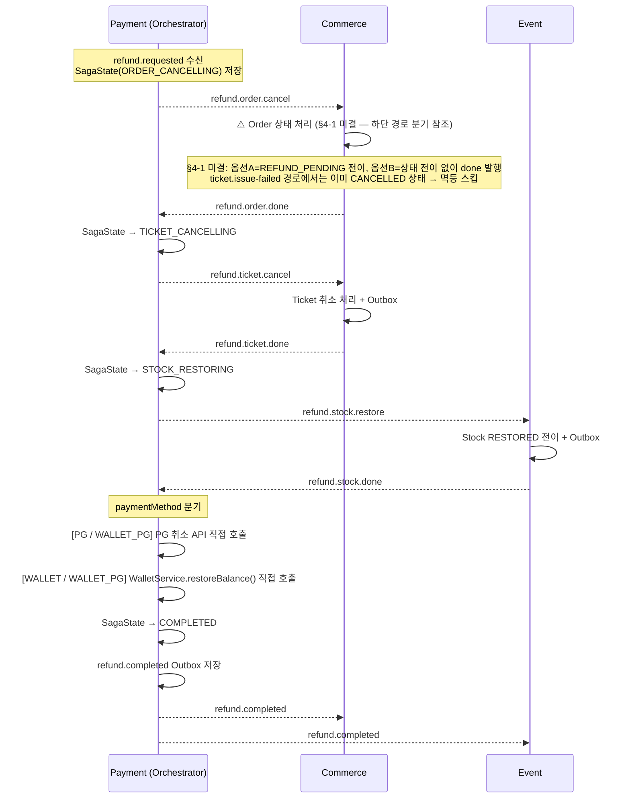

# DevTicket Kafka 설계 문서

> 최종 업데이트: 2026-04-10  
> 브랜치: semi-integration

---

## 공통 원칙

> 이 문서는 서비스 간 Kafka 통신 계약입니다.
> **내용 변경 시 관련 서비스 팀 전원 리뷰 및 합의 필수.**

### 팀 단위 설계 합의 필수

Kafka는 서비스 간 통신이므로 아래 항목은 반드시 팀 합의 후 결정한다.

| 항목 | 이유 |
|------|------|
| 이벤트 DTO 필드명·타입 | 변경 시 Consumer 역직렬화 실패 → 장애 |
| 토픽명 | 변경 시 Consumer가 메시지를 못 받음 |
| groupId | 중복 시 메시지 분산 수신 → 일부 누락 |
| 상태 전이 조건 | 서비스마다 다르게 구현하면 데이터 불일치 |
| 보상 이벤트 트리거 조건 | 보상 범위가 서비스마다 달라지면 복구 불완전 |

**이 문서가 합의 기록이다. 구현 전 반드시 확인할 것.**

---

## 목차

1. [서비스별 Kafka 역할](#1-서비스별-kafka-역할)
2. [토픽 목록](#2-토픽-목록)
3. [이벤트 DTO 계약](#3-이벤트-dto-계약)
4. [Outbox 패턴](#4-outbox-패턴)
5. [Consumer 멱등성 설계](#5-consumer-멱등성-설계)
6. [Producer 설정](#6-producer-설정)
7. [Consumer 설정](#7-consumer-설정)
8. [락 전략](#8-락-전략)
9. [Saga 플로우](#9-saga-플로우)
10. [DLT 전략](#10-dlt-전략)
11. [멱등성 케이스별 결정사항](#11-멱등성-케이스별-결정사항)
12. [서비스별 구현 체크리스트](#12-서비스별-구현-체크리스트)

---

## 1. 서비스별 Kafka 역할

| 서비스 | Producer (발행) | Consumer (소비) |
|---|---|---|
| Commerce | `order.created`, `ticket.issue-failed`, `refund.requested` (fan-out), `refund.order.done`, `refund.order.failed`, `refund.ticket.done`, `refund.ticket.failed` | `stock.deducted`, `stock.failed`, `payment.completed`, `payment.failed`, `ticket.issue-failed`, `refund.completed`, `event.force-cancelled`, `refund.order.cancel`, `refund.ticket.cancel`, `refund.order.compensate`, `refund.ticket.compensate` |
| Event | `stock.deducted`, `stock.failed`, `event.force-cancelled`, `event.sale-stopped`, `refund.stock.done`, `refund.stock.failed` | `order.created`, `payment.failed`, `refund.completed`, `refund.stock.restore` |
| Payment (Orchestrator 포함) | `payment.completed`, `payment.failed`, `refund.completed`, `refund.order.cancel`, `refund.ticket.cancel`, `refund.stock.restore`, `refund.order.compensate`, `refund.ticket.compensate` | `refund.completed` (예치금 복구), `ticket.issue-failed`, `event.sale-stopped`, `refund.requested`, `refund.order.done`, `refund.order.failed`, `refund.ticket.done`, `refund.ticket.failed`, `refund.stock.done`, `refund.stock.failed` |

### Producer 발행 시점

| 토픽 | Producer 서비스 | 발행 위치 (메서드) | 트리거 조건 |
|------|----------------|-------------------|-----------|
| `order.created` | Commerce | `OrderService.createOrder()` | 주문 생성 + Outbox INSERT 커밋 시 |
| `stock.deducted` | Event | `StockService.deductStock()` | `order.created` 수신 → 재고 차감 성공 시 |
| `stock.failed` | Event | `StockService.deductStock()` | `order.created` 수신 → 재고 부족 판정 시 |
| `payment.completed` | Payment | `PaymentService.confirmPayment()` | PG 승인 성공 + 내부 상태 반영 커밋 시 |
| `payment.failed` | Payment | `PaymentService.confirmPayment()` | PG 승인 실패 또는 내부 검증 실패 시 |
| `ticket.issue-failed` | Commerce | `TicketService.issueTicket()` | 결제 성공 후 티켓 발급 실패 감지 시 |
| `refund.completed` | Payment (Orchestrator) | `RefundSagaOrchestrator.completeRefund()` | Saga 마지막 단계 완료 후 Outbox 발행 |
| `event.force-cancelled` | Event | `EventService.forceCancel()` | Admin 강제 취소 API 호출 시 |
| `event.sale-stopped` | Event | `EventService.stopSale()` | Admin/Seller 판매 중지 API 호출 시 |
| `refund.requested` | Commerce | `RefundFanoutService.fanout()` | `event.force-cancelled` 수신 → 대상 orderId별 fan-out 발행 |
| `refund.order.cancel` | Payment (Orchestrator) | `RefundSagaOrchestrator.start()` / `onTicketFailed()` | Saga 시작 또는 Ticket 취소 실패 보상 시 |
| `refund.ticket.cancel` | Payment (Orchestrator) | `RefundSagaOrchestrator.onOrderDone()` | Order 취소 완료 수신 시 |
| `refund.stock.restore` | Payment (Orchestrator) | `RefundSagaOrchestrator.onTicketDone()` | Ticket 취소 완료 수신 시 |
| `refund.order.compensate` | Payment (Orchestrator) | `RefundSagaOrchestrator.onTicketFailed()` | Ticket 취소 실패 → Order 롤백 시 |
| `refund.ticket.compensate` | Payment (Orchestrator) | `RefundSagaOrchestrator.onStockFailed()` | Stock 복구 실패 → Ticket 롤백 시 |
| `refund.order.done` / `refund.order.failed` | Commerce | `OrderRefundConsumer` | Order 취소 처리 성공/실패 시 |
| `refund.ticket.done` / `refund.ticket.failed` | Commerce | `TicketRefundConsumer` | Ticket 취소 처리 성공/실패 시 |
| `refund.stock.done` / `refund.stock.failed` | Event | `StockRestoreConsumer` | Stock 복구 처리 성공/실패 시 |

> 위 메서드명은 설계 기준이며, 구현 시 네이밍이 달라질 수 있음.
> 핵심은 **비즈니스 로직 + Outbox INSERT가 단일 `@Transactional` 안에 있어야 한다**는 것.

---

## 2. 토픽 목록

```java
// KafkaTopics.java
public final class KafkaTopics {

    // Saga 흐름
    public static final String ORDER_CREATED         = "order.created";
    public static final String STOCK_DEDUCTED        = "stock.deducted";
    public static final String STOCK_FAILED          = "stock.failed";
    public static final String PAYMENT_COMPLETED     = "payment.completed";
    public static final String PAYMENT_FAILED        = "payment.failed";
    public static final String TICKET_ISSUE_FAILED   = "ticket.issue-failed";

    // 환불 (Orchestrator)
    public static final String REFUND_COMPLETED      = "refund.completed";

    // 이벤트 관리
    public static final String EVENT_FORCE_CANCELLED = "event.force-cancelled";
    public static final String EVENT_SALE_STOPPED    = "event.sale-stopped";

    // 환불 Orchestration (Refund Saga) — Payment Orchestrator 전용
    public static final String REFUND_REQUESTED          = "refund.requested";
    public static final String REFUND_ORDER_CANCEL       = "refund.order.cancel";
    public static final String REFUND_ORDER_DONE         = "refund.order.done";
    public static final String REFUND_ORDER_FAILED       = "refund.order.failed";
    public static final String REFUND_TICKET_CANCEL      = "refund.ticket.cancel";
    public static final String REFUND_TICKET_DONE        = "refund.ticket.done";
    public static final String REFUND_TICKET_FAILED      = "refund.ticket.failed";
    public static final String REFUND_STOCK_RESTORE      = "refund.stock.restore";
    public static final String REFUND_STOCK_DONE         = "refund.stock.done";
    public static final String REFUND_STOCK_FAILED       = "refund.stock.failed";
    public static final String REFUND_ORDER_COMPENSATE   = "refund.order.compensate";
    public static final String REFUND_TICKET_COMPENSATE  = "refund.ticket.compensate";

    // -- 이번 스코프 제외 (추후 논의 예정) --
    // public static final String MEMBER_SUSPENDED = "member.suspended";

}
```

---

## 3. 이벤트 DTO 계약

### 공통 원칙

- 모든 ID 필드: `UUID` 타입 통일 (String/Long 사용 금지)
- 모든 timestamp 필드: `Instant` 타입 통일 (LocalDateTime 사용 금지)
- enum 필드: String 대신 Java enum 타입 사용
- 직렬화: `JacksonConfig` — `JavaTimeModule` + `WRITE_DATES_AS_TIMESTAMPS=false` 적용
  - **모든 서비스(Commerce, Event, Payment, Member, Admin, Settlement)에 JacksonConfig 추가 필요**

### OrderCreatedEvent

```java
public record OrderCreatedEvent(
    UUID orderId,
    UUID userId,
    UUID eventId,
    int quantity,
    int totalAmount,
    Instant timestamp
) {}
```

### PaymentCompletedEvent

```java
public record PaymentCompletedEvent(
    UUID orderId,
    UUID userId,
    UUID paymentId,
    PaymentMethod paymentMethod,   // enum: WALLET | PG | WALLET_PG
    int totalAmount,
    Instant timestamp
) {}
```

### PaymentFailedEvent

```java
public record PaymentFailedEvent(
    UUID orderId,
    UUID userId,
    String reason,
    Instant timestamp
) {}
```

### RefundCompletedEvent

```java
public record RefundCompletedEvent(
    UUID refundId,
    UUID orderId,
    UUID userId,
    UUID paymentId,
    PaymentMethod paymentMethod,   // enum: WALLET | PG | WALLET_PG
    int refundAmount,
    int refundRate,                // 0 | 50 | 100
    Instant timestamp
) {}
```

### EventCancelledEvent (force-cancelled / sale-stopped 공용)

```java
public record EventCancelledEvent(
    UUID eventId,
    UUID sellerId,
    CancelledBy cancelledBy,       // enum: ADMIN | SELLER
    UUID adminId,                  // nullable (cancelledBy=ADMIN 시에만)
    Instant timestamp
) {}
```

### StockDeductedEvent / StockFailedEvent

```java
public record StockDeductedEvent(
    UUID orderId,
    UUID eventId,
    int quantity,
    Instant timestamp
) {}

public record StockFailedEvent(
    UUID orderId,
    UUID eventId,
    String reason,
    Instant timestamp
) {}
```

### TicketIssueFailedEvent

```java
public record TicketIssueFailedEvent(
    UUID orderId,
    UUID userId,
    UUID eventId,
    UUID paymentId,
    int quantity,
    int totalAmount,
    String reason,
    Instant timestamp
) {}
```

### RefundRequestedEvent (환불 Saga 진입점)

```java
public record RefundRequestedEvent(
    UUID refundId,       // Saga 추적 키 — SagaState PK
    UUID orderId,
    UUID userId,
    UUID paymentId,
    PaymentMethod paymentMethod,  // enum: WALLET | PG | WALLET_PG
    int refundAmount,
    String reason,
    Instant timestamp
) {}
```

> `refundId`는 Orchestrator가 Saga 시작 전 생성 (`UUID.randomUUID()`).
> Commerce fan-out 시 각 orderId마다 새 `refundId`를 발행한다.

### RefundSagaStepEvent (Orchestrator ↔ 각 서비스 공용)

```java
// refund.order.done / refund.order.failed
// refund.ticket.done / refund.ticket.failed
// refund.stock.done / refund.stock.failed
public record RefundSagaStepEvent(
    UUID refundId,
    UUID orderId,
    boolean success,
    String reason,      // 실패 시에만 값 있음
    Instant timestamp
) {}
```

---

## 4. Outbox 패턴

### 원칙

- 비즈니스 로직 + `outboxService.save()` 호출은 **반드시 단일 `@Transactional` 경계** 안에 위치
- Outbox 레코드의 `messageId`는 생성 시 `UUID.randomUUID()`로 **단 한 번 고정** — 재발행 시에도 변경하지 않음
- **Outbox 스케줄러는 Kafka 발행 시 `message_id`를 Kafka 헤더(`X-Message-Id`)에 포함해야 한다**
- Consumer는 이 헤더에서 `message_id`를 추출하여 `processed_message` dedup에 사용한다
- **Commerce·Event 서비스 신규 적용 시 동일 원칙 적용 필수**

### Outbox 테이블 설계

| 컬럼 | 타입 | 설명 |
|------|------|------|
| id | BIGSERIAL | PK |
| message_id | UUID | `UUID.randomUUID()`로 생성 — Kafka 헤더로 전달, Consumer dedup 키로 사용 |
| aggregate_id | VARCHAR(36) | 비즈니스 키 UUID — 운영 추적용 (orderId, paymentId 등) |
| partition_key | VARCHAR(36) | Kafka Partition Key — orderId 기준 순서 보장용 (kafka-design.md §6) |
| event_type | VARCHAR(128) | 이벤트 유형 (ORDER_CREATED, STOCK_DEDUCTED 등) |
| topic | VARCHAR(128) | Kafka 토픽명 |
| payload | TEXT | JSON 직렬화된 이벤트 |
| status | VARCHAR(20) | PENDING / SENT / FAILED |
| retry_count | INT | 현재 재시도 횟수 |
| next_retry_at | TIMESTAMP | 다음 재시도 시각 |
| created_at | TIMESTAMP | 생성 시각 |
| sent_at | TIMESTAMP | 발행 완료 시각 |

> `aggregate_id`(운영 추적)와 `partition_key`(Kafka 순서 보장)를 분리합니다.
>
> | 토픽 | aggregate_id | partition_key |
> |------|-------------|--------------|
> | `order.created` | orderId | orderId |
> | `payment.completed` | paymentId | orderId |
> | `payment.failed` | paymentId | orderId |
> | `refund.completed` | refundId | orderId |
> | `stock.deducted` / `stock.failed` | orderId | orderId |
> | `event.force-cancelled` / `event.sale-stopped` | eventId | eventId |
> | `refund.requested` | refundId | orderId |
> | `refund.order.cancel` / `refund.order.done` / `refund.order.failed` | refundId | orderId |
> | `refund.ticket.cancel` / `refund.ticket.done` / `refund.ticket.failed` | refundId | orderId |
> | `refund.stock.restore` / `refund.stock.done` / `refund.stock.failed` | refundId | orderId |
> | `refund.order.compensate` / `refund.ticket.compensate` | refundId | orderId |

> `event_type` 컬럼은 멱등성 자체에는 필수가 아니지만,
> 운영 중 "이 aggregate에서 어떤 이벤트가 몇 번 발행됐는지" 추적하는 데 유용합니다.

### Outbox 엔티티 변경사항 (기존 배포 마이그레이션)

```sql
ALTER TABLE outbox
    ADD COLUMN next_retry_at DATETIME(6) NULL;         -- 지수 백오프 기반 재시도 시각

-- aggregate_id: DB PK(BIGINT)가 아닌 비즈니스 키(paymentId, orderId 등) UUID 사용
ALTER TABLE outbox
    MODIFY COLUMN aggregate_id VARCHAR(36) NOT NULL;   -- UUID 문자열

-- partition_key: Kafka 파티션 키 — orderId 기준 Saga 순서 보장 (aggregate_id와 다를 수 있음)
ALTER TABLE outbox
    ADD COLUMN partition_key VARCHAR(36) NOT NULL;
```

### 재시도 정책 (지수 백오프)

> 전체 토픽 단일 정책 적용 — 총 최대 대기 시간 31초 (UX 기준 허용 범위)

| 시도 | 대기 시간 |
|---|---|
| 1회 | 즉시 |
| 2회 | 1초 |
| 3회 | 2초 |
| 4회 | 4초 |
| 5회 | 8초 |
| 6회 (최대) | 16초 → FAILED |

### 스케줄러 락 전략: ShedLock 채택

분산 환경에서 Outbox 스케줄러 중복 실행 방지.

```groovy
// build.gradle
implementation 'net.javacrumbs.shedlock:shedlock-spring:5.x'
implementation 'net.javacrumbs.shedlock:shedlock-provider-jdbc-template:5.x'
```

```sql
CREATE TABLE shedlock (
    name        VARCHAR(64)  NOT NULL,
    lock_until  TIMESTAMP    NOT NULL,
    locked_at   TIMESTAMP    NOT NULL,
    locked_by   VARCHAR(255) NOT NULL,
    PRIMARY KEY (name)
);
```

```java
@Scheduled(fixedDelay = 3000)
@SchedulerLock(name = "outbox-scheduler", lockAtMostFor = "25s", lockAtLeastFor = "5s")
public void publishPendingEvents() { ... }
```

스케줄러 쿼리: `next_retry_at <= now()` 조건 추가

```java
// OutboxRepository
List<Outbox> findTop50ByStatusAndNextRetryAtBeforeOrNextRetryAtIsNullOrderByCreatedAtAsc(
    OutboxStatus status, Instant now
);
```

---

## 5. Consumer 멱등성 설계

### 방어선 구조

```
[1차] processed_message 테이블 — 동일 messageId 재수신 방어 (Kafka 재전달)
[2차] 상태 전이 검증 (canTransitionTo) — 순서 역전·경쟁 조건 방어
[3차] 낙관적 락 (@Version) — 동시 업데이트 방어
```

### processed_message 스키마

```sql
CREATE TABLE processed_message (
    id           BIGINT       NOT NULL AUTO_INCREMENT,
    message_id   VARCHAR(36)  NOT NULL,   -- Outbox message_id (Kafka 헤더 X-Message-Id에서 추출)
    topic        VARCHAR(128) NOT NULL,   -- 운영 디버깅용
    processed_at DATETIME(6)  NOT NULL,
    PRIMARY KEY (id),
    UNIQUE KEY uk_message_id (message_id)
);
```

> MessageDeduplicationService 사용 원칙, messageId 생성 방식(코드 패턴)은
> [kafka-idempotency-guide.md §3-5, §3-6](kafka-idempotency-guide.md) 참조

### 유효 상태 전이 표

**Order** (`commerce.OrderStatus`)

| 현재 상태 | 허용 전이 | 비고 |
|---|---|---|
| `CREATED` | → `PAYMENT_PENDING` | `pendingPayment()` — 현재 `create()`가 바로 `PAYMENT_PENDING` 설정하므로 실질 미사용 |
| `PAYMENT_PENDING` | → `PAID`, `FAILED`, `CANCELLED` | `completePayment()` / `failPayment()` / `cancel()` |
| `PAID` | → `CANCELLED` | `cancel()` / ⚠️ `PAID → REFUND_PENDING` 전이 허용 여부는 §4-1 미결사항 해결 전까지 사용 금지 |
| `FAILED` | 없음 (종단) | |
| `CANCELLED` | 없음 (종단) | |
| `REFUND_PENDING` | 미정 | 선언만 있고 미사용 — `PAID → REFUND_PENDING → REFUNDED` 전이 포함 여부는 §4-1 미결사항 해결 후 결정 |
| `REFUNDED` | 미정 | 선언만 있고 미사용 — §4-1 미결사항 해결 후 결정 |

**Payment** (`payment.PaymentStatus`)

| 현재 상태 | 허용 전이 | 비고 |
|---|---|---|
| `READY` | → `SUCCESS`, `FAILED`, `CANCELLED` | `approve()` / `fail()` / `cancel()` |
| `SUCCESS` | → `REFUNDED`, `CANCELLED` | `refund()` / `cancel()` |
| `FAILED` | 없음 (종단) | |
| `CANCELLED` | 없음 (종단) | PG 자동 취소 보상 흐름에서 사용 |
| `REFUNDED` | 없음 (종단) | |

> ⚠️ **미구현:** `Payment` 엔티티의 `approve()` / `fail()` / `cancel()` / `refund()` 메서드에 현재 상태 검증 가드가 없음.
> 현재 상태와 무관하게 호출 시 바로 상태가 변경되므로, `canTransitionTo()` 구현이 필요함.

**Stock** (enum 미구현 — 설계 기준)

| 현재 상태 | 허용 전이 | 비고 |
|---|---|---|
| `DEDUCTED` | → `RESTORED` | Event Consumer가 `order.created` 수신 후 재고 차감 성공 시 (Kafka 구현 전: 동기 HTTP 차감 성공 시) |
| `RESTORED` | 없음 (종단) | `payment.failed` 수신 → 재고 복구 시 |

> Stock 상태 enum은 현재 코드에 없음 — 구현 시 위 설계 기준으로 추가 필요
>
> `RESERVED` 상태 미채택 근거: Event Consumer 내에서 재고 차감이 원자적으로 즉시 발생하므로 "차감 중" 중간 상태가 생길 틈이 없음. RESERVED는 차감과 확정 사이에 시간 간격이 있는 2단계 구조일 때만 필요 — 이 프로젝트는 1단계 즉시 차감 방식 채택. 비관적 락(`PESSIMISTIC_WRITE`)으로 동시성 제어.

---

### canTransitionTo() 구현 원칙

Consumer가 Kafka 메시지 수신 시 dedup 체크 통과 후 **반드시 상태 전이 가능 여부를 검증**해야 한다.

```java
// Order 도메인 — canTransitionTo() 구현 예시
public boolean canTransitionTo(OrderStatus target) {
    return switch (this.status) {
        case CREATED         -> target == OrderStatus.PAYMENT_PENDING;
        case PAYMENT_PENDING -> target == OrderStatus.PAID
                             || target == OrderStatus.FAILED
                             || target == OrderStatus.CANCELLED;
        case PAID            -> target == OrderStatus.CANCELLED;
        default              -> false; // FAILED, CANCELLED, REFUND_PENDING, REFUNDED: 종단
    };
}
```

**3분류 처리 원칙:**

```
① 이미 목표 상태        → 멱등 스킵 + ACK
② 설명 가능한 순서 역전  → 정책적 스킵 + ACK  (보상·만료로 이미 CANCELLED/FAILED 도달)
③ 설명 불가능한 상태     → throw → 재시도 → DLT  (단순 스킵 금지)
```

```java
// Consumer 처리 예시
if (!order.canTransitionTo(targetStatus)) {
    if (isExplainableSkip(order.getStatus())) {
        // ② 정책적 스킵
        deduplicationService.markProcessed(messageId, topic);
        ack.acknowledge();
        return;
    }
    // ③ 설명 불가능 → 재시도
    throw new IllegalStateException(
        "Invalid transition: " + order.getStatus() + " -> " + targetStatus);
}
```

> **현재 상태: 미구현** — Order·Payment 도메인 모두 `canTransitionTo()` 없음. Kafka Consumer 구현 전 반드시 추가 필요.

---

### 미결사항 — Order REFUND_PENDING / REFUNDED 상태 사용 여부

`OrderStatus`에 `REFUND_PENDING`, `REFUNDED`가 선언되어 있으나 현재 코드 어디서도 사용되지 않는다.

환불 흐름 구현 시 아래 두 가지 중 선택 필요. **어느 옵션도 확정되지 않았으며, Refund Saga 구현 착수 전 팀 합의 후 결정한다.**

| 옵션 | 내용 | 트레이드오프 |
|---|---|---|
| **A. Order 상태로 추적** | `PAID → REFUND_PENDING → REFUNDED` 전이 추가, `canTransitionTo()` 에 반영 | 환불 진행 중 상태를 Order에서 직접 추적 가능. `canTransitionTo()` 및 보상 경로(`REFUND_PENDING → PAID` 롤백) 구현 추가 필요 |
| **B. Order 상태 미사용** | 환불은 Payment/Refund 도메인에서만 관리, Order에서 `REFUND_PENDING`·`REFUNDED` 제거 | Order 도메인 단순화. 단, `refund.order.cancel` 수신 시 Order 상태 전이 없이 바로 `refund.order.done` 발행하는 구조로 변경 필요 |

> **관련 서비스:** `[Commerce]`, `[Payment]`

### groupId 네이밍 규칙

패턴: `{서비스명}-{topic명}`

| 서비스 | 소비 토픽 | groupId |
|---|---|---|
| Commerce | `stock.deducted` | `commerce-stock.deducted` |
| Commerce | `stock.failed` | `commerce-stock.failed` |
| Commerce | `payment.completed` | `commerce-payment.completed` |
| Commerce | `payment.failed` | `commerce-payment.failed` |
| Commerce | `ticket.issue-failed` | `commerce-ticket.issue-failed` |
| Commerce | `refund.completed` | `commerce-refund.completed` |
| Event | `order.created` | `event-order.created` |
| Event | `payment.failed` | `event-payment.failed` |
| Event | `refund.completed` | `event-refund.completed` |
| Payment | `refund.completed` | `payment-refund.completed` |
| Payment | `ticket.issue-failed` | `payment-ticket.issue-failed` |
| Commerce | `event.force-cancelled` | `commerce-event.force-cancelled` |
| Payment | `event.sale-stopped` | `payment-event.sale-stopped` |
| Payment (Orchestrator) | `refund.requested` | `payment-refund.requested` |
| Payment (Orchestrator) | `refund.order.done` | `payment-refund.order.done` |
| Payment (Orchestrator) | `refund.order.failed` | `payment-refund.order.failed` |
| Payment (Orchestrator) | `refund.ticket.done` | `payment-refund.ticket.done` |
| Payment (Orchestrator) | `refund.ticket.failed` | `payment-refund.ticket.failed` |
| Payment (Orchestrator) | `refund.stock.done` | `payment-refund.stock.done` |
| Payment (Orchestrator) | `refund.stock.failed` | `payment-refund.stock.failed` |
| Commerce | `refund.order.cancel` | `commerce-refund.order.cancel` |
| Commerce | `refund.ticket.cancel` | `commerce-refund.ticket.cancel` |
| Commerce | `refund.order.compensate` | `commerce-refund.order.compensate` |
| Commerce | `refund.ticket.compensate` | `commerce-refund.ticket.compensate` |
| Event | `refund.stock.restore` | `event-refund.stock.restore` |

---

## 6. Producer 설정

### Partition Key — 순서 보장

Kafka는 **같은 파티션 내에서만 순서를 보장**한다.
메시지 발행 시 Key를 지정하면 같은 Key는 항상 같은 파티션으로 라우팅된다.

```java
// Key 없이 발행 → 파티션 랜덤 분산 → 순서 역전 가능
kafkaTemplate.send("order.created", payload);

// orderId를 Key로 지정 → 같은 주문 관련 이벤트는 항상 같은 파티션
kafkaTemplate.send("order.created", orderId.toString(), payload);
```

**이 프로젝트 적용 기준:**

| 토픽 | Partition Key | 이유 |
|------|--------------|------|
| `order.created` | `orderId` | 같은 주문 Saga 이벤트 순서 보장 |
| `stock.deducted` / `stock.failed` | `orderId` | 동일 주문 재고 흐름 순서 보장 |
| `payment.completed` / `payment.failed` | `orderId` | 동일 주문 결제 흐름 순서 보장 |
| `refund.completed` | `orderId` | 환불-주문 상태 순서 보장 |
| `event.force-cancelled` / `event.sale-stopped` | `eventId` | 동일 이벤트 취소 중복 방지 |
| `refund.requested` | `orderId` | 동일 주문의 환불 Saga 진입 순서 보장 |
| `refund.order.cancel` / `refund.order.done` / `refund.order.failed` | `orderId` | 동일 주문의 Refund Saga 단계 순서 보장 |
| `refund.ticket.cancel` / `refund.ticket.done` / `refund.ticket.failed` | `orderId` | 동일 주문의 Refund Saga 단계 순서 보장 |
| `refund.stock.restore` / `refund.stock.done` / `refund.stock.failed` | `orderId` | 동일 주문의 Refund Saga 단계 순서 보장 |
| `refund.order.compensate` / `refund.ticket.compensate` | `orderId` | 동일 주문의 보상 트랜잭션 순서 보장 |

> 참고: 현재 설계는 상태전이 검증(`canTransitionTo`)으로 순서 역전을 방어하고 있음.
> Partition Key는 추가 방어선으로, 설정하지 않아도 멱등성은 유지되지만 설정 시 Consumer 재시도 빈도가 줄어든다.

---

## 7. Consumer 설정

### AckMode

`AckMode.MANUAL` — 도메인 처리 완전 성공 후 `ack.acknowledge()` 호출

### 재시도 정책 (ExponentialBackOff)

```java
// KafkaConsumerConfig.java
ExponentialBackOffWithMaxRetries backOff = new ExponentialBackOffWithMaxRetries(3);
backOff.setInitialInterval(2_000L);   // 2초
backOff.setMultiplier(2.0);           // 2→4→8초
// 총 4회 시도 (최초 1회 + 재시도 3회)
// 소진 시 DLT(topic.DLT)로 이동
```

### JacksonConfig (전 서비스 공통 적용)

```java
@Configuration
public class JacksonConfig {

    @Bean
    public ObjectMapper objectMapper() {
        return JsonMapper.builder()
            .addModule(new JavaTimeModule())
            .disable(SerializationFeature.WRITE_DATES_AS_TIMESTAMPS)
            .build();
    }
}
```

---

## 8. 락 전략

### 언제 무엇을 쓰는가

| 상황 | 권장 락 | 이유 |
|------|--------|------|
| 상태 전이 (충돌 빈도 낮음) | 낙관적 락 (`@Version`) | 충돌 시에만 예외 처리, 병목 없음 |
| 주문 중복 생성 방지 (직렬화 필요) | 비관적 락 (`SELECT FOR UPDATE`) | 동시에 두 요청이 "없음" 판단하는 걸 막아야 함 |
| INSERT 중복 방지 | UNIQUE KEY | 락 불필요, DB 제약으로 해결 |
| 단순 조회 | 락 없음 | 조회에 락 걸면 불필요한 대기 발생 |

### 비관락 남용 시 문제

```
SELECT FOR UPDATE 남용
  → 해당 행 잠금
  → 다른 트랜잭션 전부 대기 (블로킹)
  → 동시 요청 많을수록 성능 급락
  → 트랜잭션 길어지면 타임아웃 연쇄 발생
```

### 이 프로젝트 기준

```
비관락 사용: 주문 생성 시 userId + cartId 직렬화만
낙관락 사용: Payment·Order·Stock 상태 전이 (@Version)
UNIQUE KEY: processed_message INSERT 중복 방지
```

**비관락은 "동시에 두 요청이 모두 성공하면 절대 안 되는" 케이스에만 사용한다.**

---

## 9. Saga 플로우

### 9-1. Happy Path (정상 흐름)

> ⚠️ **구현 전환 주의 (현재 → Kafka 이후)**
>
> **현재 코드:** 재고 차감이 Kafka 없이 주문 생성 시점에 동기 HTTP로 처리됨
> (`OrderService.createOrderByCart()` → `orderToEventClient.adjustStocks()` → Order 생성)
>
> **Kafka 구현 후:** 아래 흐름으로 전환됨 — Order 생성이 먼저, 재고 차감은 Event가 `order.created`를 수신한 뒤 처리.
> Kafka 구현 시 `OrderService` 내 동기 HTTP 재고 차감 코드(`orderToEventClient.adjustStocks()`)를 반드시 제거해야 한다.

```
[Commerce] POST /orders 처리
    → Order 생성 + order.created 발행 (Outbox)
    ↓
[Event] order.created 소비
    → 재고 차감 처리
    → stock.deducted 발행
    ↓
[Commerce] stock.deducted 소비 (groupId: commerce-stock.deducted)
    → Order 상태 PAYMENT_PENDING 전이
    ↓
[User] POST /api/payments/ready    ← 사용자가 결제 수단 선택 후 명시적 HTTP 호출
[User] POST /api/payments/confirm  ← PG 콜백 후 사용자 최종 승인 HTTP 호출
    ↓
[Payment] PG 승인 처리
    → payment.completed 발행
    ↓
[Commerce] payment.completed 소비
    → Order 상태 PAID 전이
    → 티켓 발급 (TicketService 내부 호출 — Kafka 토픽 아님)
```

### 9-2. 보상 흐름 (실패 케이스)

**케이스 1 — 재고 부족:**
```
[Event] order.created 소비
    → 재고 차감 실패
    → stock.failed 발행
    ↓
[Commerce] stock.failed 소비 (groupId: commerce-stock.failed)
    → Order 상태 FAILED 전이
```

**케이스 2 — 결제 실패:**
```
[User] POST /api/payments/confirm  ← 사용자 HTTP 호출
[Payment] PG 거절 또는 내부 검증 실패
    → payment.failed 발행
    ↓
[Commerce] payment.failed 소비 (groupId: commerce-payment.failed)
    → Order 상태 FAILED 전이
[Event] payment.failed 소비 (groupId: event-payment.failed)
    → 차감했던 재고 복구
```

**케이스 3 — 티켓 발급 실패:**
```
[Commerce] ticket.issue-failed 소비
    → Order 상태 CANCELLED 전이
[Payment] ticket.issue-failed 소비
    → RefundSagaOrchestrator.start() → 환불 Orchestration 진행 (§9-3 참조)
```

### 보상 이벤트 원칙

- 모든 보상 Consumer(`commerce-payment.failed`, `event-payment.failed` 등)에 `processed_message` dedup 적용
- 보상 Consumer groupId도 `{서비스명}-{topic명}` 규칙을 따른다

---

### 9-3. 환불 Orchestration 플로우 (Refund Saga)

> 환불 흐름은 Choreography 대신 Orchestration 패턴 적용.
> Payment 서비스 내 `RefundSagaOrchestrator`가 모든 단계를 지휘한다.

**진입점 2가지:**

| 케이스 | 진입 경로 |
|--------|----------|
| 단건 환불 (티켓 발급 실패 등) | `ticket.issue-failed` 수신 → `RefundSagaOrchestrator.start()` |
| 일괄 환불 (이벤트 강제 취소) | `event.force-cancelled` → Commerce fan-out → `refund.requested` → `RefundSagaOrchestrator.start()` |

**정상 흐름:**



**경로 분기 — refund.order.cancel 수신 시 Order 상태별 처리:**

```
일반 환불 경로 (event.force-cancelled → refund.requested):
  Order 상태 = PAID
  ⚠️ §4-1 미결 — 구현 시 팀 합의 후 아래 중 하나 선택:
  [옵션 A] → REFUND_PENDING 전이 + Outbox → refund.order.done 발행
  [옵션 B] → 상태 전이 없이 바로 refund.order.done 발행

ticket.issue-failed 경로:
  Order 상태 = CANCELLED (Commerce가 ticket.issue-failed 소비 시 먼저 전이 완료)
  → 멱등 스킵 (상태 전이 없음) + refund.order.done 발행
  (Orchestrator는 두 경로 모두 refund.order.done을 정상 수신하므로 구분 불필요)
```

**보상 흐름 (실패 케이스):**

```
refund.order.failed  → 첫 단계 실패 → SagaState FAILED (보상 불필요)

refund.ticket.failed → Order 롤백 필요
    → refund.order.compensate 발행 → Order 취소 해제

refund.stock.failed  → Order + Ticket 롤백 필요
    → refund.ticket.compensate 발행 → Ticket 취소 해제
    → refund.order.compensate 발행 → Order 취소 해제
```

**결제 방식별 Saga Step:**

| Step | WALLET | PG | WALLET_PG |
|------|--------|----|-----------|
| 1 | Order 취소 | Order 취소 | Order 취소 |
| 2 | Ticket 취소 | Ticket 취소 | Ticket 취소 |
| 3 | Stock 복구 | Stock 복구 | Stock 복구 |
| 4 | **Wallet 복구** (내부 호출) | **PG 취소** (내부 호출) | **PG 취소** (내부 호출) |
| 5 | — | — | **Wallet 복구** (내부 호출) |

> Step 4, 5는 Orchestrator가 Payment 내부에 있으므로 별도 Kafka 토픽 없이 직접 메서드 호출로 처리.

**`saga_state` 테이블:**

```sql
CREATE TABLE saga_state (
    refund_id       VARCHAR(36)  NOT NULL,
    order_id        VARCHAR(36)  NOT NULL,
    payment_method  VARCHAR(20)  NOT NULL,   -- WALLET | PG | WALLET_PG
    current_step    VARCHAR(30)  NOT NULL,   -- ORDER_CANCELLING | TICKET_CANCELLING | STOCK_RESTORING | PG_CANCELLING | WALLET_RESTORING | COMPLETED | FAILED | COMPENSATING
    status          VARCHAR(20)  NOT NULL,   -- IN_PROGRESS | COMPLETED | FAILED | COMPENSATING
    created_at      DATETIME(6)  NOT NULL,
    updated_at      DATETIME(6)  NOT NULL,
    PRIMARY KEY (refund_id)
);
```

**Orchestrator Consumer groupId:**

| 소비 토픽 | groupId |
|----------|---------|
| `refund.requested` | `payment-refund.requested` |
| `refund.order.done` | `payment-refund.order.done` |
| `refund.order.failed` | `payment-refund.order.failed` |
| `refund.ticket.done` | `payment-refund.ticket.done` |
| `refund.ticket.failed` | `payment-refund.ticket.failed` |
| `refund.stock.done` | `payment-refund.stock.done` |
| `refund.stock.failed` | `payment-refund.stock.failed` |

> Orchestrator의 각 `@KafkaListener`는 서로 다른 토픽을 소비하므로 groupId를 토픽별로 분리한다.

---

## 10. DLT 전략

- Consumer 재시도 3회 소진 → `{topic}.DLT` 토픽으로 자동 이동 (DefaultErrorHandler)
- DLT 메시지의 Kafka 헤더에 원본 `X-Message-Id`가 유지됨
- **DLT에서 원본 토픽으로 재발행 시 반드시 원본 `X-Message-Id` 헤더를 보존해야 한다**
  - 새 UUID로 재발행하면 Consumer dedup을 우회하여 중복 처리 발생
- `markProcessed()` 미호출 상태(실패건)이므로 원본 message_id로 재발행 시 dedup 정상 통과

```
topic: refund.completed       → DLT: refund.completed.DLT
topic: order.created          → DLT: order.created.DLT
topic: event.force-cancelled  → DLT: event.force-cancelled.DLT
```

### 미결사항 — DLT 알림 채널

- 현재: `log.error` 임시 처리
- DLT에 메시지 쌓임 = 처리 못 한 주문/결제/재고 존재 → 운영팀 즉시 인지 필요
- 추후 확정 필요: Slack / PagerDuty 등 알림 채널 선택 후 교체

---

## 11. 멱등성 케이스별 결정사항

| # | 케이스 | 결정 | 구현 수단 | 현재 상태 |
|---|---|---|---|---|
| 1 | Consumer 재시작 시 동일 메시지 재처리 | `markProcessed()`를 Service 트랜잭션 내부로 이동 | `@Transactional` 경계 통합 | 수정 필요 |
| 2 | dedupe 키 스코프 (message_id+topic 복합키는 fan-out 구조에서 Consumer 간 dedup 공유 문제 발생 → 모듈별 별도 테이블로 구독자 스코프 격리) | 격리 단위 = 서비스 DB, Outbox UUID를 Kafka 헤더로 전달 | `X-Message-Id` 헤더 + 모듈별 `processed_message` + `UNIQUE(message_id)` | 구현됨, 문서화 누락 |
| 3 | 메시지 순서 역전 | 3분류 처리 — ① 이미 목표 상태: 멱등 스킵 + ACK ② 설명 가능한 순서 역전(만료·보상 등): 정책적 스킵 + ACK ③ 설명 불가능한 상태: throw → 재시도 → DLT (단순 스킵 금지 — 정합성 문제 소거 위험) | `canTransitionTo()` + 예외 타입 3분류 | 미구현 |
| 4 | Producer 재발행 시 dedupe | `Outbox.messageId` 생성 시 고정, 재발행 시 동일 ID | 현재 구현 유지 | 구현됨, 문서화 누락 |
| 5 | Outbox 락·재시도 | ShedLock 채택, `next_retry_at` 컬럼 추가 | ShedLock + 지수 백오프 | 락 미구현 → ShedLock 적용 예정 |
| 6 | DLT 재처리 중복 반영 | ① `markProcessed()`는 성공 후 마지막에 호출 ② DLT 재처리 워커/Admin API에서 원본 토픽 재발행 시 반드시 원본 `X-Message-Id` 헤더 보존 (새 UUID 생성 시 dedup 우회 → 중복 처리 발생) | 코드 순서 원칙 + DLT 재발행 구현 정책 | ① 구현됨 ② Admin API 미구현 |
| 7 | 보상 이벤트 중복 처리 | processed_message dedup + 보상 Consumer별 비즈니스 상태 확인 이중 방어 (이미 보상 완료 상태면 성공으로 간주 스킵) — 상태 확인은 별도 플래그 없이 기존 상태 전이 검증(`canTransitionTo()`)으로 커버 | 모든 보상 Consumer에 dedupe 강제 + `canTransitionTo()` (Case 3과 동일) | 원칙 미수립 |
| 8 | 상태 전이 검증 없음 | processed_message + 상태 전이 검증 두 방어선 필수 | Case 3 동일, 예외 타입 분리 | 미구현 |
| 9 | 스케줄러·Consumer 충돌 | ShedLock + processed_message + 상태 전이 검증 + 낙관적 락 4레이어 | `@Version` 추가 | 미구현 |
| 10 | 동일 계정 멀티 세션 동시 주문 (같은 장바구니를 여러 탭·기기에서 동시 주문) | userId + cartId SELECT FOR UPDATE 직렬화 후, 서버가 장바구니 내용 해시(cartHash) 계산 → 활성 주문 조회 시 userId + cartId + cartHash 3개 일치 여부 기준으로 중복 판단. cartHash 불일치(내용 변경)면 새 주문 허용. Orders 테이블에 `cart_hash VARCHAR(64)` 컬럼 추가 필요 | `SELECT FOR UPDATE` + cartHash 서버 계산(itemId 정렬 후 SHA-256) + 활성 주문 조회 기준 변경 | 미구현 |

---

## 12. 서비스별 구현 체크리스트

### Payment (기존 구현 수정)

- [ ] `KafkaConsumerConfig`: FixedBackOff → ExponentialBackOffWithMaxRetries(3, 2→4→8초)
- [ ] `WalletEventConsumer`: groupId 변경 (`payment-refund.completed`)
- [ ] `WalletEventConsumer`: `markProcessed()` 위치를 `walletService` 트랜잭션 내부로 이동
- [ ] `WalletServiceImpl.processWalletPayment()`: 결제 완료 후 `commerceInternalClient.completePayment()` 호출 추가 — 현재 Wallet 결제 시 OrderStatus가 `PAYMENT_PENDING`에서 `PAID`로 전이되지 않음
- [ ] `ProcessedMessage`: `topic VARCHAR(128)` 컬럼 추가
- [ ] `Outbox`: `aggregate_id` → UUID(비즈니스 키), `next_retry_at` 컬럼 추가, `partition_key VARCHAR(36)` 컬럼 추가 (상세: §4)
- [ ] `OutboxRepository`: `next_retry_at <= now()` 조건 추가
- [ ] `OutboxScheduler`: ShedLock 적용, 지수 백오프 재시도 간격 반영
- [ ] `RefundCompletedEvent`: `refundId(UUID)`, `userId(UUID)`, `paymentId(UUID)`, `timestamp(Instant)`
- [ ] `PaymentCompletedEvent`: `userId(UUID)`, `paymentId(UUID)`, `paymentMethod(enum)`, `timestamp(Instant)`
- [ ] `EventCancelledEvent`: `eventId(UUID)`, `sellerId(UUID)`, `adminId(UUID)`, `CancelledBy enum`, record로 변환
- [ ] `JacksonConfig`: 이미 존재, 설정 내용 검토
- [ ] 도메인 엔티티 상태 전이 검증 (`canTransitionTo()`)
- [ ] 도메인 엔티티 낙관적 락 (`@Version`)
- [ ] `RefundSagaOrchestrator` 클래스 신규 생성, `saga_state` 테이블 및 `SagaStateRepository` 구현
- [ ] Orchestrator `start()` / `onOrderDone()` / `onTicketDone()` / `onStockDone()` / `onOrderFailed()` / `onTicketFailed()` / `onStockFailed()` 구현
- [ ] Orchestrator Consumer groupId 등록 (`payment-refund.requested` 외 6개, 상세: §9-3) + dedup 적용
- [ ] `KafkaTopics` 상수 클래스에 Refund Saga Orchestration 토픽 12개 추가 (상세: §2)

> 전체 구현 체크리스트: kafka-impl-plan.md §3-1 참조

### Commerce (신규 적용)

- [ ] `JacksonConfig` 추가
- [ ] `KafkaTopics` 상수 클래스에 Commerce 발행 토픽 + Orchestration 토픽 추가
- [ ] Outbox 패턴 구현 (비즈니스 + save 단일 트랜잭션)
- [ ] `MessageDeduplicationService` 구현 + `processed_message` 테이블
- [ ] ShedLock 적용
- [ ] 모든 Consumer에 dedup 패턴 적용 (`event.force-cancelled` 포함 전체 Consumer)
- [ ] 상태 전이 검증 구현 (`canTransitionTo()`)
- [ ] 도메인 엔티티 낙관적 락 (`@Version`)
- [ ] Refund Saga 연동 — `RefundFanoutService`, `OrderRefundConsumer`, `TicketRefundConsumer`, `OrderCompensateConsumer`, `TicketCompensateConsumer`

> 전체 구현 체크리스트: kafka-impl-plan.md §3-2 참조

### Event (신규 적용)

- [ ] `JacksonConfig` 추가
- [ ] `KafkaTopics` 상수 클래스에 Event 발행 토픽 추가
- [ ] Outbox 패턴 구현 (비즈니스 + save 단일 트랜잭션)
- [ ] `MessageDeduplicationService` 구현 + `processed_message` 테이블
- [ ] ShedLock 적용
- [ ] 모든 Consumer에 dedup 패턴 적용 (`refund.stock.restore` 포함)
- [ ] 상태 전이 검증 구현 (`canTransitionTo()`)
- [ ] 도메인 엔티티 낙관적 락 (`@Version`)
- [ ] `StockStatus` enum 신규 추가 (`DEDUCTED` → `RESTORED`)
- [ ] `StockRestoreConsumer`: `refund.stock.restore` 수신 → Stock 복구 → `refund.stock.done/failed` 발행

> 전체 구현 체크리스트: kafka-impl-plan.md §3-3 참조

---

## 추후 구현 예정

### Member

- `member.suspended` Consumer 구현 (이번 스코프 제외, 추후 논의)
