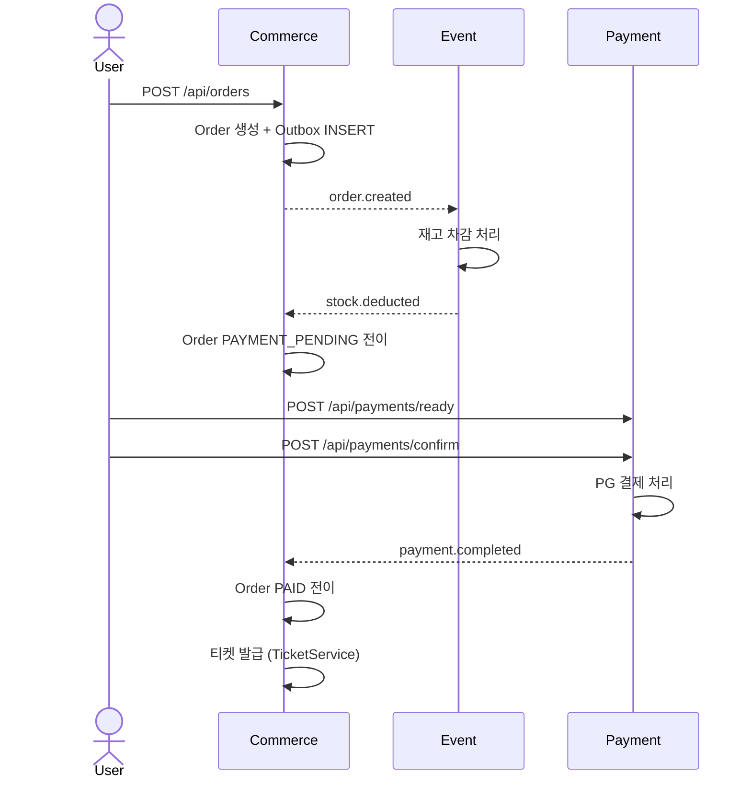
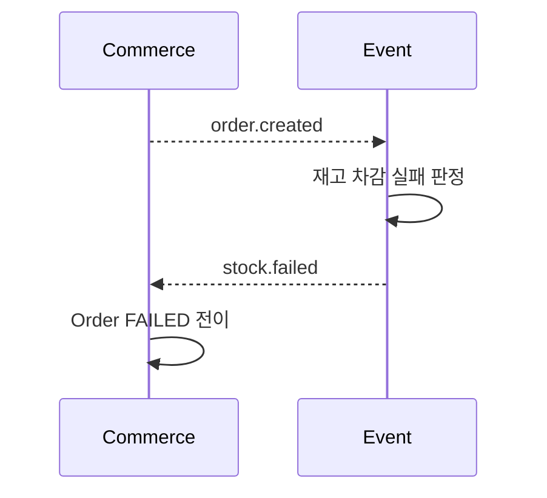
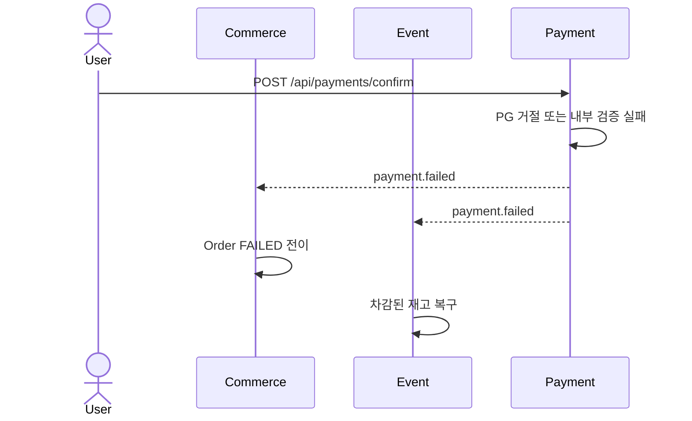
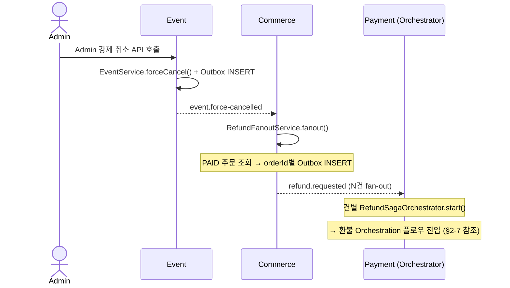
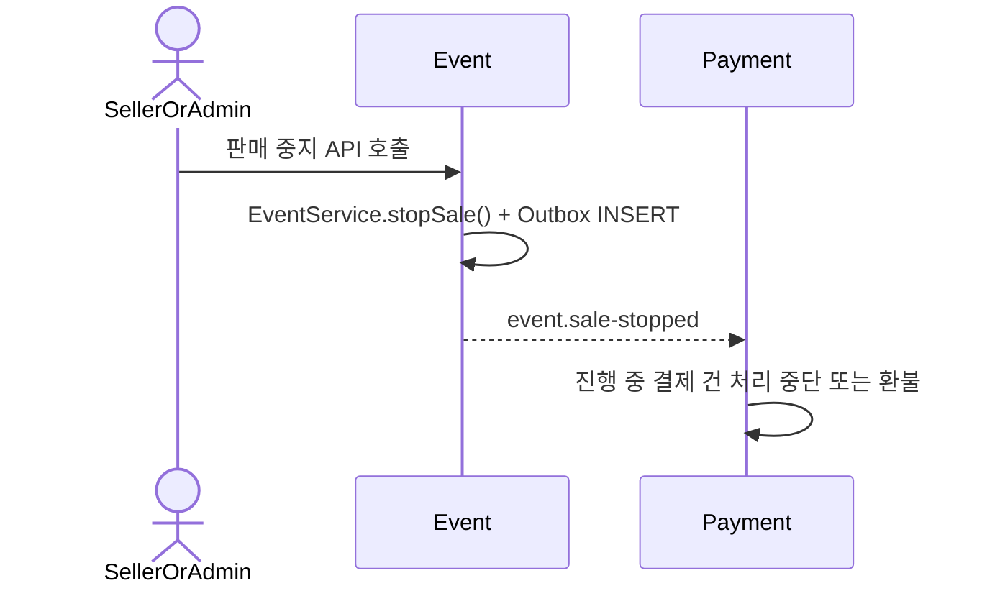
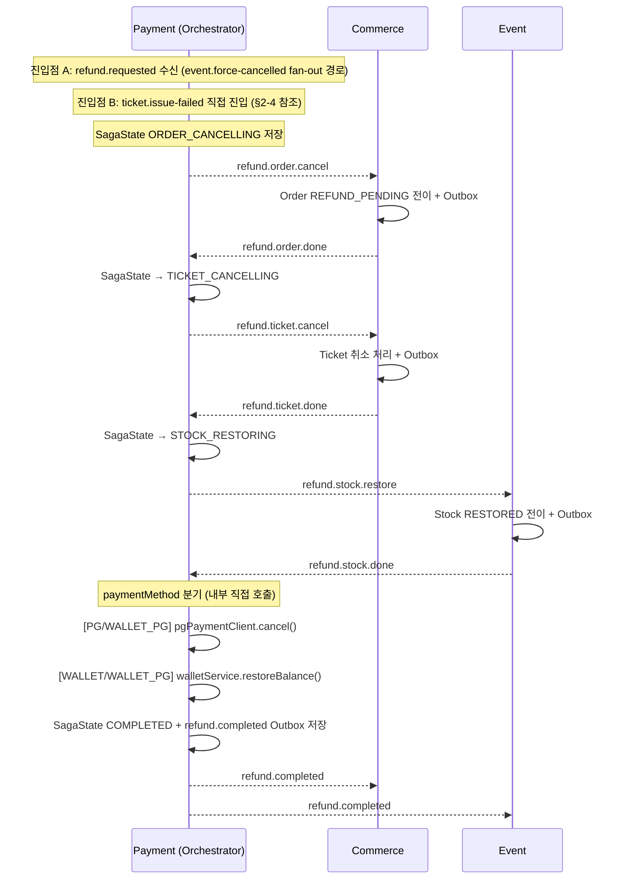
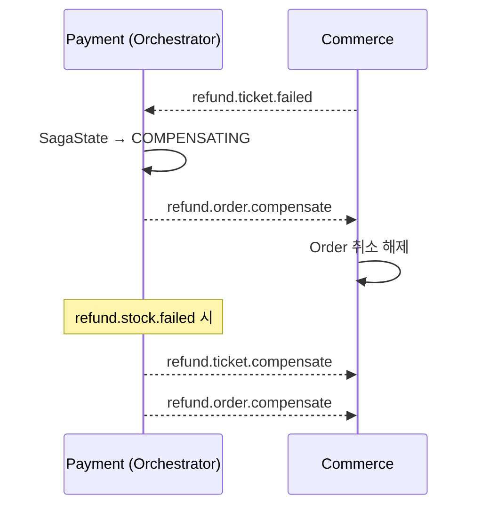

# DevTicket Kafka 구현 계획

> 최종 업데이트: 2026-04-16
> 목적: PO 기준 문서 — 이 파일을 기준으로 /docs 내 다른 문서를 수정할 것
> 원본 참조: kafka-design.md / kafka-idempotency-guide.md

---

## 목차

1. [섹션 1 — 이벤트 전체 매트릭스 (조감도)](#섹션-1--이벤트-전체-매트릭스-조감도)
2. [섹션 2 — Saga 플로우](#섹션-2--saga-플로우)
   - [2-1 정상 흐름](#2-1-정상-흐름-happy-path)
   - [2-2 보상 — 재고 부족](#2-2-보상-흐름--재고-부족)
   - [2-3 보상 — 결제 실패](#2-3-보상-흐름--결제-실패)
   - [2-4 보상 — 티켓 발급 실패](#2-4-보상-흐름--티켓-발급-실패)
   - [2-5 운영 취소 — event.force-cancelled](#2-5-운영-취소-이벤트--eventforce-cancelled)
   - [2-6 운영 취소 — event.sale-stopped](#2-6-운영-취소-이벤트--eventsale-stopped)
   - [2-7 환불 Orchestration 플로우](#2-7-환불-orchestration-플로우-refund-saga)
3. [섹션 3 — 서비스별 구현 체크리스트](#섹션-3--서비스별-구현-체크리스트)
   - [3-1 Payment](#3-1-payment-기존-구현-수정)
   - [3-2 Commerce](#3-2-commerce-신규-적용)
   - [3-3 Event](#3-3-event-신규-적용)
4. [섹션 4 — 미결 사항 및 추후 처리 항목](#섹션-4--미결-사항-및-추후-처리-항목)
5. [섹션 5 — /docs 싱크 포인트](#섹션-5--docs-싱크-포인트)

---

## 섹션 1 — 이벤트 전체 매트릭스 (조감도)

Kafka를 통해 서비스 간에 오가는 모든 이벤트를 한 눈에 확인하는 테이블입니다.
구현 상태는 kafka-design.md §11 멱등성 케이스별 결정사항 및 §12 서비스별 구현 체크리스트 기준입니다.

| 이벤트 토픽 | Producer 서비스 | Consumer 서비스 | 트리거 조건 | DLT 여부 | 구현 상태 |
|------------|----------------|----------------|-----------|---------|---------|
| `order.created` | Commerce | Event | 주문 생성 + Outbox INSERT 커밋 시 | `order.created.DLT` | 🚧 진행중 |
| `stock.deducted` | Event | Commerce | `order.created` 수신 후 재고 차감 성공 시 | `stock.deducted.DLT` | ⬜ 미구현 |
| `stock.failed` | Event | Commerce | `order.created` 수신 후 재고 부족 판정 시 | `stock.failed.DLT` | ⬜ 미구현 |
| `payment.completed` | Payment | Commerce | PG 승인 성공 + 내부 상태 반영 커밋 시 | `payment.completed.DLT` | 🚧 진행중 |
| `payment.failed` | Payment | Commerce, Event | PG 승인 실패 또는 내부 검증 실패 시 | `payment.failed.DLT` | 🚧 진행중 |
| `ticket.issue-failed` | Commerce | Commerce, Payment | 결제 성공 후 티켓 발급 실패 감지 시 | `ticket.issue-failed.DLT` | ⬜ 미구현 |
| `refund.completed` | Payment | Commerce, Event, Payment | PG 취소 완료 + 내부 환불 상태 반영 커밋 시 | `refund.completed.DLT` | 🚧 진행중 |
| `event.force-cancelled` | Event | Commerce | Admin 강제 취소 API 호출 시 | `event.force-cancelled.DLT` | ⬜ 미구현 |
| `event.sale-stopped` | Event | Payment | Admin/Seller 판매 중지 API 호출 시 | `event.sale-stopped.DLT` | ⬜ 미구현 |
| `refund.requested` | Commerce | Payment (Orchestrator) | `event.force-cancelled` 수신 → orderId별 fan-out 발행 | `refund.requested.DLT` | ⬜ 미구현 |
| `refund.order.cancel` | Payment (Orchestrator) | Commerce | Saga Order 취소 명령 | — | ⬜ 미구현 |
| `refund.order.done` / `refund.order.failed` | Commerce | Payment (Orchestrator) | Order 취소 처리 결과 | — | ⬜ 미구현 |
| `refund.ticket.cancel` | Payment (Orchestrator) | Commerce | Saga Ticket 취소 명령 | — | ⬜ 미구현 |
| `refund.ticket.done` / `refund.ticket.failed` | Commerce | Payment (Orchestrator) | Ticket 취소 처리 결과 | — | ⬜ 미구현 |
| `refund.stock.restore` | Payment (Orchestrator) | Event | Saga Stock 복구 명령 | — | ⬜ 미구현 |
| `refund.stock.done` / `refund.stock.failed` | Event | Payment (Orchestrator) | Stock 복구 처리 결과 | — | ⬜ 미구현 |
| `refund.order.compensate` | Payment (Orchestrator) | Commerce | Order 취소 보상 (롤백) | — | ⬜ 미구현 |
| `refund.ticket.compensate` | Payment (Orchestrator) | Commerce | Ticket 취소 보상 (롤백) | — | ⬜ 미구현 |

**구현 상태 범례**

| 기호 | 의미 |
|------|------|
| ✅ 완료 | 코드 구현 및 멱등성·Outbox 패턴 완전 적용 |
| 🚧 진행중 | 기본 코드는 있으나 멱등성 가드, Outbox 보완, DLT 설정 미완 |
| ⬜ 미구현 | 해당 Consumer/Producer 코드 자체가 없거나 아직 착수 전 |

> 상세: kafka-design.md §1 서비스별 Kafka 역할 / §2 토픽 목록 참조

---

## 섹션 2 — Saga 플로우

각 이벤트가 어떤 순서로 서비스 간에 흐르는지 다이어그램으로 표현합니다.
정상 흐름과 각 실패 분기, 그리고 운영 취소 이벤트를 별도로 구분합니다.

### 2-1. 정상 흐름 (Happy Path)



### 2-2. 보상 흐름 — 재고 부족



### 2-3. 보상 흐름 — 결제 실패



### 2-4. 보상 흐름 — 티켓 발급 실패

```mermaid
sequenceDiagram
    participant Commerce
    participant Event
    participant Payment

    Payment-->>Commerce: payment.completed
    Commerce->>Commerce: 티켓 발급 실패 감지
    Commerce-->>Commerce: ticket.issue-failed (자체 소비)
    Commerce-->>Payment: ticket.issue-failed

    Commerce->>Commerce: Order CANCELLED 전이
    Note over Payment: ticket.issue-failed 수신 → RefundSagaOrchestrator.start()
    Note over Payment,Commerce,Event: 환불 Orchestration 플로우 진행 (§2-7 참조)
    Note over Commerce: refund.order.cancel 수신 시 이미 CANCELLED → 멱등 스킵 후 refund.order.done 발행

    Payment-->>Commerce: refund.completed
    Payment-->>Event: refund.completed
    Payment-->>Payment: refund.completed (Wallet 예치금 복구)
```

### 2-5. 운영 취소 이벤트 — event.force-cancelled



### 2-6. 운영 취소 이벤트 — event.sale-stopped



### 2-7. 환불 Orchestration 플로우 (Refund Saga)



**보상 흐름:**



> 상세: kafka-design.md §9-3 환불 Orchestration 플로우 참조

---

## 섹션 3 — 서비스별 구현 체크리스트

각 서비스가 Kafka 연동을 위해 완료해야 하는 구현 항목입니다.
미체크 항목은 Kafka 통합 테스트 진행 전에 완료되어야 합니다.

> **모든 Consumer 공통 처리 순서 (반드시 준수)**
> `isDuplicate()` → `canTransitionTo()` → 비즈니스 로직 → `markProcessed()` → `ack.acknowledge()`
> `markProcessed()`는 비즈니스 로직과 반드시 같은 `@Transactional` 경계 안에 위치해야 한다 — 상세: kafka-idempotency-guide.md §4

### 3-1. Payment (기존 구현 수정)

**기반 인프라**
- [x] ✅ `JacksonConfig`: `JavaTimeModule`, `WRITE_DATES_AS_TIMESTAMPS=false` 적용 확인 완료
- [x] ✅ `ShedLockConfig`: JDBC provider 기반 ShedLock 설정 완료

**DB 스키마**
- [x] ✅ `outbox` 테이블 수정 완료
  - `aggregate_id` VARCHAR(36) 타입 변경, `aggregate_type` 컬럼 제거
  - `topic VARCHAR(128)`, `partition_key VARCHAR(36)`, `next_retry_at TIMESTAMP`, `sent_at TIMESTAMP` 추가
- [x] ✅ `processed_message` 테이블 수정: `topic VARCHAR(128)` 컬럼 추가 완료
- [x] ✅ `shedlock` 테이블 생성 완료
- [x] ✅ `payment` 엔티티 `version BIGINT` 컬럼 추가 (`@Version` — 낙관적 락)

**Outbox / 스케줄러**
- [x] ✅ `Outbox`: 엔티티 필드 수정 완료 — `topic`, `partitionKey`, `nextRetryAt`, `sentAt` 포함, `create()` 파라미터 반영
- [x] ✅ `OutboxScheduler`: `outbox.getTopic()` + `outbox.getPartitionKey()` 사용으로 수정 완료
- [x] ✅ `OutboxRepository`: 스케줄러 쿼리에 `next_retry_at IS NULL OR next_retry_at <= :now` 조건 추가 완료
- [x] ✅ `OutboxScheduler`: ShedLock 적용 완료 (`@SchedulerLock(name = "outbox-scheduler", lockAtMostFor = "30s", lockAtLeastFor = "5s")`)
- [x] ✅ Outbox 발행 시 Partition Key 설정 완료 — `outbox.getPartitionKey()` (fallback: aggregateId)
- [ ] `OutboxEventProducer`: Kafka 발행 시 `X-Message-Id` 헤더 세팅 추가 필요 — 현재 헤더 미세팅, Consumer dedup이 깨짐 (kafka-design.md §4, kafka-idempotency-guide.md §3-5 참조)

**Consumer 멱등성**
- [ ] `KafkaConsumerConfig`: FixedBackOff → ExponentialBackOff(3회, 2→4→8초) 변경 — 현재 `FixedBackOff(2000L, 3L)` 사용 중
- [ ] `WalletEventConsumer`: groupId를 `payment-refund.completed` 로 수정 — 현재 `payment-wallet-group` 사용 중
- [ ] `WalletEventConsumer`: `markProcessed()` 위치를 `walletService` 트랜잭션 내부로 이동
- [x] ✅ `ProcessedMessage`: `topic VARCHAR(128)` 컬럼 추가 완료

**이벤트 DTO** *(타입 수정 완료)*
- [x] ✅ `PaymentCompletedEvent`: record 타입, `UUID` / `PaymentMethod enum` / `Instant` 적용 완료
- [x] ✅ `RefundCompletedEvent`: record 타입, `UUID` / `PaymentMethod enum` / `Instant` 적용 완료
- [x] ✅ `EventCancelledEvent`: record 타입, `UUID` / `CancelledBy enum` / `Instant` 적용 완료
- [x] ✅ `PaymentFailedEvent`: record 신규 생성 완료

**비즈니스 로직**
- [x] ✅ `WalletServiceImpl.processWalletPayment()`: Wallet 결제 완료 시 `payment.completed` Outbox 이벤트 발행으로 전환 — Commerce가 이벤트 수신하여 Order 상태 전이 처리 (Saga 설계 §9-1 기준)

**WALLET_PG 복합결제 (신규 구현)**

> 사용자가 지정한 예치금 금액을 먼저 차감하고 나머지 금액을 PG(토스)로 결제하는 방식.
> 예: 주문 10만원 → 예치금 3만원 차감 + PG 7만원 결제.

*도메인 변경*
- [ ] `PaymentMethod` enum에 `WALLET_PG` 추가
- [ ] `Payment` 엔티티에 `walletAmount(Integer)`, `pgAmount(Integer)` 필드 추가 — PG/WALLET 단독결제 시 각각 0 저장, WALLET_PG 시 양쪽 모두 값 저장. 기존 `amount`는 총 결제금액 유지
- [ ] `Payment.create()` 오버로딩 팩토리 추가 — `create(orderId, userId, method, amount, walletAmount, pgAmount)` (기존 PG/WALLET 호출부는 수정 불필요)
- [ ] `PaymentReadyRequest`에 `walletAmount(Integer)` 필드 추가 — WALLET_PG일 때만 사용, PG/WALLET일 때는 null
- [ ] `PaymentReadyResponse`에 `walletAmount(Integer)`, `pgAmount(Integer)` 필드 추가 — 프론트가 결제 구성 표시 + Toss SDK에 pgAmount 전달용

*readyPayment 멱등성 가드 (PG/WALLET/WALLET_PG 공통)*
- [ ] `readyPayment()` 진입 시 orderId 기준 기존 Payment 조회 → READY면 기존 결과 반환, SUCCESS/FAILED면 에러 — 현재 코드에 미구현, WALLET_PG에서 누락 시 예치금 이중 차감 발생 (상세: front-server-idempotency-guide.md §4-2)
- [ ] WALLET_PG 동시성 2차 방어선: WalletTransaction transactionKey("USE_" + orderId) UNIQUE 제약 — 극단적 경쟁 조건에서 두 요청이 동시에 Payment 조회를 통과하더라도 하나만 성공

*readyPayment WALLET_PG 분기*
- [ ] `readyPayment()` 내 `PaymentMethod.WALLET_PG` 분기 추가
- [ ] 입력값 검증: `walletAmount > 0`, `walletAmount < totalAmount`, 잔액 >= walletAmount
- [ ] `pgAmount = totalAmount - walletAmount` 계산
- [ ] `WalletService.deductForWalletPg(userId, orderId, walletAmount)` 호출 — 예치금 차감 + WalletTransaction(USE, "USE_" + orderId) 기록
- [ ] Payment 생성 (READY, WALLET_PG, walletAmount/pgAmount 저장)
- [ ] 응답에 pgAmount 포함하여 반환 → 프론트에서 pgAmount로 Toss 결제창 오픈

*confirmPgPayment 수정*
- [ ] `validatePaymentAmount()`: WALLET_PG이면 `payment.getPgAmount()` 기준으로 검증 (기존 PG는 `payment.getAmount()` 유지)

*failPgPayment 수정*
- [ ] `failPgPayment()` 내 WALLET_PG 분기 추가: `WalletService.restoreForWalletPgFail(userId, walletAmount, orderId)` 호출 — 예치금 복구 + WalletTransaction(REFUND, "PG_WALLET_RESTORE_" + orderId) 기록

*WalletService 메서드 추가*
- [ ] `WalletService` 인터페이스에 `deductForWalletPg(UUID userId, UUID orderId, int walletAmount)` 추가 — 차감만 수행, Payment approve/Outbox 발행 안 함 (processWalletPayment과 구분)
- [ ] `WalletService` 인터페이스에 `restoreForWalletPgFail(UUID userId, int walletAmount, UUID orderId)` 추가 — 기존 restoreBalance와 용도/transactionKey가 다르므로 별도 메서드
- [ ] `WalletServiceImpl` 위 두 메서드 구현

*타임아웃 스케줄러 (WALLET_PG READY 방치 대응)*
- [ ] READY 상태 WALLET_PG 결제가 일정 시간(팀 합의 필요, 예: 30분) 경과 시 자동 FAILED 처리 + 예치금 복구
- [ ] ShedLock 기반 스케줄러로 구현 (기존 OutboxScheduler 패턴 참고)
- [ ] 예치금 복구는 `restoreForWalletPgFail()` 재사용, transactionKey 멱등성으로 중복 복구 방지
- [ ] `payment.failed` Outbox 발행 (Commerce 주문 상태 FAILED 전이 + Event 재고 복구용)

**Refund Saga Orchestrator (신규 구현)**
- [ ] `RefundSagaOrchestrator` 클래스 신규 생성 — Payment 서비스 내 `@Service`
- [ ] `saga_state` 테이블 생성 및 `SagaStateRepository` 구현 — `refund_id(PK)`, `order_id`, `payment_method`, `current_step`, `status`, `created_at`, `updated_at`
- [ ] `RefundSagaOrchestrator.start()`: `refund.requested` 수신 → `SagaState` 저장 → `refund.order.cancel` 발행 (Outbox)
- [ ] `RefundSagaOrchestrator.onOrderDone()`: `SagaState` → `TICKET_CANCELLING` → `refund.ticket.cancel` 발행 (Outbox)
- [ ] `RefundSagaOrchestrator.onTicketDone()`: `SagaState` → `STOCK_RESTORING` → `refund.stock.restore` 발행 (Outbox)
- [ ] `RefundSagaOrchestrator.onStockDone()`: `paymentMethod` 분기 → PG취소/Wallet복구 내부 호출 → `SagaState` `COMPLETED` → `refund.completed` Outbox 발행
- [ ] `RefundSagaOrchestrator.onOrderFailed()`: `SagaState` `FAILED` 저장 (첫 단계 실패 — 보상 불필요)
- [ ] `RefundSagaOrchestrator.onTicketFailed()`: `refund.order.compensate` 발행 (Order 롤백)
- [ ] `RefundSagaOrchestrator.onStockFailed()`: `refund.ticket.compensate` + `refund.order.compensate` 순서대로 발행
- [ ] Orchestrator `@KafkaListener` 전체에 `refund_id` 기반 `processed_message` dedup 적용
- [ ] Orchestrator Consumer groupId 등록 — `payment-refund.requested` 외 6개 (상세: kafka-design.md §9-3)
- [ ] `KafkaTopics` 상수 클래스에 Orchestration 토픽 12개 추가 (상세: kafka-design.md §2)

**도메인 안전장치**
- [x] ✅ `PaymentStatus.canTransitionTo()` 상태 전이 검증 구현 완료 — READY→(SUCCESS,FAILED,CANCELLED), SUCCESS→(REFUNDED,CANCELLED), 나머지 종단
- [ ] Payment 엔티티 `approve()` / `fail()` / `cancel()` / `refund()` 메서드 내부에 `canTransitionTo()` 가드 호출 추가 — 메서드는 존재하나 상태 변경 시 호출하지 않음
- [x] ✅ Payment 엔티티 낙관적 락 (`@Version`) 적용 완료
- [ ] Consumer 순서 역전 3분류 처리 구현 — ①이미 목표 상태(멱등 스킵+ACK) ②설명 가능한 역전(정책적 스킵+ACK) ③설명 불가능한 상태(throw→재시도→DLT) — 상세: kafka-design.md §5
- [ ] Outbox 스케줄러와 Consumer 동시 처리 충돌 방지 — `@Version` 낙관적 락 + 상태 전이 검증 양쪽 적용 (상세: kafka-design.md §11 Case 9)

> 설계 기준: kafka-design.md §12 참조 (이 문서가 상세 구현 체크리스트)

### 3-2. Commerce (신규 적용)

**DB 스키마**
- [ ] `Order` 엔티티 필드 추가 (ddl-auto 자동 반영)
  - `cart_hash VARCHAR(64)` — 장바구니 내용 해시 (itemId 정렬 후 SHA-256), 중복 주문 판단 기준
  - `expires_at DATETIME` — 주문 만료 시각 (생성 시 created_at + 10분, 시간 리밋 팀 합의 필요)
  - `version BIGINT` — 낙관적 락 (`@Version`)
- [ ] `Order` 엔티티 인덱스 추가: `(user_id, cart_hash)` — 활성 주문 중복 판단 조회용
- [ ] `Order.create()` 수정: 초기 status `PAYMENT_PENDING` → `CREATED` 변경, `expires_at = now() + 10분` 설정 추가
- [ ] `outbox` 테이블 신규 생성 — JPA `@Entity` 추가 시 ddl-auto 자동 생성
- [ ] `processed_message` 테이블 신규 생성 — JPA `@Entity` 추가 시 ddl-auto 자동 생성
- [ ] `shedlock` 테이블 생성 — 수동 SQL 실행 필요

**기반 인프라**
- [ ] `JacksonConfig` 추가 (JavaTimeModule + WRITE_DATES_AS_TIMESTAMPS=false)
- [ ] `KafkaTopics` 상수 클래스에 Commerce 발행 토픽 추가 — `order.created`, `ticket.issue-failed` (현재 Payment 서비스 KafkaTopics에 미포함)

**이벤트 DTO** *(신규 생성 — 현재 코드에 없음)*
- [ ] `OrderCreatedEvent` record 신규 생성 — `orderId(UUID)`, `userId(UUID)`, `eventId(UUID)`, `quantity(int)`, `totalAmount(int)`, `timestamp(Instant)`
- [ ] `TicketIssueFailedEvent` record 신규 생성 — `orderId(UUID)`, `userId(UUID)`, `eventId(UUID)`, `paymentId(UUID)`, `quantity(int)`, `totalAmount(int)`, `reason(String)`, `timestamp(Instant)`

**Outbox 패턴**
- [ ] Outbox 패턴 구현 — 비즈니스 로직 + `outboxService.save()` 반드시 단일 `@Transactional` 경계 안에 위치
- [ ] `OutboxScheduler` ShedLock 적용 (6회, 즉시→1→2→4→8→16초, 총 최대 31초 — 상세: kafka-design.md §4)
- [ ] Outbox 발행 시 Partition Key 설정 — `order.created` / `ticket.issue-failed` / `refund.requested` / `refund.order.done` / `refund.order.failed` / `refund.ticket.done` / `refund.ticket.failed` → `orderId` (상세: kafka-design.md §6)
- [ ] `OrderService.createOrderByCart()` 내 동기 HTTP 재고 차감 코드(`orderToEventClient.adjustStocks()`) 제거 — Kafka 전환 후 Event Consumer가 담당하므로 중복 차감 방지 필수
- [ ] `KafkaTopics` 상수 클래스에 Commerce 관련 Orchestration 토픽 추가 — `refund.requested`, `refund.order.cancel`, `refund.order.done`, `refund.order.failed`, `refund.ticket.cancel`, `refund.ticket.done`, `refund.ticket.failed`, `refund.order.compensate`, `refund.ticket.compensate`

**Consumer 멱등성**
- [ ] `MessageDeduplicationService` 구현 + `processed_message` 테이블 생성
- [ ] 모든 Consumer에 dedup 패턴 적용 (Saga 이벤트 + 보상 이벤트 + Orchestration 이벤트 포함)
  - `stock.deducted` Consumer
  - `stock.failed` Consumer
  - `payment.completed` Consumer
  - `payment.failed` Consumer
  - `ticket.issue-failed` Consumer
  - `refund.completed` Consumer
  - `event.force-cancelled` Consumer (RefundFanoutService 진입점)
  - `refund.order.cancel` Consumer (Orchestrator 명령 수신)
  - `refund.ticket.cancel` Consumer (Orchestrator 명령 수신)
  - `refund.order.compensate` Consumer (보상 명령 수신)
  - `refund.ticket.compensate` Consumer (보상 명령 수신)

**Refund Saga — Commerce 연동 (신규 구현)**
- [ ] `OrderRefundConsumer`: `refund.order.cancel` 수신 → Order가 `PAID`면 `REFUND_PENDING` 전이 / 이미 `CANCELLED`면 멱등 스킵 → `refund.order.done` Outbox 발행 (`REFUND_PENDING` 전이 사용 여부는 §4-1 미결사항 해결 후 확정)
- [ ] `TicketRefundConsumer`: `refund.ticket.cancel` 수신 → Ticket 취소 처리 → `refund.ticket.done` / `refund.ticket.failed` Outbox 발행
- [ ] `OrderCompensateConsumer`: `refund.order.compensate` 수신 → Order `REFUND_PENDING` → `PAID` 롤백
- [ ] `TicketCompensateConsumer`: `refund.ticket.compensate` 수신 → Ticket 취소 해제
- [ ] `RefundFanoutService`: `event.force-cancelled` 수신 → 대상 Order 목록 조회 → orderId별 `refund.requested` Outbox 발행 (fan-out)

**도메인 안전장치**
- [ ] Order 엔티티 `canTransitionTo()` 상태 전이 검증 구현
- [ ] Order 엔티티 낙관적 락 (`@Version`) 적용
- [ ] Consumer 순서 역전 3분류 처리 구현 — ①이미 목표 상태(멱등 스킵+ACK) ②설명 가능한 역전(정책적 스킵+ACK) ③설명 불가능한 상태(throw→재시도→DLT) — 상세: kafka-design.md §5
- [ ] Outbox 스케줄러와 Consumer 동시 처리 충돌 방지 — `@Version` 낙관적 락 + 상태 전이 검증 양쪽 적용

> 설계 기준: kafka-design.md §12 참조 (이 문서가 상세 구현 체크리스트)

### 3-3. Event (신규 적용)

**DB 스키마**
- [ ] `event` 엔티티 `version BIGINT` 컬럼 추가 (`@Version` — 낙관적 락)
- [ ] `outbox` 테이블 신규 생성 — JPA `@Entity` 추가 시 ddl-auto 자동 생성
- [ ] `processed_message` 테이블 신규 생성 — JPA `@Entity` 추가 시 ddl-auto 자동 생성
- [ ] `shedlock` 테이블 생성 — 수동 SQL 실행 필요
- [x] ✅ **합의 완료 (2026-04-14)**: `OrderCreatedEvent` · `PaymentFailedEvent` 모두 `List<OrderItem>` 구조 채택 — Stock 신규 엔티티 추가 없음, 기존 event 테이블 `quantity` 컬럼 사용

**기반 인프라**
- [ ] `JacksonConfig` 추가 (JavaTimeModule + WRITE_DATES_AS_TIMESTAMPS=false)
- [ ] `KafkaTopics` 상수 클래스에 Event 발행 토픽 추가 — `stock.deducted`, `stock.failed`, `event.force-cancelled`, `event.sale-stopped` (현재 Payment 서비스 KafkaTopics에 미포함)

**이벤트 DTO** *(신규 생성 — 현재 코드에 없음)*
- [ ] `StockDeductedEvent` record 신규 생성 — `orderId(UUID)`, `eventId(UUID)`, `quantity(int)`, `timestamp(Instant)` *(단건 유지 — 차감 성공 시 eventId 단위로 발행)*
- [ ] `StockFailedEvent` record 신규 생성 — `orderId(UUID)`, `eventId(UUID)`, `reason(String)`, `timestamp(Instant)` *(단건 유지 — 실패 시 eventId 단위로 발행)*
- [ ] `OrderCreatedEvent` record 수정 — `List<OrderItem>(eventId, quantity)` 리스트 구조, 기존 `UUID eventId` / `int quantity` 단건 필드 제거
- [ ] `PaymentFailedEvent` record 수정 — `List<OrderItem>(eventId, quantity)` 재고 복구 목록 추가

**Outbox 패턴**
- [ ] Outbox 패턴 구현 — 비즈니스 로직 + `outboxService.save()` 반드시 단일 `@Transactional` 경계 안에 위치
- [ ] `OutboxScheduler` ShedLock 적용 (6회, 즉시→1→2→4→8→16초, 총 최대 31초 — 상세: kafka-design.md §4)
- [ ] Outbox 발행 시 Partition Key 설정 — `stock.deducted` / `stock.failed` / `refund.stock.done` / `refund.stock.failed` → `orderId`, `event.force-cancelled` / `event.sale-stopped` → `eventId` (상세: kafka-design.md §6)

**Consumer 멱등성**
- [ ] `MessageDeduplicationService` 구현 + `processed_message` 테이블 생성
- [ ] 모든 Consumer에 dedup 패턴 적용 (Saga 이벤트 + 보상 이벤트 + Orchestration 이벤트 포함)
  - `order.created` Consumer
  - `payment.failed` Consumer (재고 복구)
  - `refund.completed` Consumer
  - `refund.stock.restore` Consumer (Orchestrator 명령 수신)

**Refund Saga — Event 연동 (신규 구현)**
- [ ] `StockRestoreConsumer`: `refund.stock.restore` 수신 → Stock `RESTORED` 전이 → `refund.stock.done` / `refund.stock.failed` Outbox 발행
- [ ] 벌크 처리(`adjustStockBulk` 등) 시 예외 삼키기 금지 — 전체 성공/전체 실패 원칙, 하나라도 실패 시 전체 롤백 (상세: kafka-idempotency-guide.md §7)

**Stock 상태 관리**
- [ ] `StockStatus` enum 신규 추가 (`DEDUCTED` → `RESTORED`)
- [ ] Stock 엔티티 `canTransitionTo()` 상태 전이 검증 구현
- [ ] Stock 엔티티 낙관적 락 (`@Version`) 적용
- [ ] Consumer 순서 역전 3분류 처리 구현 — ①이미 목표 상태(멱등 스킵+ACK) ②설명 가능한 역전(정책적 스킵+ACK) ③설명 불가능한 상태(throw→재시도→DLT) — 상세: kafka-design.md §5
- [ ] Outbox 스케줄러와 Consumer 동시 처리 충돌 방지 — `@Version` 낙관적 락 + 상태 전이 검증 양쪽 적용

> 설계 기준: kafka-design.md §12 / §5 Stock 상태 전이 표 참조 (이 문서가 상세 구현 체크리스트)

---

## 섹션 4 — 미결 사항 및 추후 처리 항목

### 4-1. ⚠️ [Commerce] `OrderStatus.REFUND_PENDING` / `REFUNDED` 사용 여부 — 추후 결정

`OrderStatus`에 `REFUND_PENDING`, `REFUNDED`가 선언되어 있으나 현재 코드 어디서도 사용되지 않습니다.
환불 흐름 구현 시 아래 두 가지 중 선택이 필요합니다.

| 옵션 | 내용 |
|------|------|
| **A. Order 상태로 추적** | `PAID → REFUND_PENDING → REFUNDED` 전이 추가, `canTransitionTo()` 에 반영 |
| **B. Order 상태 미사용** | 환불은 Payment/Refund 도메인에서만 관리, Order에서 `REFUND_PENDING`·`REFUNDED` 제거 |

> Saga Orchestration 구현 진행 후 결정 예정  
> **관련 서비스:** `[Commerce]`, `[Payment]`

---

### 4-2. 📋 DLT 관련 추후 구현 (TODO)

> Kafka 통합 테스트 완료 후 순차 처리 예정. 현재 구현 블로커는 아닙니다.

- [ ] **DLT 알림 채널 연동** `[Commerce]` `[Event]` `[Payment]`
  현재 `log.error` 임시 처리 → Slack / PagerDuty 등 알림 채널 선택 후 `DefaultErrorHandler` DLT 핸들러 교체
  (DLT 도달 = 처리 못 한 주문/결제/재고 존재 → 운영팀 즉시 인지 필요)

- [ ] **DLT 재처리 Admin API 구현** `[Commerce]` `[Event]` `[Payment]`
  DLT에 쌓인 메시지를 원본 토픽으로 재발행하는 Admin API
  반드시 원본 `X-Message-Id` 헤더 보존 필수 (새 UUID 생성 시 Consumer dedup 우회 → 중복 처리 발생)

---

## 섹션 5 — /docs 싱크 포인트

Kafka 설계 및 구현 내용이 다른 문서에 아직 반영되지 않은 항목을 정리합니다.
이 문서를 기준으로 아래 파일들을 수정하면 /docs 전체가 동기화됩니다.

| 이 문서의 항목 | 수정 대상 파일 | 반영 내용 | 우선순위 |
|--------------|--------------|----------|---------|
| Kafka Consumer가 주문 상태를 직접 전이시킴 (payment.completed → PAID, payment.failed → FAILED 등) | `api-overview.md` | Commerce Internal API 표에 Kafka 트리거 주석 추가 — `/internal/orders/{orderId}/payment-completed`, `/internal/orders/{orderId}/payment-failed`가 Payment Consumer에서 호출됨을 명시 | 높음 |
| `WalletServiceImpl.processWalletPayment()`에서 `commerceInternalClient.completePayment()` 미호출 | `api-overview.md` | Commerce Internal API `POST /internal/orders/{orderId}/payment-completed` 항목에 "Wallet 결제 경로에서 미호출" 미결 사항 추가 | 높음 |
| Payment 이벤트 DTO 타입 수정 및 신규 DTO 추가 (`PaymentCompletedEvent` 등 String→UUID/Instant, `OrderCreatedEvent` 등 신규) | `dto-overview.md` | 이벤트 DTO 섹션 신규 추가 또는 수정 — `PaymentCompletedEvent`, `RefundCompletedEvent`, `EventCancelledEvent`(타입 수정), `OrderCreatedEvent`, `StockDeductedEvent`, `StockFailedEvent`, `TicketIssueFailedEvent`(신규) 필드 목록 | 높음 |
| `StockStatus` enum 신규 추가 예정 (`DEDUCTED`, `RESTORED`) | `dto-overview.md` | Event 서비스 enum 섹션에 `StockStatus` 추가 (현재 미존재) | 중간 |
| `OrderStatus`의 `REFUND_PENDING` / `REFUNDED` 사용 여부 미결 | `dto-overview.md` | `OrderStatus` enum 항목에 "⚠️ 사용 여부 미결" 표기 추가 | 중간 |
| Payment 서비스에 `processRefund()`, `confirmPayment()`, `processBatchRefund()` Kafka 연동 예정 | `service-status.md` | `PaymentServiceImpl`, `RefundServiceImpl`, `WalletServiceImpl` 항목에 Kafka Consumer/Producer 역할 및 구현 상태 추가 — 현재 service-status.md는 Kafka 연동 내용 전혀 없음 | 중간 |
| Commerce·Event 서비스 전체가 Kafka 신규 적용 대상 | `service-status.md` | Commerce, Event 서비스 섹션 신규 추가 — 현재 service-status.md에 해당 서비스 미등재. Outbox 패턴, Consumer 메서드(deductStock, processOrderCreated 등) 구현 현황 반영 필요 | 낮음 |
| Outbox 스케줄러 FAILED 레코드 수동 재발행 Admin API 이번 스코프 포함 | `api-overview.md` | Admin Internal API 표에 `PATCH /i