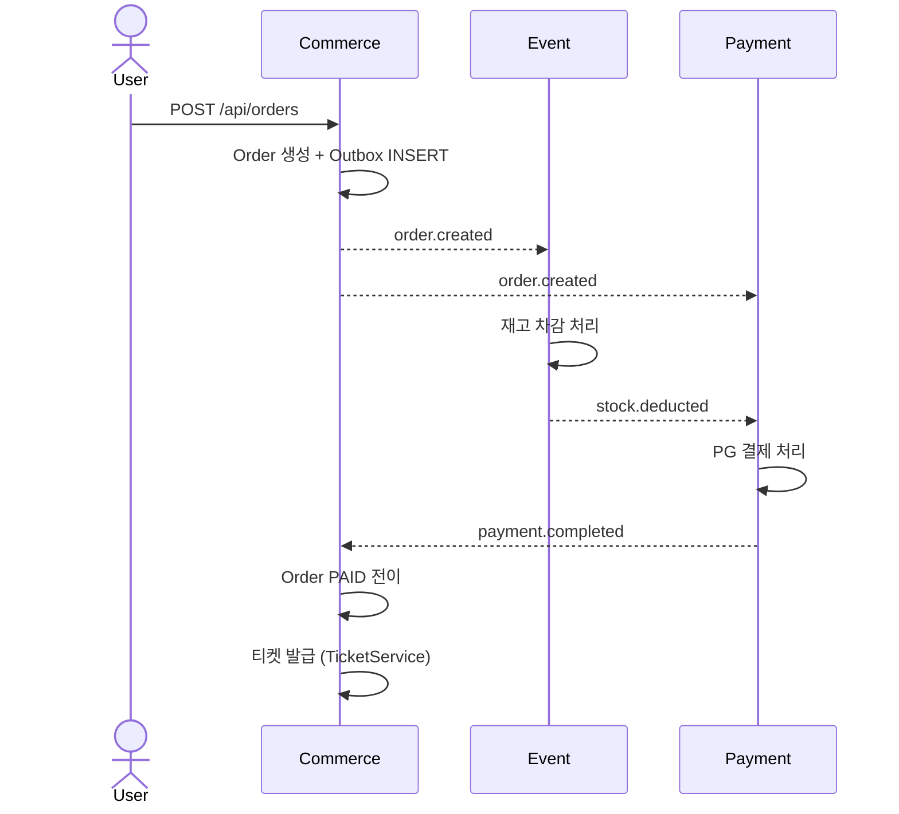
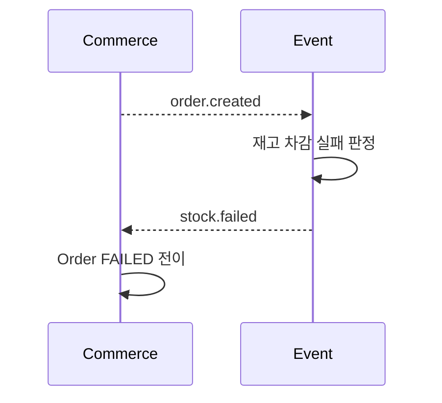
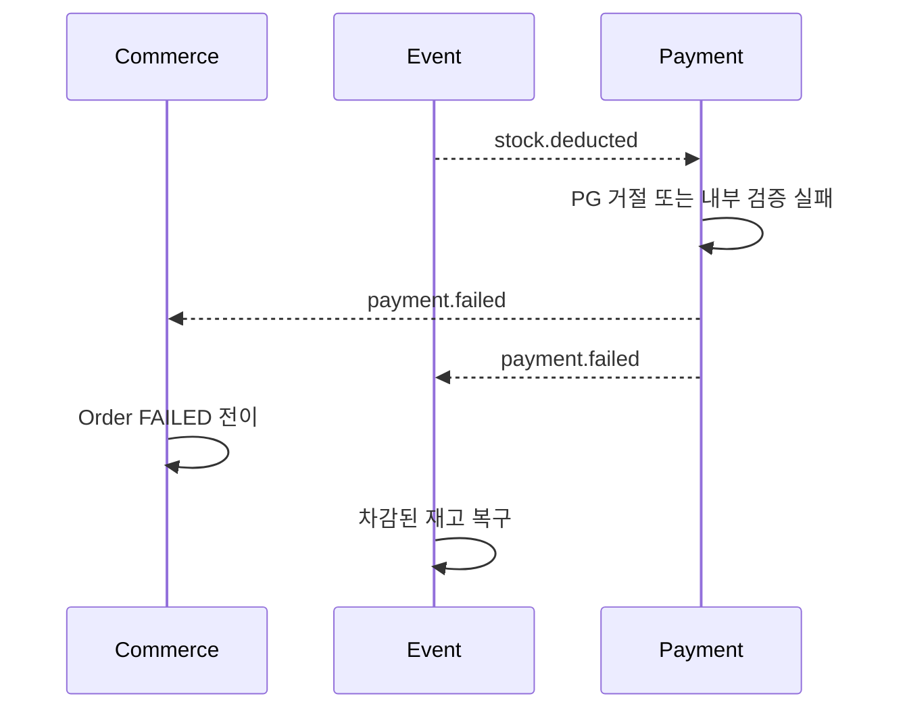
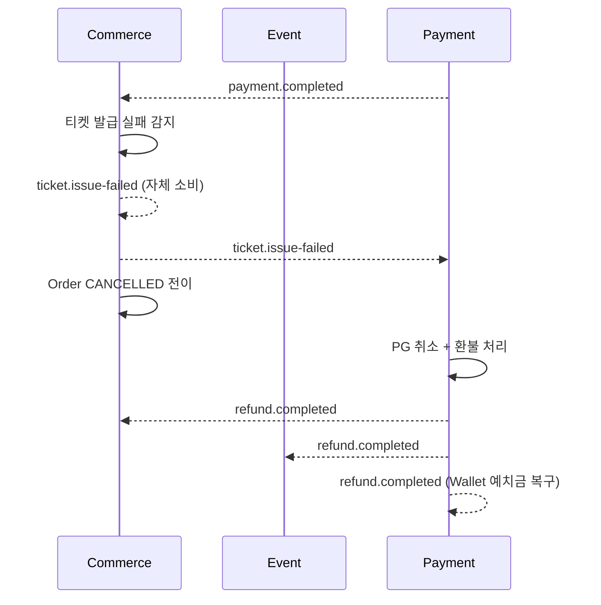
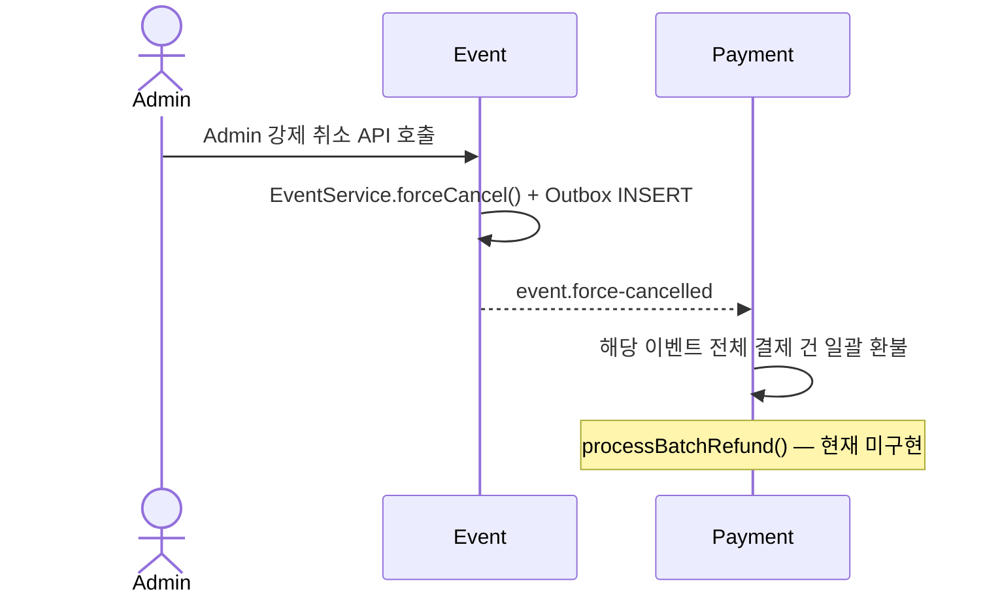
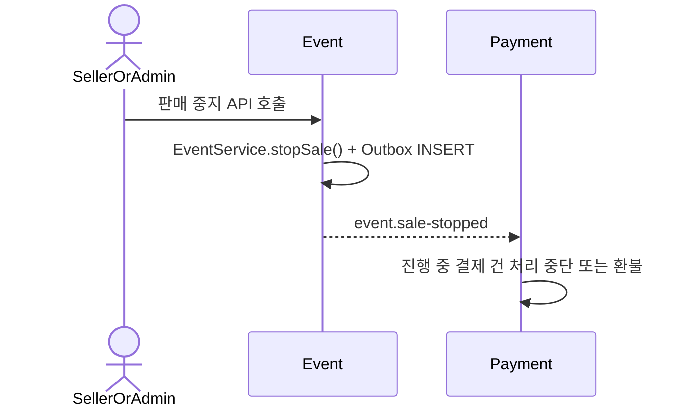

# DevTicket Kafka 구현 계획

> 최종 업데이트: 2026-04-13
> 목적: PO 기준 문서 — 이 파일을 기준으로 /docs 내 다른 문서를 수정할 것
> 원본 참조: kafka-design.md / kafka-idempotency-guide.md

---

## 섹션 1 — 이벤트 전체 매트릭스 (조감도)

Kafka를 통해 서비스 간에 오가는 모든 이벤트를 한 눈에 확인하는 테이블입니다.
구현 상태는 kafka-design.md §11 멱등성 케이스별 결정사항 및 §12 서비스별 구현 체크리스트 기준입니다.

| 이벤트 토픽 | Producer 서비스 | Consumer 서비스 | 트리거 조건 | DLT 여부 | 구현 상태 |
|------------|----------------|----------------|-----------|---------|---------|
| `order.created` | Commerce | Event, Payment | 주문 생성 + Outbox INSERT 커밋 시 | `order.created.DLT` | 🚧 진행중 |
| `stock.deducted` | Event | Payment | `order.created` 수신 후 재고 차감 성공 시 | `stock.deducted.DLT` | ⬜ 미구현 |
| `stock.failed` | Event | Commerce | `order.created` 수신 후 재고 부족 판정 시 | `stock.failed.DLT` | ⬜ 미구현 |
| `payment.completed` | Payment | Commerce | PG 승인 성공 + 내부 상태 반영 커밋 시 | `payment.completed.DLT` | 🚧 진행중 |
| `payment.failed` | Payment | Commerce, Event | PG 승인 실패 또는 내부 검증 실패 시 | `payment.failed.DLT` | 🚧 진행중 |
| `ticket.issue-failed` | Commerce | Commerce, Payment | 결제 성공 후 티켓 발급 실패 감지 시 | `ticket.issue-failed.DLT` | ⬜ 미구현 |
| `refund.completed` | Payment | Commerce, Event, Payment | PG 취소 완료 + 내부 환불 상태 반영 커밋 시 | `refund.completed.DLT` | 🚧 진행중 |
| `event.force-cancelled` | Event | Payment | Admin 강제 취소 API 호출 시 | `event.force-cancelled.DLT` | ⬜ 미구현 |
| `event.sale-stopped` | Event | Payment | Admin/Seller 판매 중지 API 호출 시 | `event.sale-stopped.DLT` | ⬜ 미구현 |

**구현 상태 범례**

| 기호 | 의미 |
|------|------|
| ✅ 완료 | 코드 구현 및 멱등성·Outbox 패턴 완전 적용 |
| 🚧 진행중 | 기본 코드는 있으나 멱등성 가드, Outbox 보완, DLT 설정 미완 |
| ⬜ 미구현 | 해당 Consumer/Producer 코드 자체가 없거나 아직 착수 전 |

> 상세: kafka-design.md §1 서비스별 Kafka 역할 / §2 토픽 목록 참조

---

## 섹션 2 — Saga 플로우

각 이벤트가 어떤 순서로 서비스 간에 흐르는지 다이어그램으로 표현합니다.
정상 흐름과 각 실패 분기, 그리고 운영 취소 이벤트를 별도로 구분합니다.

### 2-1. 정상 흐름 (Happy Path)

### 2-2. 보상 흐름 — 재고 부족

### 2-3. 보상 흐름 — 결제 실패

### 2-4. 보상 흐름 — 티켓 발급 실패

### 2-5. 운영 취소 이벤트 — event.force-cancelled

### 2-6. 운영 취소 이벤트 — event.sale-stopped

> 상세: kafka-design.md §9 Saga 플로우 참조

---

## 섹션 3 — 서비스별 구현 체크리스트

각 서비스가 Kafka 연동을 위해 완료해야 하는 구현 항목입니다.
미체크 항목은 Kafka 통합 테스트 진행 전에 완료되어야 합니다.

> **모든 Consumer 공통 처리 순서 (반드시 준수)**
> `isDuplicate()` → `canTransitionTo()` → 비즈니스 로직 → `markProcessed()` → `ack.acknowledge()`
> `markProcessed()`는 비즈니스 로직과 반드시 같은 `@Transactional` 경계 안에 위치해야 한다 — 상세: kafka-idempotency-guide.md §4

### 3-1. Payment (기존 구현 수정)

**기반 인프라**
- [ ] `JacksonConfig`: 기존 설정 검토 — `JavaTimeModule`, `WRITE_DATES_AS_TIMESTAMPS=false` 적용 여부 확인 (전 서비스 공통 필수)

**Outbox / 스케줄러**
- [ ] `Outbox`: `aggregate_id` → UUID(비즈니스 키), `next_retry_at` 컬럼 추가 (DB 마이그레이션 필요)
- [ ] `OutboxRepository`: 스케줄러 쿼리에 `next_retry_at <= now()` 조건 추가
- [ ] `OutboxScheduler`: ShedLock 적용 (분산 환경 중복 실행 방지), 지수 백오프 재시도 간격 반영 (6회, 즉시→1→2→4→8→16초, 총 최대 31초 — 상세: kafka-design.md §4)
- [ ] Outbox 발행 시 Partition Key 설정 — `payment.completed` / `payment.failed` / `refund.completed` 모두 `orderId`를 Key로 지정 (상세: kafka-design.md §6)

**Consumer 멱등성**
- [ ] `KafkaConsumerConfig`: FixedBackOff → ExponentialBackOff(3회, 2→4→8초) 변경
- [ ] `WalletEventConsumer`: groupId를 `payment-refund.completed`, `payment-event.force-cancelled` 로 수정
- [ ] `WalletEventConsumer`: `markProcessed()` 위치를 `walletService` 트랜잭션 내부로 이동
- [ ] `ProcessedMessage`: `topic VARCHAR(128)` 컬럼 추가

**이벤트 DTO** *(현재 코드 타입 불일치 — 역직렬화 실패 유발)*
- [ ] `PaymentCompletedEvent`: 필드 타입 수정 — `userId` / `paymentId` String→UUID, `paymentMethod` String→enum, `timestamp` LocalDateTime→Instant
- [ ] `RefundCompletedEvent`: 필드 타입 수정 — `refundId` / `userId` / `paymentId` String→UUID, `paymentMethod` String→enum, `timestamp` LocalDateTime→Instant
- [ ] `EventCancelledEvent`: 구조 전환 — `@Getter class` → `record`, `eventId` / `sellerId` / `adminId` Long→UUID, `timestamp` LocalDateTime→Instant

**미구현 비즈니스 로직**
- [ ] `WalletServiceImpl.processWalletPayment()`: 결제 완료 후 `commerceInternalClient.completePayment()` 호출 추가 — 현재 Wallet 결제 시 Order가 `PAYMENT_PENDING` → `PAID` 전이되지 않음
- [ ] `WalletEventConsumer.consumeEventCancelled()`: 이벤트 강제 취소 시 일괄 환불 (`walletService.processBatchRefund()`) — 현재 주석 처리 상태, Refund 모듈 완성 후 처리

**도메인 안전장치**
- [ ] Payment 엔티티 `approve()` / `fail()` / `cancel()` / `refund()` 메서드에 `canTransitionTo()` 상태 검증 가드 추가
- [ ] Payment / Order 엔티티 낙관적 락 (`@Version`) 적용
- [ ] Consumer 순서 역전 3분류 처리 구현 — ①이미 목표 상태(멱등 스킵+ACK) ②설명 가능한 역전(정책적 스킵+ACK) ③설명 불가능한 상태(throw→재시도→DLT) — 상세: kafka-design.md §5
- [ ] Outbox 스케줄러와 Consumer 동시 처리 충돌 방지 — `@Version` 낙관적 락 + 상태 전이 검증 양쪽 적용 (상세: kafka-design.md §11 Case 9)

> 상세: kafka-design.md §12 Payment 체크리스트 참조

### 3-2. Commerce (신규 적용)

**기반 인프라**
- [ ] `JacksonConfig` 추가 (JavaTimeModule + WRITE_DATES_AS_TIMESTAMPS=false)
- [ ] `KafkaTopics` 상수 클래스에 Commerce 발행 토픽 추가 — `order.created`, `ticket.issue-failed` (현재 Payment 서비스 KafkaTopics에 미포함)

**이벤트 DTO** *(신규 생성 — 현재 코드에 없음)*
- [ ] `OrderCreatedEvent` record 신규 생성 — `orderId(UUID)`, `userId(UUID)`, `eventId(UUID)`, `quantity(int)`, `totalAmount(int)`, `timestamp(Instant)`
- [ ] `TicketIssueFailedEvent` record 신규 생성 — `orderId(UUID)`, `userId(UUID)`, `eventId(UUID)`, `paymentId(UUID)`, `quantity(int)`, `totalAmount(int)`, `reason(String)`, `timestamp(Instant)`

**Outbox 패턴**
- [ ] Outbox 패턴 구현 — 비즈니스 로직 + `outboxService.save()` 반드시 단일 `@Transactional` 경계 안에 위치
- [ ] `OutboxScheduler` ShedLock 적용 (6회, 즉시→1→2→4→8→16초, 총 최대 31초 — 상세: kafka-design.md §4)
- [ ] Outbox 발행 시 Partition Key 설정 — `order.created` / `ticket.issue-failed` → `orderId` (상세: kafka-design.md §6)
- [ ] `OrderService.createOrderByCart()` 내 동기 HTTP 재고 차감 코드(`orderToEventClient.adjustStocks()`) 제거 — Kafka 전환 후 Event Consumer가 담당하므로 중복 차감 방지 필수

**Consumer 멱등성**
- [ ] `MessageDeduplicationService` 구현 + `processed_message` 테이블 생성
- [ ] 모든 Consumer에 dedup 패턴 적용 (Saga 이벤트 + 보상 이벤트 포함)
  - `stock.deducted` Consumer
  - `stock.failed` Consumer
  - `payment.completed` Consumer
  - `payment.failed` Consumer
  - `ticket.issue-failed` Consumer
  - `refund.completed` Consumer

**도메인 안전장치**
- [ ] Order 엔티티 `canTransitionTo()` 상태 전이 검증 구현
- [ ] Order 엔티티 낙관적 락 (`@Version`) 적용
- [ ] Consumer 순서 역전 3분류 처리 구현 — ①이미 목표 상태(멱등 스킵+ACK) ②설명 가능한 역전(정책적 스킵+ACK) ③설명 불가능한 상태(throw→재시도→DLT) — 상세: kafka-design.md §5
- [ ] Outbox 스케줄러와 Consumer 동시 처리 충돌 방지 — `@Version` 낙관적 락 + 상태 전이 검증 양쪽 적용

> 상세: kafka-design.md §12 Commerce 체크리스트 참조

### 3-3. Event (신규 적용)

**기반 인프라**
- [ ] `JacksonConfig` 추가 (JavaTimeModule + WRITE_DATES_AS_TIMESTAMPS=false)
- [ ] `KafkaTopics` 상수 클래스에 Event 발행 토픽 추가 — `stock.deducted`, `stock.failed`, `event.force-cancelled`, `event.sale-stopped` (현재 Payment 서비스 KafkaTopics에 미포함)

**이벤트 DTO** *(신규 생성 — 현재 코드에 없음)*
- [ ] `StockDeductedEvent` record 신규 생성 — `orderId(UUID)`, `eventId(UUID)`, `quantity(int)`, `timestamp(Instant)`
- [ ] `StockFailedEvent` record 신규 생성 — `orderId(UUID)`, `eventId(UUID)`, `reason(String)`, `timestamp(Instant)`

**Outbox 패턴**
- [ ] Outbox 패턴 구현 — 비즈니스 로직 + `outboxService.save()` 반드시 단일 `@Transactional` 경계 안에 위치
- [ ] `OutboxScheduler` ShedLock 적용 (6회, 즉시→1→2→4→8→16초, 총 최대 31초 — 상세: kafka-design.md §4)
- [ ] Outbox 발행 시 Partition Key 설정 — `stock.deducted` / `stock.failed` → `orderId`, `event.force-cancelled` / `event.sale-stopped` → `eventId` (상세: kafka-design.md §6)

**Consumer 멱등성**
- [ ] `MessageDeduplicationService` 구현 + `processed_message` 테이블 생성
- [ ] 모든 Consumer에 dedup 패턴 적용 (Saga 이벤트 + 보상 이벤트 포함)
  - `order.created` Consumer
  - `payment.failed` Consumer (재고 복구)
  - `refund.completed` Consumer
- [ ] 벌크 처리(`adjustStockBulk` 등) 시 예외 삼키기 금지 — 전체 성공/전체 실패 원칙, 하나라도 실패 시 전체 롤백 (상세: kafka-idempotency-guide.md §7)

**Stock 상태 관리**
- [ ] `StockStatus` enum 신규 추가 (`DEDUCTED` → `RESTORED`)
- [ ] Stock 엔티티 `canTransitionTo()` 상태 전이 검증 구현
- [ ] Stock 엔티티 낙관적 락 (`@Version`) 적용
- [ ] Consumer 순서 역전 3분류 처리 구현 — ①이미 목표 상태(멱등 스킵+ACK) ②설명 가능한 역전(정책적 스킵+ACK) ③설명 불가능한 상태(throw→재시도→DLT) — 상세: kafka-design.md §5
- [ ] Outbox 스케줄러와 Consumer 동시 처리 충돌 방지 — `@Version` 낙관적 락 + 상태 전이 검증 양쪽 적용

> 상세: kafka-design.md §12 Event 체크리스트 / §5 Stock 상태 전이 표 참조

---

## 섹션 4 — 미결 사항 (⚠️ 결정 필요)

팀 합의 또는 구현 결정이 필요한 항목입니다. 해결되기 전까지 해당 기능의 구현을 시작하지 않아야 합니다.

### ⚠️ [Commerce] Order의 REFUND_PENDING / REFUNDED 상태 사용 여부

`OrderStatus`에 `REFUND_PENDING`과 `REFUNDED`가 선언되어 있으나 현재 코드 어디서도 사용되지 않습니다.
환불 흐름 구현 전에 아래 두 옵션 중 하나를 팀이 결정해야 합니다.

| 옵션 | 내용 | 영향 범위 |
|------|------|----------|
| Order 상태로 추적 | `PAID → REFUND_PENDING → REFUNDED` 전이 추가, `canTransitionTo()` 반영 | Commerce, api-overview.md (Internal API 응답 상태값) |
| Order 상태 미사용 | 환불은 Payment/Refund 도메인에서만 관리, Order에서 두 상태 제거 | Commerce, dto-overview.md (OrderStatus enum 정리) |

### ⚠️ [Payment] event.force-cancelled 수신 시 일괄 환불 구현 범위

`WalletEventConsumer.consumeEventCancelled()`의 `walletService.processBatchRefund()` 호출이 현재 주석 처리 상태입니다.
Refund 모듈이 완성된 이후 구현 예정이나, 아래를 미리 결정해야 합니다.

- PG 결제 건과 Wallet 결제 건의 일괄 환불 처리 방식 통일 여부
- `refund.completed` 발행 주체 및 시점 (건별 발행 vs 배치 완료 후 1회 발행)

**관련 서비스:** `[Payment]`, `[Commerce]`

### ⚠️ [전 서비스] DLT 알림 채널 미결정

현재 DLT에 메시지가 쌓이면 `log.error` 임시 처리만 존재합니다.
DLT 도달 = 처리 못 한 주문/결제/재고가 존재한다는 의미이므로 운영팀 즉시 인지가 필요합니다.

- Slack, PagerDuty 등 알림 채널 선택 후 `DefaultErrorHandler` DLT 핸들러 교체 필요

**관련 서비스:** `[Commerce]`, `[Event]`, `[Payment]`

### ⚠️ [전 서비스] DLT 재처리 Admin API 미구현

DLT에 쌓인 메시지를 원본 토픽으로 다시 넣는 Admin API가 없습니다.
구현 시 반드시 원본 `X-Message-Id` 헤더를 그대로 보존해야 합니다 (새 UUID 생성 시 중복 처리 위험).

**관련 서비스:** `[Commerce]`, `[Event]`, `[Payment]`

> 상세: kafka-design.md §10 DLT 전략 / kafka-idempotency-guide.md §8 Retry+DLT 정책 참조

---

## 섹션 5 — /docs 싱크 포인트

Kafka 설계 및 구현 내용이 다른 문서에 아직 반영되지 않은 항목을 정리합니다.
이 문서를 기준으로 아래 파일들을 수정하면 /docs 전체가 동기화됩니다.

| 이 문서의 항목 | 수정 대상 파일 | 반영 내용 | 우선순위 |
|--------------|--------------|----------|---------|
| Kafka Consumer가 주문 상태를 직접 전이시킴 (payment.completed → PAID, payment.failed → FAILED 등) | `api-overview.md` | Commerce Internal API 표에 Kafka 트리거 주석 추가 — `/internal/orders/{orderId}/payment-completed`, `/internal/orders/{orderId}/payment-failed`가 Payment Consumer에서 호출됨을 명시 | 높음 |
| `WalletServiceImpl.processWalletPayment()`에서 `commerceInternalClient.completePayment()` 미호출 | `api-overview.md` | Commerce Internal API `POST /internal/orders/{orderId}/payment-completed` 항목에 "Wallet 결제 경로에서 미호출" 미결 사항 추가 | 높음 |
| Payment 이벤트 DTO 타입 수정 및 신규 DTO 추가 (`PaymentCompletedEvent` 등 String→UUID/Instant, `OrderCreatedEvent` 등 신규) | `dto-overview.md` | 이벤트 DTO 섹션 신규 추가 또는 수정 — `PaymentCompletedEvent`, `RefundCompletedEvent`, `EventCancelledEvent`(타입 수정), `OrderCreatedEvent`, `StockDeductedEvent`, `StockFailedEvent`, `TicketIssueFailedEvent`(신규) 필드 목록 | 높음 |
| `StockStatus` enum 신규 추가 예정 (`DEDUCTED`, `RESTORED`) | `dto-overview.md` | Event 서비스 enum 섹션에 `StockStatus` 추가 (현재 미존재) | 중간 |
| `OrderStatus`의 `REFUND_PENDING` / `REFUNDED` 사용 여부 미결 | `dto-overview.md` | `OrderStatus` enum 항목에 "⚠️ 사용 여부 미결" 표기 추가 | 중간 |
| Payment 서비스에 `processRefund()`, `confirmPayment()`, `processBatchRefund()` Kafka 연동 예정 | `service-status.md` | `PaymentServiceImpl`, `RefundServiceImpl`, `WalletServiceImpl` 항목에 Kafka Consumer/Producer 역할 및 구현 상태 추가 — 현재 service-status.md는 Kafka 연동 내용 전혀 없음 | 중간 |
| Commerce·Event 서비스 전체가 Kafka 신규 적용 대상 | `service-status.md` | Commerce, Event 서비스 섹션 신규 추가 — 현재 service-status.md에 해당 서비스 미등재. Outbox 패턴, Consumer 메서드(deductStock, processOrderCreated 등) 구현 현황 반영 필요 | 낮음 |
| Outbox 스케줄러 FAILED 레코드 수동 재발행 Admin API 이번 스코프 포함 | `api-overview.md` | Admin Internal API 표에 `PATCH /internal/outbox/{messageId}/retry` (또는 유사 경로) 항목 추가 — 현재 미기재 | 낮음 |
