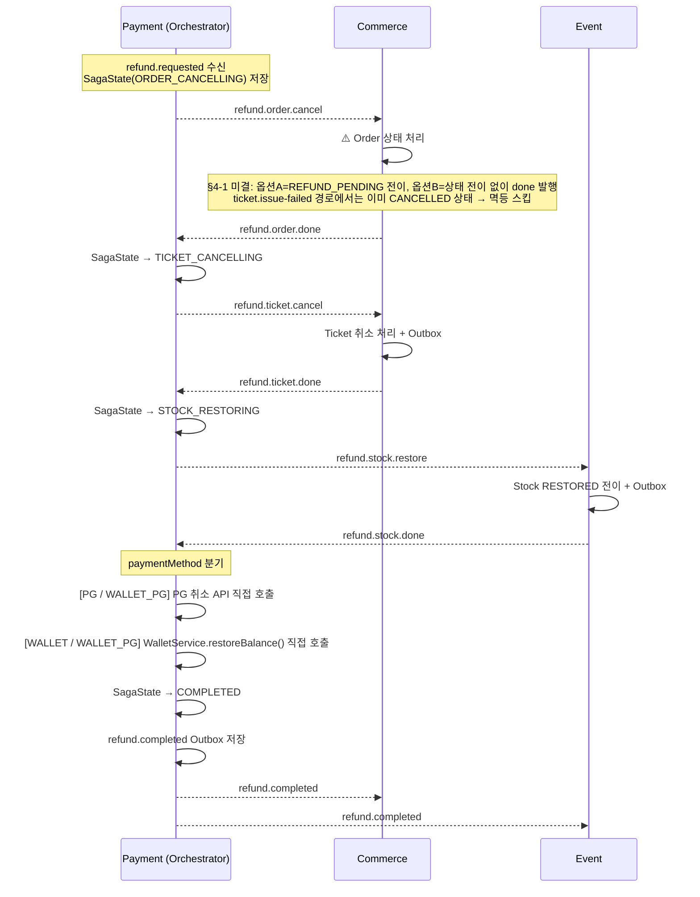

# DevTicket Kafka 설계 문서

> 최종 업데이트: 2026-04-16  
> 브랜치: feat/payment-kafka

---

## 공통 원칙

> 이 문서는 서비스 간 Kafka 통신 계약입니다.
> **내용 변경 시 관련 서비스 팀 전원 리뷰 및 합의 필수.**

### 팀 단위 설계 합의 필수

Kafka는 서비스 간 통신이므로 아래 항목은 반드시 팀 합의 후 결정한다.

| 항목 | 이유 |
|------|------|
| 이벤트 DTO 필드명·타입 | 변경 시 Consumer 역직렬화 실패 → 장애 |
| 토픽명 | 변경 시 Consumer가 메시지를 못 받음 |
| groupId | 중복 시 메시지 분산 수신 → 일부 누락 |
| 상태 전이 조건 | 서비스마다 다르게 구현하면 데이터 불일치 |
| 보상 이벤트 트리거 조건 | 보상 범위가 서비스마다 달라지면 복구 불완전 |

**이 문서가 합의 기록이다. 구현 전 반드시 확인할 것.**

### 코드 컨벤션 / 리뷰 기준 참조

Kafka 관련 코드의 **계층 배치·네이밍·Lombok·테스트·보안·PR 리뷰 접두사**는 레포 루트 `AGENTS.md` 기준.

| 영역 | AGENTS.md 섹션 |
|---|---|
| 계층 배치 (`presentation.consumer` / `infrastructure.messaging`) | §2.1~2.2 |
| Consumer/Producer 네이밍 (`*Consumer`, `*Producer`, `*EventPublisher`) | §3.1 |
| Lombok 규칙, `@Enumerated(STRING)`, Entity 정적 팩토리 | §3.3, §4.3 |
| 민감정보 로그 금지, SQL 인젝션 방지 | §7, §10.4 |
| 테스트 네이밍/구조 (Given-When-Then) | §8 |
| PR 리뷰 심각도 접두사 (🚨 / ⚠️ / 💡 / ❓) | §12 |
| Enum 값 정의 일관성 | §11 |

> **충돌 시 우선순위:** 이벤트 계약·토픽·Saga·멱등성 = 본 문서 / 코드 컨벤션 = `AGENTS.md`

### 상위 원칙 — Sync vs Async 경계

본 문서가 규정하는 Producer/Consumer 설정(§6), Outbox 패턴(§4), `action.log` 예외(§6)는 **통신 경계 3분류**(1-A Sync HTTP / 1-B Kafka + Outbox / 1-C Kafka fire-and-forget)의 구체 구현이다. 신규 기능 설계 시 어느 분류로 갈지에 대한 **의사결정 기준**과 분류별 설정 요약은 `kafka-sync-async-policy.md` 참조.

---

## 목차

1. [서비스별 Kafka 역할](#1-서비스별-kafka-역할)
2. [토픽 목록](#2-토픽-목록)
3. [이벤트 DTO 계약](#3-이벤트-dto-계약)
4. [Outbox 패턴](#4-outbox-패턴)
5. [Consumer 멱등성 설계](#5-consumer-멱등성-설계)
6. [Producer 설정](#6-producer-설정)
7. [Consumer 설정](#7-consumer-설정)
8. [락 전략](#8-락-전략)
9. [Saga 플로우](#9-saga-플로우)
10. [DLT 전략](#10-dlt-전략)
11. [멱등성 케이스별 결정사항](#11-멱등성-케이스별-결정사항)
12. [서비스별 구현 체크리스트](#12-서비스별-구현-체크리스트)

---

## 1. 서비스별 Kafka 역할

| 서비스 | Producer (발행) | Consumer (소비) |
|---|---|---|
| Commerce | `order.created`, `ticket.issue-failed`, `refund.requested` (fan-out), `refund.order.done`, `refund.order.failed`, `refund.ticket.done`, `refund.ticket.failed`, `action.log` (CART_ADD / CART_REMOVE) | `stock.deducted`, `stock.failed`, `payment.completed`, `payment.failed`, `ticket.issue-failed`, `refund.completed`, `event.force-cancelled`, `refund.order.cancel`, `refund.ticket.cancel`, `refund.order.compensate`, `refund.ticket.compensate` |
| Event | `stock.deducted`, `stock.failed`, `event.force-cancelled`, `event.sale-stopped`, `refund.stock.done`, `refund.stock.failed`, `action.log` (VIEW / DETAIL_VIEW / DWELL_TIME) | `order.created`, `payment.failed`, `refund.completed`, `refund.stock.restore` |
| Payment (Orchestrator 포함) | `payment.completed`, `payment.failed`, `refund.completed`, `refund.order.cancel`, `refund.ticket.cancel`, `refund.stock.restore`, `refund.order.compensate`, `refund.ticket.compensate` | `refund.completed` (예치금 복구), `ticket.issue-failed`, `event.force-cancelled`, `event.sale-stopped`, `refund.requested`, `refund.order.done`, `refund.order.failed`, `refund.ticket.done`, `refund.ticket.failed`, `refund.stock.done`, `refund.stock.failed` |
| **Log** (별도 스택 — Fastify/TS, 상세: [actionLog.md](actionLog.md)) | — (Kafka 재발행 없음, DB INSERT 전용) | `action.log`, `payment.completed` (PURCHASE 직접 INSERT) |

### Producer 발행 시점

> **`order.created` / `stock.deducted` / `stock.failed` — 활성 흐름 외 (REST 전환됨)**
> 본 표는 초기 Kafka choreography 설계 기준. 현재 주문 생성 → 재고 차감 흐름은 **`OrderService.createOrderByCart` 내부의 동기 REST(`OrderToEventClient.adjustStocks` → `PATCH /internal/events/stock-adjustments`)** 로 동작합니다 (`OrderService.java:116-117`, `Order.createPending` 으로 곧장 `PAYMENT_PENDING` 진입). 따라서 아래 3개 토픽은 `KafkaTopics` 상수와 빈 Producer/Consumer 코드는 잔존하나 활성 발행 호출자 없음. 토픽 폐지 vs 부활 여부는 별도 트랙. 이하 다른 토픽들은 정상 활성.

| 토픽 | Producer 서비스 | 발행 위치 (메서드) | 트리거 조건 |
|------|----------------|-------------------|-----------|
| ~~`order.created`~~ ⚠️ 비활성 | ~~Commerce~~ | ~~`OrderService.createOrder()`~~ | REST 동기 차감으로 전환 — 발행 호출자 없음 |
| ~~`stock.deducted`~~ ⚠️ 비활성 | ~~Event~~ | ~~`StockService.deductStock()`~~ | `order.created` 미수신 — 동기 REST 응답으로 대체 |
| ~~`stock.failed`~~ ⚠️ 비활성 | ~~Event~~ | ~~`StockService.deductStock()`~~ | 동일 |
| `payment.completed` | Payment | `PaymentService.confirmPayment()` | PG 승인 성공 + 내부 상태 반영 커밋 시 |
| `payment.failed` | Payment | `PaymentService.confirmPayment()` | PG 승인 실패 또는 내부 검증 실패 시 |
| `ticket.issue-failed` | Commerce | `TicketService.issueTicket()` | 결제 성공 후 티켓 발급 실패 감지 시 |
| `refund.completed` | Payment (Orchestrator) | `RefundSagaOrchestrator.completeRefund()` | Saga 마지막 단계 완료 후 Outbox 발행 |
| `event.force-cancelled` | Event | `EventService.forceCancel()` | Admin 강제 취소 API 호출 시 |
| `event.sale-stopped` | Event | `EventService.stopSale()` | Admin/Seller 판매 중지 API 호출 시 |
| `refund.requested` | Commerce | `RefundFanoutService.fanout()` | `event.force-cancelled` 수신 → 대상 orderId별 fan-out 발행 |
| `refund.order.cancel` | Payment (Orchestrator) | `RefundSagaOrchestrator.start()` / `onTicketFailed()` | Saga 시작 또는 Ticket 취소 실패 보상 시 |
| `refund.ticket.cancel` | Payment (Orchestrator) | `RefundSagaOrchestrator.onOrderDone()` | Order 취소 완료 수신 시 |
| `refund.stock.restore` | Payment (Orchestrator) | `RefundSagaOrchestrator.onTicketDone()` | Ticket 취소 완료 수신 시 |
| `refund.order.compensate` | Payment (Orchestrator) | `RefundSagaOrchestrator.onTicketFailed()` | Ticket 취소 실패 → Order 롤백 시 |
| `refund.ticket.compensate` | Payment (Orchestrator) | `RefundSagaOrchestrator.onStockFailed()` | Stock 복구 실패 → Ticket 롤백 시 |
| `refund.order.done` / `refund.order.failed` | Commerce | `OrderRefundConsumer` | Order 취소 처리 성공/실패 시 |
| `refund.ticket.done` / `refund.ticket.failed` | Commerce | `TicketRefundConsumer` | Ticket 취소 처리 성공/실패 시 |
| `refund.stock.done` / `refund.stock.failed` | Event | `StockRestoreConsumer` | Stock 복구 처리 성공/실패 시 |
| `action.log` (VIEW) | Event | 이벤트 목록 조회 API 핸들러 | API 호출 시 (트랜잭션 경계 밖 비동기 발행, `acks=0`) |
| `action.log` (DETAIL_VIEW) | Event | 이벤트 상세 조회 API 핸들러 | API 호출 시 (동일 정책) |
| `action.log` (DWELL_TIME) | Event | 프론트 이탈 API 핸들러 | API 호출 시 (동일 정책, `dwellTimeSeconds` 포함) |
| `action.log` (CART_ADD) | Commerce | 장바구니 담기 API 핸들러 | API 호출 시 (동일 정책) |
| `action.log` (CART_REMOVE) | Commerce | 장바구니 삭제 API 핸들러 | API 호출 시 (동일 정책) |
| `action.log` (PURCHASE) | **Log 서비스 자체 Consumer** | `payment.completed` 수신 → **Kafka 재발행 없이 `log.action_log`에 직접 INSERT** | 상세: [actionLog.md](actionLog.md) §3 |

> 위 메서드명은 설계 기준이며, 구현 시 네이밍이 달라질 수 있음.
> 핵심은 **비즈니스 로직 + Outbox INSERT가 단일 `@Transactional` 안에 있어야 한다**는 것.
> 예외: `action.log`는 Outbox 미사용·`acks=0` — §6 Producer 설정 참조.

---

## 2. 토픽 목록

```java
// KafkaTopics.java
public final class KafkaTopics {

    // Saga 흐름
    public static final String ORDER_CREATED         = "order.created";
    public static final String STOCK_DEDUCTED        = "stock.deducted";
    public static final String STOCK_FAILED          = "stock.failed";
    public static final String PAYMENT_COMPLETED     = "payment.completed";
    public static final String PAYMENT_FAILED        = "payment.failed";
    public static final String TICKET_ISSUE_FAILED   = "ticket.issue-failed";

    // 환불 (Orchestrator)
    public static final String REFUND_COMPLETED      = "refund.completed";

    // 이벤트 관리
    public static final String EVENT_FORCE_CANCELLED = "event.force-cancelled";
    public static final String EVENT_SALE_STOPPED    = "event.sale-stopped";

    // 환불 Orchestration (Refund Saga) — Payment Orchestrator 전용
    public static final String REFUND_REQUESTED          = "refund.requested";
    public static final String REFUND_ORDER_CANCEL       = "refund.order.cancel";
    public static final String REFUND_ORDER_DONE         = "refund.order.done";
    public static final String REFUND_ORDER_FAILED       = "refund.order.failed";
    public static final String REFUND_TICKET_CANCEL      = "refund.ticket.cancel";
    public static final String REFUND_TICKET_DONE        = "refund.ticket.done";
    public static final String REFUND_TICKET_FAILED      = "refund.ticket.failed";
    public static final String REFUND_STOCK_RESTORE      = "refund.stock.restore";
    public static final String REFUND_STOCK_DONE         = "refund.stock.done";
    public static final String REFUND_STOCK_FAILED       = "refund.stock.failed";
    public static final String REFUND_ORDER_COMPENSATE   = "refund.order.compensate";
    public static final String REFUND_TICKET_COMPENSATE  = "refund.ticket.compensate";

    // 행동 로그 (analytics — acks=0, Outbox 미사용, DLT 없음)
    public static final String ACTION_LOG                = "action.log";

    // -- 이번 스코프 제외 (추후 논의 예정) --
    // public static final String MEMBER_SUSPENDED = "member.suspended";

}
```

---

## 3. 이벤트 DTO 계약

### 공통 원칙

- 모든 ID 필드: `UUID` 타입 통일 (String/Long 사용 금지)
- 모든 timestamp 필드: `Instant` 타입 통일 (LocalDateTime 사용 금지)
- enum 필드: String 대신 Java enum 타입 사용
- 직렬화: `JacksonConfig` — `JavaTimeModule` + `WRITE_DATES_AS_TIMESTAMPS=false` + `FAIL_ON_UNKNOWN_PROPERTIES=false` 적용
  - **모든 서비스(Commerce, Event, Payment, Member, Admin, Settlement)에 JacksonConfig 추가 필요**
  - **`objectMapper` Bean에 `@Primary` 부여 의무** — 향후 Kafka Producer Bean 복수 등록(예: `actionLogKafkaTemplate`) 등으로 `ObjectMapper` 추가 Bean이 등장할 경우 `NoUniqueBeanDefinitionException` 예방. 현재 Event만 `@Primary` 부여 상태(Commerce·Payment 미부착) → **전 서비스 통일 대상**. 별도 리팩터링 트랙을 신설하지 말고, 각 서비스에서 **`ObjectMapper`를 주입받는 신규 Bean이 추가되는 PR에 동반 부여** 권장 (예: Commerce·Payment의 action.log Producer PR 내 1줄 수정)
- **`@JsonIgnoreProperties(ignoreUnknown = true)` 모든 이벤트 DTO record에 명시 의무** — 상류 Producer가 필드 확장할 경우 Consumer 배포 지연 시 DLT 적재를 막기 위한 **이중 방어**. 전역 `JacksonConfig` 단일 의존은 설정 변경·리팩토링 실수에 취약하므로, 개별 record(부모 + nested record 모두)에도 어노테이션을 붙여 forward-compatible 계약을 코드 자체에 선언한다. 발행 측(Producer)·수신 측(Consumer) DTO 복사본 양쪽 동일 원칙.

### OrderCreatedEvent

```java
public record OrderCreatedEvent(
    UUID orderId,
    UUID userId,
    List<OrderItem> orderItems,   // 리스트 — 다중 이벤트 티켓 지원
    int totalAmount,
    Instant timestamp
) {
    public record OrderItem(
        UUID eventId,
        int quantity
    ) {}
}
```

### PaymentCompletedEvent

```java
public record PaymentCompletedEvent(
    UUID orderId,
    UUID userId,
    UUID paymentId,
    PaymentMethod paymentMethod,   // enum: WALLET | PG | WALLET_PG
    int totalAmount,
    List<OrderItem> orderItems,    // PURCHASE 레코드 fan-out 키 (Log 서비스 PURCHASE INSERT 용)
    Instant timestamp
) {
    public record OrderItem(
        UUID eventId,
        int quantity
    ) {}
}
```

> **호환성 주의** — `orderItems` 필드는 Log 서비스의 `action_log.PURCHASE` 직접 INSERT 정책(actionLog.md §2 #12) 지원을 위해 추가된 필드이다. Commerce / Event 등 기존 Consumer 측 DTO 복사본 동기화(`@JsonIgnoreProperties(ignoreUnknown=true)` 또는 DeserializationFeature.FAIL_ON_UNKNOWN_PROPERTIES=false)가 **Payment Producer 배포 이전에 선행**되어야 한다. 역순 배포 시 역직렬화 실패로 DLT 적재 위험.

### PaymentFailedEvent

```java
public record PaymentFailedEvent(
    UUID orderId,
    UUID userId,
    List<OrderItem> orderItems,   // 재고 복구 대상 목록
    String reason,                // reason 허용값은 아래 표 참조
    Instant timestamp
) {
    public record OrderItem(
        UUID eventId,
        int quantity
    ) {}
}
```

#### `reason` 허용값 (팀 컨벤션)

| 값 | 발행 상황 | 발행자 |
|----|----------|--------|
| `ORDER_TIMEOUT` | 주문 30분 만료 스케줄러 → `PAYMENT_PENDING` 주문을 `CANCELLED` 전이하면서 발행 | Commerce |
| `PAYMENT_DECLINED` | PG 승인 실패 | Payment |
| `VALIDATION_FAILED` | 내부 검증 실패 (금액/상태 등) | Payment |
| `PAYMENT_TIMEOUT` | 결제 PG 응답 타임아웃 | Payment |

> Consumer(Event `PaymentFailedConsumer`)는 `reason` 값으로 **로직 분기하지 않음** — 재고 복구 동작은 동일.
> `reason`은 로깅·집계·모니터링 전용.

### RefundCompletedEvent

```java
public record RefundCompletedEvent(
    UUID refundId,
    UUID orderId,
    UUID userId,
    UUID paymentId,
    PaymentMethod paymentMethod,   // enum: WALLET | PG | WALLET_PG
    int refundAmount,
    int refundRate,                // 0 | 50 | 100
    Instant timestamp
) {}
```

### EventCancelledEvent (force-cancelled / sale-stopped 공용)

```java
public record EventCancelledEvent(
    UUID eventId,
    UUID sellerId,
    CancelledBy cancelledBy,       // enum: ADMIN | SELLER
    UUID adminId,                  // nullable (cancelledBy=ADMIN 시에만)
    Instant timestamp
) {}
```

### StockDeductedEvent / StockFailedEvent

```java
public record StockDeductedEvent(
    UUID orderId,
    UUID eventId,
    int quantity,
    Instant timestamp
) {}

public record StockFailedEvent(
    UUID orderId,
    UUID eventId,
    String reason,
    Instant timestamp
) {}
```

### TicketIssueFailedEvent

```java
public record TicketIssueFailedEvent(
    UUID orderId,
    UUID userId,
    UUID eventId,
    UUID paymentId,
    int quantity,
    int totalAmount,
    String reason,
    Instant timestamp
) {}
```

### RefundRequestedEvent (환불 Saga 진입점)

```java
public record RefundRequestedEvent(
    UUID refundId,       // Saga 추적 키 — SagaState PK
    UUID orderId,
    UUID userId,
    UUID paymentId,
    PaymentMethod paymentMethod,  // enum: WALLET | PG | WALLET_PG
    int refundAmount,
    String reason,
    Instant timestamp
) {}
```

> `refundId`는 Orchestrator가 Saga 시작 전 생성 (`UUID.randomUUID()`).
> Commerce fan-out 시 각 orderId마다 새 `refundId`를 발행한다.

### RefundSagaStepEvent (Orchestrator ↔ 각 서비스 공용)

```java
// refund.order.done / refund.order.failed
// refund.ticket.done / refund.ticket.failed
// refund.stock.done / refund.stock.failed
public record RefundSagaStepEvent(
    UUID refundId,
    UUID orderId,
    boolean success,
    String reason,      // 실패 시에만 값 있음
    Instant timestamp
) {}
```

### ActionLogEvent (analytics — `action.log` 전용)

> **예외 이벤트**: 기존 비즈니스 이벤트와 달리 `acks=0` + Outbox 미사용. 단일 DTO + nullable 필드 방식. 검증은 Consumer(Log 서비스, Fastify)에서 수행.
> Consumer 측 DTO는 TypeScript interface(`fastify-log/src/model/action-log.model.ts`)로 정의되어 있으며, 아래 Java record와 **동일한 JSON 스키마**를 공유한다.

```java
public record ActionLogEvent(
    UUID userId,                     // 필수
    UUID eventId,                    // VIEW는 nullable (목록 조회 시 특정 이벤트 없음)
    ActionType actionType,           // 필수
    String searchKeyword,            // nullable — 검색어 (VIEW 시 분석용)
    String stackFilter,              // nullable — 기술스택 필터 (VIEW 시 분석용)
    Integer dwellTimeSeconds,        // nullable — DWELL_TIME 시에만
    Integer quantity,                // nullable — CART_ADD / PURCHASE 시 수량
    Long totalAmount,                // nullable — PURCHASE 시 금액
    Instant timestamp                // 필수
) {}

public enum ActionType {
    VIEW,         // 이벤트 목록 조회
    DETAIL_VIEW,  // 이벤트 상세 조회
    CART_ADD,     // 장바구니 담기
    CART_REMOVE,  // 장바구니 삭제
    PURCHASE,     // 결제 완료 (payment.completed 수신 시 Log 서비스가 직접 INSERT)
    DWELL_TIME,   // 페이지 이탈 시 체류 시간 기록
    REFUND        // 환불 (향후 환불 스코프 사전 반영 — 현 스코프 미사용)
}
```

**필드별 actionType 적용 매트릭스**

| 필드 | VIEW | DETAIL_VIEW | DWELL_TIME | CART_ADD | CART_REMOVE | PURCHASE |
|---|:-:|:-:|:-:|:-:|:-:|:-:|
| `userId` | 필수 | 필수 | 필수 | 필수 | 필수 | 필수 |
| `eventId` | nullable | 필수 | 필수 | 필수 | 필수 | 필수 |
| `searchKeyword` | 선택 | — | — | — | — | — |
| `stackFilter` | 선택 | — | — | — | — | — |
| `dwellTimeSeconds` | — | — | 필수 | — | — | — |
| `quantity` | — | — | — | 선택 | — | 선택 |
| `totalAmount` | — | — | — | — | — | 선택 |
| `timestamp` | 필수 | 필수 | 필수 | 필수 | 필수 | 필수 |

> **상세 요구사항**: [actionLog.md](actionLog.md) §3.2

---

## 4. Outbox 패턴

### 원칙

- 비즈니스 로직 + `outboxService.save()` 호출은 **반드시 단일 `@Transactional` 경계** 안에 위치
- Outbox 레코드의 `messageId`는 생성 시 `UUID.randomUUID().toString()`로 **단 한 번 고정** — 재발행 시에도 변경하지 않음 (3모듈 통일: `String(VARCHAR(36))`)
- **Outbox 스케줄러는 Kafka 발행 시 `message_id`를 Kafka 헤더(`X-Message-Id`)에 포함해야 한다**
- Consumer는 이 헤더에서 `message_id`를 추출하여 `processed_message` dedup에 사용한다
- **Commerce·Event 서비스 신규 적용 시 동일 원칙 적용 필수**
- **패키지 경로**: `{module}.common.outbox.*` (3모듈 공통 — 2026-04-22 `infrastructure.messaging` 이동 방향 번복 확정 / `infrastructure.messaging` 하위 `Outbox*` 발견 시 `common.outbox`로 되돌리는 리팩토링 대상 / 상세: `outbox_fix.md §4-C`)

### Outbox 테이블 설계

| 컬럼 | 타입 | 설명 |
|------|------|------|
| id | BIGSERIAL | PK |
| message_id | VARCHAR(36) | `UUID.randomUUID().toString()`로 생성 — Kafka 헤더 `X-Message-Id`로 전달, Consumer dedup 키로 사용 (3모듈 통일) |
| aggregate_id | VARCHAR(36) | 비즈니스 키 UUID — 운영 추적용 (orderId, paymentId 등) |
| partition_key | VARCHAR(36) | Kafka Partition Key — orderId 기준 순서 보장용 (kafka-design.md §6) |
| event_type | VARCHAR(128) | 이벤트 유형. **현 구현은 토픽명과 동일 문자열을 저장** (예: `"payment.completed"`). 추적성을 높이려면 별도 enum-style 문자열(`PAYMENT_COMPLETED` 등)로 분리하는 리팩터 고려 가능 |
| topic | VARCHAR(128) | Kafka 토픽명 |
| payload | TEXT | JSON 직렬화된 이벤트 |
| status | VARCHAR(20) | PENDING / SENT / FAILED |
| retry_count | INT | 현재 재시도 횟수 |
| next_retry_at | TIMESTAMP | 다음 재시도 시각 |
| created_at | TIMESTAMP | 생성 시각 |
| sent_at | TIMESTAMP | 발행 완료 시각 |

> `aggregate_id`(운영 추적)와 `partition_key`(Kafka 순서 보장)를 분리합니다.
>
> | 토픽 | aggregate_id | partition_key |
> |------|-------------|--------------|
> | `order.created` | orderId | orderId |
> | `payment.completed` | paymentId | orderId |
> | `payment.failed` | paymentId | orderId |
> | `refund.completed` | refundId | orderId |
> | `stock.deducted` / `stock.failed` | orderId | orderId |
> | `event.force-cancelled` / `event.sale-stopped` | eventId | eventId |
> | `refund.requested` | refundId | orderId |
> | `refund.order.cancel` / `refund.order.done` / `refund.order.failed` | refundId | orderId |
> | `refund.ticket.cancel` / `refund.ticket.done` / `refund.ticket.failed` | refundId | orderId |
> | `refund.stock.restore` / `refund.stock.done` / `refund.stock.failed` | refundId | orderId |
> | `refund.order.compensate` / `refund.ticket.compensate` | refundId | orderId |

> `event_type` 컬럼은 멱등성 자체에는 필수가 아니지만,
> 운영 중 "이 aggregate에서 어떤 이벤트가 몇 번 발행됐는지" 추적하는 데 유용합니다.
> 단, **현 구현은 이 컬럼에 토픽명 문자열을 그대로 저장**하므로 `topic` 컬럼과 값이 동일하여 추적 기능은 제한적입니다 (`OutboxService.save(...)` 호출부 전수: `PaymentServiceImpl.java:152, 237`, `WalletServiceImpl.java:375`, `WalletPgTimeoutHandler.java:58`).

### Kafka 발행 본문 구조 (`OutboxEventMessage`)

> **Outbox 기반 이벤트는 `payload` 필드(실제 이벤트 DTO JSON)를 `ProducerRecord` value에 단일 인코딩으로 발행하며, `messageId`는 Kafka 헤더 `X-Message-Id`로 분리 전달된다.**
> `OutboxEventMessage`는 **스케줄러 → `OutboxEventProducer` 전달용 VO**로, 토픽 value에 JSON 직렬화되지 않는다 (`ProducerRecord` 구성 인자 추출 용도).
> `action.log`는 Outbox 미사용이므로 래퍼 없이 `ActionLogEvent` JSON을 직접 발행 — 본 구조 적용 대상 아님.

```java
// common/outbox/OutboxEventMessage.java (Commerce 기준 — 3모듈 통일)
public record OutboxEventMessage(
    Long outboxId,          // Outbox 엔티티 PK — 상태 갱신 참조용
    String messageId,       // Kafka 헤더 X-Message-Id로 전달, Consumer dedup 키
    String topic,           // Kafka 토픽명 (ProducerRecord 구성)
    String partitionKey,    // Kafka Partition Key (ProducerRecord 구성)
    String payload          // JSON 직렬화된 실제 이벤트 DTO — 토픽 value로 직접 발행
) {
    public static OutboxEventMessage from(Outbox outbox) { ... }
}
```

**발행 포맷** (`payment.completed` 토픽)

| 구성 요소 | 값 |
|---|---|
| `ProducerRecord.topic()` | `message.topic()` (예: `"payment.completed"`) |
| `ProducerRecord.key()` | `message.partitionKey()` (예: `orderId` UUID) |
| `ProducerRecord.value()` | `message.payload()` — **실제 이벤트 DTO JSON 단일 인코딩** |
| Kafka 헤더 `X-Message-Id` | `message.messageId()` (UUID 문자열, UTF-8 bytes) |

**토픽 value 예시** (문자열 이스케이프 없음 — 실제 DTO JSON 직접 발행)

```json
{"orderId":"...","userId":"...","paymentId":"...","paymentMethod":"PG","totalAmount":50000,"orderItems":[...],"timestamp":"2026-04-21T..."}
```

**Consumer 측 역직렬화**

- 토픽 value = 실제 이벤트 DTO JSON **단일 파싱**으로 복원 (이중 래핑 없음)
- `messageId`는 **Kafka 헤더 `X-Message-Id`에서 추출** (본문 파싱 불필요) — `processed_message` dedup 키
- Java Consumer 예: `commerce/order/application/service/OrderService.java:405` `deserialize(payload, PaymentCompletedEvent.class)` (단일 파싱)
- Node.js Consumer 예: `fastify-log/src/service/payment-completed.service.ts` `unwrapOutboxPayload()` — Outbox wrapper(`{messageId, eventType, payload, timestamp}`)의 `payload` 필드(JSON 문자열)를 **단일 `JSON.parse`로 복원**. wrapper 구조가 아니면 원본 그대로 반환. consumer 진입점은 `src/consumer/action-log.consumer.ts` `dispatchMessage`가 topic 분기 후 service 호출 (1a469ce5에서 전용 consumer 파일 평탄화)
- **신규 Consumer 구현 시**: 헤더에서 `X-Message-Id` 추출 + value 단일 파싱 — 이중 래핑 파싱 금지 (역직렬화 실패로 DLT 적재 위험)

---

### Outbox 엔티티 변경사항 (기존 배포 마이그레이션)

```sql
ALTER TABLE outbox
    ADD COLUMN next_retry_at TIMESTAMP NULL;           -- 지수 백오프 기반 재시도 시각 (2^(retryCount-1)초)

-- aggregate_id: DB PK(BIGINT)가 아닌 비즈니스 키(paymentId, orderId 등) UUID 사용
ALTER TABLE outbox
    ALTER COLUMN aggregate_id TYPE VARCHAR(36) USING aggregate_id::text;  -- UUID 문자열

-- partition_key: Kafka 파티션 키 — orderId 기준 Saga 순서 보장 (aggregate_id와 다를 수 있음)
ALTER TABLE outbox
    ADD COLUMN partition_key VARCHAR(36) NOT NULL;
```

### 재시도 정책 (지수 백오프)

> 전체 토픽 단일 정책 적용 — `nextRetryAt = now + 2^(retryCount-1)초` (`Outbox.markFailed()`), `retryCount >= 6` 도달 시 FAILED
> 3개 모듈(Commerce/Event/Payment) 통일 기준. Payment의 기존 `선형 5회(retryCount*60s)` 는 본 정책으로 수렴 예정.

| 시도 | 대기 시간 (직전 실패 기준) |
|---|---|
| 1회 (최초 발행) | 즉시 |
| 2회 | 1초 |
| 3회 | 2초 |
| 4회 | 4초 |
| 5회 | 8초 |
| 6회 | 16초 |

> 6회 실패 후 `retryCount=6` 도달 시 `FAILED` 전환 (더 이상 재시도하지 않음). 총 시도 횟수 = 6회 (최초 1 + 재시도 5).

### 스케줄러 락 전략: ShedLock 채택

분산 환경에서 Outbox 스케줄러 중복 실행 방지.

```groovy
// build.gradle
implementation 'net.javacrumbs.shedlock:shedlock-spring:5.x'
implementation 'net.javacrumbs.shedlock:shedlock-provider-jdbc-template:5.x'
```

```sql
CREATE TABLE shedlock (
    name        VARCHAR(64)  NOT NULL,
    lock_until  TIMESTAMP    NOT NULL,
    locked_at   TIMESTAMP    NOT NULL,
    locked_by   VARCHAR(255) NOT NULL,
    PRIMARY KEY (name)
);
```

```java
@Scheduled(fixedDelay = 3000)
@SchedulerLock(name = "outbox-scheduler", lockAtMostFor = "5m", lockAtLeastFor = "5s")
public void publishPendingEvents() { ... }
```

> `lockAtMostFor="5m"` 산정 근거: 50건 × 건당 `.get(2s)` = 최악 100초 + DB save 오버헤드. 기존 `30s`는 최악 처리 시간보다 짧아 **처리 중 락 만료 → 타 인스턴스 재진입 → 동일 Outbox 이중 발행** 경로가 열려 있었음 (`kafka-impl-plan.md §4-18` OrderExpirationScheduler 원칙과 동일 — `lockAtMostFor < 최악 처리 시간`이면 중복 진입 가능). 안전계수 3배 적용.

### Producer 타임아웃 정합 (이중 발행 차단)

앱 측 `KafkaTemplate.send(record).get(2s)`와 Kafka Producer 내부 타임아웃을 정합시켜 **백그라운드 재시도 경로의 이중 발행**을 차단한다.

문제: `.get(2s)` 타임아웃이 터져도 Kafka Producer는 `delivery.timeout.ms`(기본 120s) 동안 백그라운드 재시도를 지속 → 앱은 `markFailed()` + `nextRetryAt=+1s` 로 스케줄러 재발행 예약 → 1초 뒤 재선택되어 재발행 → 그 사이 첫 send도 뒤늦게 성공하면 Kafka에 2회 도달 (Consumer dedup으로 business-level 중복은 커버되지만 자원 낭비 + 최후의 방어선에만 의존하는 구조).

해결: Producer 내부 타임아웃을 앱 `.get()` 타임아웃 이하로 강제.

```java
// KafkaProducerConfig
config.put(ProducerConfig.DELIVERY_TIMEOUT_MS_CONFIG, 1500); // .get(2s) 이전에 재시도 확정 종료
config.put(ProducerConfig.REQUEST_TIMEOUT_MS_CONFIG, 1000);
config.put(ProducerConfig.MAX_BLOCK_MS_CONFIG, 500);
```

- 일시 실패 시 재시도는 **Outbox 레벨 지수 백오프(§위 재시도 정책)** 가 단일 메커니즘으로 수행
- `enable.idempotence=true` 전제 유지 (`retries>=1`, `max.in.flight<=5`, `acks=all` 자동 충족)
- 3개 모듈(Commerce/Event/Payment) 공통 적용

스케줄러 쿼리: `next_retry_at < now()` 조건 추가 (경계 배제 — `nextRetryAt == now` 레코드는 다음 폴링 틱에서 픽업)

```java
// OutboxRepository
@Query("SELECT o FROM Outbox o WHERE o.status = :status " +
       "AND (o.nextRetryAt IS NULL OR o.nextRetryAt < :now) " +
       "ORDER BY o.createdAt ASC LIMIT 50")
List<Outbox> findPendingToPublish(@Param("status") OutboxStatus status,
                                  @Param("now") Instant now);
```

---

## 5. Consumer 멱등성 설계

### 방어선 구조

```
[1차] processed_message 테이블 — 동일 messageId 재수신 방어 (Kafka 재전달)
[2차] 상태 전이 검증 (canTransitionTo) — 순서 역전·경쟁 조건 방어
[3차] 낙관적 락 (@Version) — 동시 업데이트 방어
```

### processed_message 스키마

```sql
CREATE TABLE processed_message (
    id           BIGSERIAL    NOT NULL,
    message_id   VARCHAR(36)  NOT NULL,   -- Outbox message_id (Kafka 헤더 X-Message-Id에서 추출)
    topic        VARCHAR(128) NOT NULL,   -- 운영 디버깅용
    processed_at TIMESTAMP    NOT NULL,
    PRIMARY KEY (id),
    CONSTRAINT uk_processed_message_message_id_topic UNIQUE (message_id)
);
```

> ⚠️ 제약명(`uk_processed_message_message_id_topic`)은 엔티티 `ProcessedMessage`의 `@Table(uniqueConstraints = @UniqueConstraint(name = "uk_processed_message_message_id_topic", columnNames = "message_id"))` 로 **명시 고정**되어 있다 (Hibernate 자동 생성 이름이 아니므로 벤더/버전에 관계없이 안정적). 이름이 복합키처럼 보이지만 **실제 UNIQUE 컬럼은 `message_id` 단독**이며, Consumer UNIQUE 충돌 catch 시 이 제약명으로 비교한다 (`isProcessedMessageUniqueConflict()` 참조).

> MessageDeduplicationService 사용 원칙, messageId 생성 방식(코드 패턴)은
> [kafka-idempotency-guide.md §3-5, §3-6](kafka-idempotency-guide.md) 참조

### 유효 상태 전이 표

**Order** (`commerce.OrderStatus`)

| 현재 상태 | 허용 전이 | 비고 |
|---|---|---|
| `CREATED` | → `PAYMENT_PENDING`, `FAILED` | `pendingPayment()` (stock.deducted 수신) / `failByStock()` (stock.failed 수신) / `expire()` (만료 스케줄러 — CREATED 상태 만료 시) |
| `PAYMENT_PENDING` | → `PAID`, `FAILED`, `CANCELLED` | `completePayment()` / `failPayment()` / `cancel()` |
| `PAID` | → `CANCELLED` | `cancel()` / ⚠️ `PAID → REFUND_PENDING` 전이 허용 여부는 §4-1 미결사항 해결 전까지 사용 금지 |
| `FAILED` | 없음 (종단) | |
| `CANCELLED` | 없음 (종단) | |
| `REFUND_PENDING` | 미정 | 선언만 있고 미사용 — `PAID → REFUND_PENDING → REFUNDED` 전이 포함 여부는 §4-1 미결사항 해결 후 결정 |
| `REFUNDED` | 미정 | 선언만 있고 미사용 — §4-1 미결사항 해결 후 결정 |

**Payment** (`payment.PaymentStatus`)

| 현재 상태 | 허용 전이 | 비고 |
|---|---|---|
| `READY` | → `SUCCESS`, `FAILED`, `CANCELLED` | `approve()` / `fail()` / `cancel()` |
| `SUCCESS` | → `REFUNDED`, `CANCELLED` | `refund()` / `cancel()` |
| `FAILED` | 없음 (종단) | |
| `CANCELLED` | 없음 (종단) | PG 자동 취소 보상 흐름에서 사용 |
| `REFUNDED` | 없음 (종단) | |

> ✅ `PaymentStatus.canTransitionTo()` 구현 완료.
> ✅ `approve()` / `fail()` / `cancel()` / `refund()` 메서드 진입 시 `validateTransition()` 가드 호출 적용 완료.

**Stock** ⏸ **Refund Saga 단계 결정** — 현 스코프는 enum 도입 보류

| 현재 상태 | 허용 전이 | 비고 |
|---|---|---|
| `DEDUCTED` | → `RESTORED` | Event Consumer가 `order.created` 수신 후 재고 차감 성공 시 (Kafka 구현 전: 동기 HTTP 차감 성공 시) |
| `RESTORED` | 없음 (종단) | `payment.failed` 수신 → 재고 복구 시 |

> 본 프로젝트는 별도 Stock 엔티티 없이 `Event.remainingQuantity` 단일 컬럼으로 재고 관리.
> 현 스코프(`payment.failed` → 재고 복구)는 **dedup + EventStatus 정책적 스킵(CANCELLED/FORCE_CANCELLED) + Event `@Version`** 3중 방어선으로 멱등성 충족.
> EventStatus 정책적 스킵 판정은 상태 머신 기반 `EventInternalService.resolveReason()` (hotfix `f2d7377`)과 동일 정책(취소류 > 품절 > 판매종료)을 공유한다.
> Stock enum / `canTransitionTo()` / 별도 `@Version` 도입은 Refund Saga(`refund.stock.restore`) 진입 시 도메인 모델 변경 동반 여부와 함께 재논의.
>
> `RESERVED` 상태 미채택 근거: Event Consumer 내에서 재고 차감이 원자적으로 즉시 발생하므로 "차감 중" 중간 상태가 생길 틈이 없음. RESERVED는 차감과 확정 사이에 시간 간격이 있는 2단계 구조일 때만 필요 — 이 프로젝트는 1단계 즉시 차감 방식 채택. 비관적 락(`PESSIMISTIC_WRITE`)으로 동시성 제어.

---

### canTransitionTo() 구현 원칙

Consumer가 Kafka 메시지 수신 시 dedup 체크 통과 후 **반드시 상태 전이 가능 여부를 검증**해야 한다.

```java
// Order 도메인 — canTransitionTo() 구현 (실제 코드: order/domain/model/Order.java)
public boolean canTransitionTo(OrderStatus target) {
    return switch (this.status) {
        // CREATED: 재고 확인 대기 중 — stock.deducted(→PAYMENT_PENDING) 또는 stock.failed/만료(→FAILED)
        case CREATED         -> target == OrderStatus.PAYMENT_PENDING
                             || target == OrderStatus.FAILED;
        case PAYMENT_PENDING -> target == OrderStatus.PAID
                             || target == OrderStatus.FAILED
                             || target == OrderStatus.CANCELLED;
        case PAID            -> target == OrderStatus.CANCELLED;
        default              -> false; // FAILED, CANCELLED, REFUND_PENDING, REFUNDED: 종단
    };
}
```

**3분류 처리 원칙:**

```
① 이미 목표 상태        → 멱등 스킵 + ACK
② 설명 가능한 순서 역전  → 정책적 스킵 + ACK  (보상·만료로 이미 CANCELLED/FAILED 도달)
③ 설명 불가능한 상태     → throw → 재시도 → DLT  (단순 스킵 금지)
```

```java
// Consumer 처리 예시
if (!order.canTransitionTo(targetStatus)) {
    if (isExplainableSkip(order.getStatus())) {
        // ② 정책적 스킵
        deduplicationService.markProcessed(messageId, topic);
        ack.acknowledge();
        return;
    }
    // ③ 설명 불가능 → 재시도
    throw new IllegalStateException(
        "Invalid transition: " + order.getStatus() + " -> " + targetStatus);
}
```

> **현재 상태:**
> - **Order**: ✅ 구현 완료 — `order/domain/model/Order.java:200-214` (CREATED→PAYMENT_PENDING/FAILED, PAYMENT_PENDING→PAID/FAILED/CANCELLED, PAID→CANCELLED) + 각 상태 전이 메서드 내부 가드 호출
> - **Payment**: `PaymentStatus.canTransitionTo()` 구현 완료 + `approve()` / `fail()` / `cancel()` / `refund()` 내부 가드 호출 완료
> - **Event**: 표준 `canTransitionTo()` 형태는 미구현이나, 부분 가드 메서드(`Event.canBeUpdated()`, `canBeCancelled()`, `cancel()`) 및 상태 머신 기반 `EventInternalService.resolveReason()` (hotfix `f2d7377` — CANCELLED/FORCE_CANCELLED → SOLD_OUT → SALE_ENDED 우선순위)로 현재 스코프(`payment.failed` 수신 시 정책적 스킵)는 커버됨. Refund Saga(`refund.stock.restore`) 진입 시 Stock 도메인 모델 변경과 함께 재논의.

---

### 미결사항 — Order REFUND_PENDING / REFUNDED 상태 사용 여부

`OrderStatus`에 `REFUND_PENDING`, `REFUNDED`가 선언되어 있으나 현재 코드 어디서도 사용되지 않는다.

환불 흐름 구현 시 아래 두 가지 중 선택 필요. **어느 옵션도 확정되지 않았으며, Refund Saga 구현 착수 전 팀 합의 후 결정한다.**

| 옵션 | 내용 | 트레이드오프 |
|---|---|---|
| **A. Order 상태로 추적** | `PAID → REFUND_PENDING → REFUNDED` 전이 추가, `canTransitionTo()` 에 반영 | 환불 진행 중 상태를 Order에서 직접 추적 가능. `canTransitionTo()` 및 보상 경로(`REFUND_PENDING → PAID` 롤백) 구현 추가 필요 |
| **B. Order 상태 미사용** | 환불은 Payment/Refund 도메인에서만 관리, Order에서 `REFUND_PENDING`·`REFUNDED` 제거 | Order 도메인 단순화. 단, `refund.order.cancel` 수신 시 Order 상태 전이 없이 바로 `refund.order.done` 발행하는 구조로 변경 필요 |

> **관련 서비스:** `[Commerce]`, `[Payment]`

### groupId 네이밍 규칙

패턴: `{서비스명}-{topic명}`

> **예외:** Payment가 `event.force-cancelled` / `event.sale-stopped`를 동일 핸들러(`WalletEventConsumer.consumeEventCancelled`)로 처리하므로 두 토픽이 단일 groupId `payment-event-cancel-group`을 공유한다. 일괄 환불 로직 관점에서 두 토픽은 동등하므로 파티션 분산을 하나의 컨슈머 그룹 안에서 공유하는 것이 자연스럽다.

| 서비스 | 소비 토픽 | groupId |
|---|---|---|
| Commerce | `stock.deducted` | `commerce-stock.deducted` |
| Commerce | `stock.failed` | `commerce-stock.failed` |
| Commerce | `payment.completed` | `commerce-payment.completed` |
| Commerce | `payment.failed` | `commerce-payment.failed` |
| Commerce | `ticket.issue-failed` | `commerce-ticket.issue-failed` |
| Commerce | `refund.completed` | `commerce-refund.completed` |
| Event | `order.created` | `event-order.created` |
| Event | `payment.failed` | `event-payment.failed` |
| Event | `refund.completed` | `event-refund.completed` |
| Payment | `refund.completed` | `payment-refund.completed` |
| Payment | `ticket.issue-failed` | `payment-ticket.issue-failed` |
| Commerce | `event.force-cancelled` | `commerce-event.force-cancelled` |
| Payment | `event.force-cancelled` | `payment-event-cancel-group` ⚠️ 네이밍 규칙 예외 |
| Payment | `event.sale-stopped` | `payment-event-cancel-group` ⚠️ 네이밍 규칙 예외 |
| Payment (Orchestrator) | `refund.requested` | `payment-refund.requested` |
| Payment (Orchestrator) | `refund.order.done` | `payment-refund.order.done` |
| Payment (Orchestrator) | `refund.order.failed` | `payment-refund.order.failed` |
| Payment (Orchestrator) | `refund.ticket.done` | `payment-refund.ticket.done` |
| Payment (Orchestrator) | `refund.ticket.failed` | `payment-refund.ticket.failed` |
| Payment (Orchestrator) | `refund.stock.done` | `payment-refund.stock.done` |
| Payment (Orchestrator) | `refund.stock.failed` | `payment-refund.stock.failed` |
| Commerce | `refund.order.cancel` | `commerce-refund.order.cancel` |
| Commerce | `refund.ticket.cancel` | `commerce-refund.ticket.cancel` |
| Commerce | `refund.order.compensate` | `commerce-refund.order.compensate` |
| Commerce | `refund.ticket.compensate` | `commerce-refund.ticket.compensate` |
| Event | `refund.stock.restore` | `event-refund.stock.restore` |

---

## 6. Producer 설정

### Partition Key — 순서 보장

Kafka는 **같은 파티션 내에서만 순서를 보장**한다.
메시지 발행 시 Key를 지정하면 같은 Key는 항상 같은 파티션으로 라우팅된다.

```java
// Key 없이 발행 → 파티션 랜덤 분산 → 순서 역전 가능
kafkaTemplate.send("order.created", payload);

// orderId를 Key로 지정 → 같은 주문 관련 이벤트는 항상 같은 파티션
kafkaTemplate.send("order.created", orderId.toString(), payload);
```

**이 프로젝트 적용 기준:**

| 토픽 | Partition Key | 이유 |
|------|--------------|------|
| `order.created` | `orderId` | 같은 주문 Saga 이벤트 순서 보장 |
| `stock.deducted` / `stock.failed` | `orderId` | 동일 주문 재고 흐름 순서 보장 |
| `payment.completed` / `payment.failed` | `orderId` | 동일 주문 결제 흐름 순서 보장 |
| `refund.completed` | `orderId` | 환불-주문 상태 순서 보장 |
| `event.force-cancelled` / `event.sale-stopped` | `eventId` | 동일 이벤트 취소 중복 방지 |
| `refund.requested` | `orderId` | 동일 주문의 환불 Saga 진입 순서 보장 |
| `refund.order.cancel` / `refund.order.done` / `refund.order.failed` | `orderId` | 동일 주문의 Refund Saga 단계 순서 보장 |
| `refund.ticket.cancel` / `refund.ticket.done` / `refund.ticket.failed` | `orderId` | 동일 주문의 Refund Saga 단계 순서 보장 |
| `refund.stock.restore` / `refund.stock.done` / `refund.stock.failed` | `orderId` | 동일 주문의 Refund Saga 단계 순서 보장 |
| `refund.order.compensate` / `refund.ticket.compensate` | `orderId` | 동일 주문의 보상 트랜잭션 순서 보장 |
| `action.log` | `userId` | AI 행동분석 시 **동일 사용자 이벤트 시퀀스 순서 보장** (시퀀스 학습·이탈 예측 전제) |

> 참고: 현재 설계는 상태전이 검증(`canTransitionTo`)으로 순서 역전을 방어하고 있음.
> Partition Key는 추가 방어선으로, 설정하지 않아도 멱등성은 유지되지만 설정 시 Consumer 재시도 빈도가 줄어든다.

---

### action.log Producer 예외 설정

> **기존 비즈니스 이벤트와 정책이 완전히 다른 별도 Producer 경로.** 상세: [actionLog.md](actionLog.md) §1~§2.

| 항목 | action.log | 기존 비즈니스 이벤트 |
|---|---|---|
| `acks` | **`0`** (fire-and-forget) | `acks=all` |
| `retries` | `0` | 재시도 활성화 |
| `enable.idempotence` | `false` | `true` |
| Outbox 패턴 | **미사용** (트랜잭션 경계 밖 비동기 발행) | 필수 (원자성) |
| `X-Message-Id` 헤더 | 미사용 | 필수 (Consumer dedup용) |
| KafkaTemplate / Producer Bean | **전용 Bean 분리 필요** — 기존 `kafkaTemplate` Bean `@Primary` 부여 + 신규 `actionLogKafkaTemplate` 등록 (`@Qualifier("actionLogKafkaTemplate")` 매칭) | 공유 |
| `max.in.flight.requests.per.connection` | `5` (기본값 유지) | `5` |
| `linger.ms` | `10` (batch 효율 ↑, 비동기 발행 전제라 UX 무영향) | `0` (지연 최소화) |
| `batch.size` | 기본(`16KB`) — `linger.ms=10`이 먼저 flush 트리거하므로 증설 효과 제한적 | 기본 |
| `compression.type` | `none` (1차 기능 검증 우선 — `lz4` 전환은 성능 테스트 후 별도 Task로 분리) | `none` |

**핵심 원칙**
- **손실 허용**: 로그 데이터 성격상 네트워크/브로커 장애 시 일부 메시지 손실 허용 → 재시도·DLT 운영 오버헤드 제거
- **비즈니스 API 응답 지연 제로**: 트랜잭션 경계 밖에서 비동기 발행 → API 응답 시간에 영향 없음
- **구현 주의**: 기존 Producer Bean과 설정이 완전히 다르므로 **반드시 전용 `KafkaProducerConfig` Bean을 별도로 등록**해 공유하지 말 것
- **Bean 분리 방식**: 동일 타입 `KafkaTemplate<String, Object>` 2개 공존 시 `NoUniqueBeanDefinitionException` 방지를 위해 기존 Saga용 Bean에 `@Primary` + action.log 전용 Bean에 `@Qualifier("actionLogKafkaTemplate")` 조합 사용 (상세: [actionLog.md](actionLog.md) §2 #13)
- **Producer 측 스키마 검증**: 숫자·필수 필드는 Jakarta Bean Validation(`@NotNull`·`@Positive` 등)으로 **Controller 진입 시점에 선 차단** (예: `DwellRequest.dwellTimeSeconds`). `acks=0` + Consumer dedup 미적용 정책상 Producer validation이 DB 오염 방지의 **최종 방어선** — Consumer(Log Fastify)는 의미 검증 전담, Producer는 스키마 검증 전담으로 레이어 분리 (상세: [actionLog.md](actionLog.md) §2 #2)

---

## 7. Consumer 설정

### AckMode

`AckMode.MANUAL` — 도메인 처리 완전 성공 후 `ack.acknowledge()` 호출

### 재시도 정책 (ExponentialBackOff)

```java
// KafkaConsumerConfig.java
ExponentialBackOff backOff = new ExponentialBackOff(2000L, 2.0); // 2→4→8초
backOff.setMaxAttempts(3); // 최대 3회 재시도
// 총 4회 시도 (최초 1회 + 재시도 3회)
// 소진 시 DLT(topic.DLT)로 이동
```

### JacksonConfig (전 서비스 공통 적용)

```java
@Configuration
public class JacksonConfig {

    @Bean
    public ObjectMapper objectMapper() {
        return JsonMapper.builder()
            .addModule(new JavaTimeModule())
            .disable(SerializationFeature.WRITE_DATES_AS_TIMESTAMPS)
            .build();
    }
}
```

### action.log Consumer 예외 (Log 서비스, Fastify/TS 별도 스택)

> **기존 Java `common` 모듈(AckMode, ExponentialBackOff, JacksonConfig 등) 재사용 불가.** Node.js 별도 스택(`fastify-log/`, kafkajs)으로 운영. 상세: [actionLog.md](actionLog.md) §1.

| 항목 | 값 / 정책 |
|---|---|
| 구독 토픽 | `action.log` (VIEW/DETAIL_VIEW/DWELL_TIME/CART_ADD/CART_REMOVE 수신) + `payment.completed` (PURCHASE 수신용 — **Log 서비스가 Kafka 재발행 없이 `log.action_log`에 직접 INSERT**) |
| groupId | `log-group` |
| 커밋 | `autoCommit=false` — 수동 offset commit |
| 예외 처리 | **예외 시 로깅 + 스킵 + offset commit** — at-most-once (재시도·DLT 없음) |
| dedup | **미적용** — 상류(`payment.completed`)에서 이미 `processed_message` 보장. Kafka rebalance edge case 중복은 리포트 쿼리로 사후 보정 |
| 상태 전이 검증 | 해당 없음 (단순 INSERT — 도메인 상태 머신 없음) |

---

## 8. 락 전략

### 언제 무엇을 쓰는가

| 상황 | 권장 락 | 이유 |
|------|--------|------|
| 상태 전이 (충돌 빈도 낮음) | 낙관적 락 (`@Version`) | 충돌 시에만 예외 처리, 병목 없음 |
| 주문 중복 생성 방지 (직렬화 필요) | 비관적 락 (`SELECT FOR UPDATE`) | 동시에 두 요청이 "없음" 판단하는 걸 막아야 함 |
| INSERT 중복 방지 | UNIQUE KEY | 락 불필요, DB 제약으로 해결 |
| 단순 조회 | 락 없음 | 조회에 락 걸면 불필요한 대기 발생 |

### 비관락 남용 시 문제

```
SELECT FOR UPDATE 남용
  → 해당 행 잠금
  → 다른 트랜잭션 전부 대기 (블로킹)
  → 동시 요청 많을수록 성능 급락
  → 트랜잭션 길어지면 타임아웃 연쇄 발생
```

### 이 프로젝트 기준

```
비관락 사용: 주문 생성 시 userId + cartId 직렬화만
낙관락 사용: Payment·Order·Stock 상태 전이 (@Version)
UNIQUE KEY: processed_message INSERT 중복 방지
```

**비관락은 "동시에 두 요청이 모두 성공하면 절대 안 되는" 케이스에만 사용한다.**

---

## 9. Saga 플로우

### 9-1. Happy Path (정상 흐름)

> ⚠️ **구현 전환 주의 (현재 → Kafka 이후)**
>
> **현재 코드:** 재고 차감이 Kafka 없이 주문 생성 시점에 동기 HTTP로 처리됨
> (`OrderService.createOrderByCart()` → `orderToEventClient.adjustStocks()` → Order 생성)
>
> **Kafka 구현 후:** 아래 흐름으로 전환됨 — Order 생성이 먼저, 재고 차감은 Event가 `order.created`를 수신한 뒤 처리.
> Kafka 구현 시 `OrderService` 내 동기 HTTP 재고 차감 코드(`orderToEventClient.adjustStocks()`)를 반드시 제거해야 한다.

```
[Commerce] POST /orders 처리
    → Order 생성 + order.created 발행 (Outbox)
    ↓
[Event] order.created 소비
    → 재고 차감 처리
    → stock.deducted 발행
    ↓
[Commerce] stock.deducted 소비 (groupId: commerce-stock.deducted)
    → Order 상태 PAYMENT_PENDING 전이
    ↓
[User] POST /api/payments/ready    ← 사용자가 결제 수단 선택 후 명시적 HTTP 호출
[User] POST /api/payments/confirm  ← PG 콜백 후 사용자 최종 승인 HTTP 호출
    ↓
[Payment] PG 승인 처리
    → payment.completed 발행
    ↓
[Commerce] payment.completed 소비
    → Order 상태 PAID 전이
    → 티켓 발급 (TicketService 내부 호출 — Kafka 토픽 아님)
```

### 9-2. 보상 흐름 (실패 케이스)

**케이스 1 — 재고 부족:**
```
[Event] order.created 소비
    → 재고 차감 실패
    → stock.failed 발행
    ↓
[Commerce] stock.failed 소비 (groupId: commerce-stock.failed)
    → Order 상태 FAILED 전이
```

**케이스 2 — 결제 실패:**
```
[User] POST /api/payments/confirm  ← 사용자 HTTP 호출
[Payment] PG 거절 또는 내부 검증 실패
    → payment.failed 발행
    ↓
[Commerce] payment.failed 소비 (groupId: commerce-payment.failed)
    → Order 상태 FAILED 전이
[Event] payment.failed 소비 (groupId: event-payment.failed)
    → 차감했던 재고 복구
```

**케이스 3 — 티켓 발급 실패:**
```
[Commerce] ticket.issue-failed 소비
    → Order 상태 CANCELLED 전이
[Payment] ticket.issue-failed 소비
    → RefundSagaOrchestrator.start() → 환불 Orchestration 진행
```

### 보상 이벤트 원칙

- 모든 보상 Consumer(`commerce-payment.failed`, `event-payment.failed` 등)에 `processed_message` dedup 적용
- 보상 Consumer groupId도 `{서비스명}-{topic명}` 규칙을 따른다

---

### 9-3. 환불 Orchestration 플로우 (Refund Saga)

> 환불 흐름은 Choreography 대신 Orchestration 패턴 적용.
> Payment 서비스 내 `RefundSagaOrchestrator`가 모든 단계를 지휘한다.

**진입점 2가지:**

| 케이스 | 진입 경로 |
|--------|----------|
| 단건 환불 (티켓 발급 실패 등) | `ticket.issue-failed` 수신 → `RefundSagaOrchestrator.start()` |
| 일괄 환불 (이벤트 강제 취소) | `event.force-cancelled` → Commerce fan-out → `refund.requested` → `RefundSagaOrchestrator.start()` |

**정상 흐름:**



**경로 분기 — refund.order.cancel 수신 시 Order 상태별 처리:**

```
일반 환불 경로 (event.force-cancelled → refund.requested):
  Order 상태 = PAID
  ⚠️ §4-1 미결 — 구현 시 팀 합의 후 아래 중 하나 선택:
  [옵션 A] → REFUND_PENDING 전이 + Outbox → refund.order.done 발행
  [옵션 B] → 상태 전이 없이 바로 refund.order.done 발행

ticket.issue-failed 경로:
  Order 상태 = CANCELLED (Commerce가 ticket.issue-failed 소비 시 먼저 전이 완료)
  → 멱등 스킵 (상태 전이 없음) + refund.order.done 발행
  (Orchestrator는 두 경로 모두 refund.order.done을 정상 수신하므로 구분 불필요)
```

**보상 흐름 (실패 케이스):**

```
refund.order.failed  → 첫 단계 실패 → SagaState FAILED (보상 불필요)

refund.ticket.failed → Order 롤백 필요
    → refund.order.compensate 발행 → Order 취소 해제

refund.stock.failed  → Order + Ticket 롤백 필요
    → refund.ticket.compensate 발행 → Ticket 취소 해제
    → refund.order.compensate 발행 → Order 취소 해제
```

**결제 방식별 Saga Step:**

| Step | WALLET | PG | WALLET_PG |
|------|--------|----|-----------|
| 1 | Order 취소 | Order 취소 | Order 취소 |
| 2 | Ticket 취소 | Ticket 취소 | Ticket 취소 |
| 3 | Stock 복구 | Stock 복구 | Stock 복구 |
| 4 | **Wallet 복구** (내부 호출) | **PG 취소** (내부 호출) | **PG 취소** (내부 호출) |
| 5 | — | — | **Wallet 복구** (내부 호출) |

> Step 4, 5는 Orchestrator가 Payment 내부에 있으므로 별도 Kafka 토픽 없이 직접 메서드 호출로 처리.

**`saga_state` 테이블:**

```sql
CREATE TABLE saga_state (
    refund_id       VARCHAR(36)  NOT NULL,
    order_id        VARCHAR(36)  NOT NULL,
    payment_method  VARCHAR(20)  NOT NULL,   -- WALLET | PG | WALLET_PG
    current_step    VARCHAR(30)  NOT NULL,   -- ORDER_CANCELLING | TICKET_CANCELLING | STOCK_RESTORING | PG_CANCELLING | WALLET_RESTORING | COMPLETED | FAILED | COMPENSATING
    status          VARCHAR(20)  NOT NULL,   -- IN_PROGRESS | COMPLETED | FAILED | COMPENSATING
    created_at      TIMESTAMP    NOT NULL,
    updated_at      TIMESTAMP    NOT NULL,
    PRIMARY KEY (refund_id)
);
```

**Orchestrator Consumer groupId:**

| 소비 토픽 | groupId |
|----------|---------|
| `refund.requested` | `payment-refund.requested` |
| `refund.order.done` | `payment-refund.order.done` |
| `refund.order.failed` | `payment-refund.order.failed` |
| `refund.ticket.done` | `payment-refund.ticket.done` |
| `refund.ticket.failed` | `payment-refund.ticket.failed` |
| `refund.stock.done` | `payment-refund.stock.done` |
| `refund.stock.failed` | `payment-refund.stock.failed` |

> Orchestrator의 각 `@KafkaListener`는 서로 다른 토픽을 소비하므로 groupId를 토픽별로 분리한다.

---

## 10. DLT 전략

- Consumer 재시도 3회 소진 → `{topic}.DLT` 토픽으로 자동 이동 (DefaultErrorHandler)
- DLT 메시지의 Kafka 헤더에 원본 `X-Message-Id`가 유지됨
- **DLT에서 원본 토픽으로 재발행 시 반드시 원본 `X-Message-Id` 헤더를 보존해야 한다**
  - 새 UUID로 재발행하면 Consumer dedup을 우회하여 중복 처리 발생
- `markProcessed()` 미호출 상태(실패건)이므로 원본 message_id로 재발행 시 dedup 정상 통과

```
topic: refund.completed       → DLT: refund.completed.DLT
topic: order.created          → DLT: order.created.DLT
topic: event.force-cancelled  → DLT: event.force-cancelled.DLT
```

### 미결사항 — DLT 알림 채널

- 현재: `log.error` 임시 처리
- DLT에 메시지 쌓임 = 처리 못 한 주문/결제/재고 존재 → 운영팀 즉시 인지 필요
- 추후 확정 필요: Slack / PagerDuty 등 알림 채널 선택 후 교체

---

## 11. 멱등성 케이스별 결정사항

| # | 케이스 | 결정 | 구현 수단 | 현재 상태 |
|---|---|---|---|---|
| 1 | Consumer 재시작 시 동일 메시지 재처리 | `markProcessed()`를 Service 트랜잭션 내부로 이동 | `@Transactional` 경계 통합 | 완료 |
| 2 | dedupe 키 스코프 (message_id+topic 복합키는 fan-out 구조에서 Consumer 간 dedup 공유 문제 발생 → 모듈별 별도 테이블로 구독자 스코프 격리) | 격리 단위 = 서비스 DB, Outbox UUID를 Kafka 헤더로 전달 | `X-Message-Id` 헤더 + 모듈별 `processed_message` + `UNIQUE(message_id)` | Payment·Event 적용 완료 / Commerce 미적용 |
| 3 | 메시지 순서 역전 | 3분류 처리 — ① 이미 목표 상태: 멱등 스킵 + ACK ② 설명 가능한 순서 역전(만료·보상 등): 정책적 스킵 + ACK ③ 설명 불가능한 상태: throw → 재시도 → DLT (단순 스킵 금지 — 정합성 문제 소거 위험) | `canTransitionTo()` + 예외 타입 3분류 | 미구현 |
| 4 | Producer 재발행 시 dedupe | `Outbox.messageId` 생성 시 고정, 재발행 시 동일 ID | 현재 구현 유지 | 구현됨, 문서화 누락 |
| 5 | Outbox 락·재시도 | ShedLock 채택, `next_retry_at` 컬럼 추가 | ShedLock(`lockAtMostFor=5m`, `lockAtLeastFor=5s`) + 지수 백오프 6회(`2^(retryCount-1)초` = 즉시/1/2/4/8/16초, 누적 31초) → `retryCount >= 6` 도달 시 FAILED | ShedLock 적용 완료 — 3개 모듈 정책 통일 (2026-04-22) |
| 6 | DLT 재처리 중복 반영 | ① `markProcessed()`는 성공 후 마지막에 호출 ② DLT 재처리 워커/Admin API에서 원본 토픽 재발행 시 반드시 원본 `X-Message-Id` 헤더 보존 (새 UUID 생성 시 dedup 우회 → 중복 처리 발생) | 코드 순서 원칙 + DLT 재발행 구현 정책 | ① 구현됨 ② Admin API 미구현 |
| 7 | 보상 이벤트 중복 처리 | processed_message dedup + 보상 Consumer별 비즈니스 상태 확인 이중 방어 (이미 보상 완료 상태면 성공으로 간주 스킵) — 상태 확인은 별도 플래그 없이 기존 상태 전이 검증(`canTransitionTo()`)으로 커버 | 모든 보상 Consumer에 dedupe 강제 + `canTransitionTo()` (Case 3과 동일) | 원칙 미수립 |
| 8 | 상태 전이 검증 없음 | processed_message + 상태 전이 검증 두 방어선 필수 | Case 3 동일, 예외 타입 분리 | 미구현 |
| 9 | 스케줄러·Consumer 충돌 | ShedLock + processed_message + 상태 전이 검증 + 낙관적 락 4레이어 | `@Version` 추가 | 미구현 |
| 10 | 동일 계정 멀티 세션 동시 주문 (같은 장바구니를 여러 탭·기기에서 동시 주문) | userId + cartId SELECT FOR UPDATE 직렬화 후, 서버가 장바구니 내용 해시(cartHash) 계산 → 활성 주문 조회 시 userId + cartId + cartHash 3개 일치 여부 기준으로 중복 판단. cartHash 불일치(내용 변경)면 새 주문 허용. Orders 테이블에 `cart_hash VARCHAR(64)` 컬럼 추가 필요 | `SELECT FOR UPDATE` + cartHash 서버 계산((eventId, quantity) 정렬 후 SHA-256 — unitPrice 미포함, 팀 합의) + 활성 주문 조회 기준 변경 | ✅ 구현 완료 (2026-04-19) |

---

## 12. 서비스별 구현 체크리스트

### Payment (기존 구현 수정)

**구현 완료**
- [x] ✅ `JacksonConfig`: `JavaTimeModule`, `WRITE_DATES_AS_TIMESTAMPS=false` 적용 확인 완료
- [x] ✅ `ShedLockConfig`: JDBC provider 기반 ShedLock 설정 완료
- [x] ✅ `Outbox`: 엔티티 필드 수정 완료 — `aggregate_id` VARCHAR(36), `topic`, `partitionKey`, `nextRetryAt`, `sentAt`
- [x] ✅ `OutboxRepository`: `next_retry_at IS NULL OR next_retry_at < :now` 조건 추가 완료 (Commerce 기준으로 연산자 통일 — 2026-04-22)
- [x] ✅ `OutboxScheduler`: ShedLock 적용 + `getTopic()` / `getPartitionKey()` 사용 완료
- [x] ✅ `ProcessedMessage`: `topic VARCHAR(128)` 컬럼 추가 완료
- [x] ✅ `PaymentCompletedEvent`: record, `UUID` / `PaymentMethod enum` / `Instant` 적용 완료
- [x] ✅ `RefundCompletedEvent`: record, `UUID` / `PaymentMethod enum` / `Instant` 적용 완료
- [x] ✅ `EventCancelledEvent`: record, `UUID` / `CancelledBy enum` / `Instant` 적용 완료
- [x] ✅ `PaymentFailedEvent`: record 신규 생성 완료
- [x] ✅ `PaymentStatus.canTransitionTo()` 상태 전이 검증 구현 완료
- [x] ✅ Payment 엔티티 낙관적 락 (`@Version`) 적용 완료
- [x] ✅ `WalletServiceImpl.processWalletPayment()`: `payment.completed` Outbox 이벤트 발행으로 전환 완료
- [x] ✅ `OutboxEventProducer`: Kafka 발행 시 `X-Message-Id` 헤더 세팅 완료
- [x] ✅ `KafkaConsumerConfig`: FixedBackOff → ExponentialBackOff(2→4→8초, 3회) 변경 완료
- [x] ✅ `WalletEventConsumer`: groupId `payment-wallet-group` → `payment-refund.completed` 수정 완료
- [x] ✅ `WalletEventConsumer`: `markProcessed()`를 `RefundCompletedHandler`의 단일 `@Transactional`로 이동 완료
- [x] ✅ Payment 엔티티 `approve()` / `fail()` / `cancel()` / `refund()` 내부에 `validateTransition()` 가드 호출 추가 완료

**미구현**
- [ ] Consumer 순서 역전 3분류 처리 구현
- [ ] `RefundSagaOrchestrator` 클래스 신규 생성, `saga_state` 테이블 및 `SagaStateRepository` 구현
- [ ] Orchestrator `start()` / `onOrderDone()` / `onTicketDone()` / `onStockDone()` / `onOrderFailed()` / `onTicketFailed()` / `onStockFailed()` 구현
- [ ] Orchestrator Consumer groupId 등록 (`payment-refund.requested` 외 6개, 상세: §9-3) + dedup 적용
- [ ] `KafkaTopics` 상수 클래스에 Refund Saga Orchestration 토픽 12개 추가 (상세: §2)

> 전체 구현 체크리스트: kafka-impl-plan.md §3-1 참조

### Commerce (신규 적용)

**구현 완료 (주문생성 ~ 결제완료 Phase)**
- [x] ✅ **config 패키지 이전 (2026-04-21)** — `common/config/*` 8파일(`JacksonConfig`·`AsyncConfig`·`KafkaProducerConfig`·`KafkaConsumerConfig`·`ShedLockConfig`·`ActionLogKafkaProducerConfig`·`OpenApiConfig`·`TransactionConfig`) → **`infrastructure/config/*`** 로 이전 (AGENTS.md §2.1 규정 정합). Event·Payment 모듈은 여전히 `common/config/` 유지 (scope 외, 추후 리팩터링 트랙)
- [x] ✅ `JacksonConfig` (`infrastructure/config/JacksonConfig.java`)
- [x] ✅ `KafkaTopics` 상수 클래스 — Saga 6개 + 환불 1개 + 이벤트 관리 2개 + Orchestration 12개 (`common/messaging/KafkaTopics.java`)
- [x] ✅ Outbox 패턴 구현 (`Outbox`, `OutboxService`, `OutboxEventProducer`, `OutboxScheduler` + ShedLock)
- [x] ✅ `MessageDeduplicationService` + `processed_message` 테이블 (제약명: `uk_processed_message_message_id_topic`, 실제 `message_id` 단독 UNIQUE)
- [x] ✅ ShedLock 적용 (`OutboxScheduler` / `OrderExpirationScheduler`)
- [x] ✅ Consumer dedup 패턴 적용 — `StockEventConsumer`, `PaymentCompletedConsumer`, `PaymentFailedConsumer`
- [x] ✅ 상태 전이 검증 `canTransitionTo()` — `Order.java:200-214` (CREATED→PAYMENT_PENDING/FAILED, PAYMENT_PENDING→PAID/FAILED/CANCELLED, PAID→CANCELLED)
- [x] ✅ Order 엔티티 낙관적 락 (`@Version`)
- [x] ✅ 주문 만료 스케줄러 + 재고 복구 Outbox 발행 (`OrderExpirationScheduler` + `OrderExpirationCancelService`)
- [x] ✅ 결제 완료 시 장바구니 매칭 차감 (A안, #427/#436)

**환불 Saga 스코프 (본 스코프 외)**
- [ ] Refund Saga 연동 — `RefundFanoutService`, `OrderRefundConsumer`, `TicketRefundConsumer`, `OrderCompensateConsumer`, `TicketCompensateConsumer`

> 상세 구현 체크리스트 및 미결 사항: kafka-impl-plan.md §3-2 참조

> 전체 구현 체크리스트: kafka-impl-plan.md §3-2 참조

### Event (신규 적용)

**구현 완료**
- [x] ✅ `KafkaTopics` 상수 클래스 (`common/messaging/KafkaTopics.java`) — Consumer/Producer 토픽 모두 선반영
  > ⚠️ `infrastructure/messaging/KafkaTopics.java` 사본이 로컬 untracked로 존재 — 사용처 없음, 후속 정리 필요
- [x] ✅ `JacksonConfig` 빈 (`common/config/JacksonConfig.java`) — Jackson 2 `ObjectMapper` `@Primary`, `JavaTimeModule` + `WRITE_DATES_AS_TIMESTAMPS` disable
  > 참고: `StockRestoreService`는 Jackson 3(`tools.jackson`) `JsonMapper`도 병행 DI. Spring Boot 4 auto-config이 자동 등록 — Jackson 2/3 공존 상태
- [x] ✅ `KafkaProducerConfig` — `acks=all`, `enable.idempotence=true`, `retries=3`, `max.in.flight.requests=5`, StringSerializer
- [x] ✅ `ShedLockConfig` — `JdbcTemplateLockProvider` + `.usingDbTime()`, `lockAtMostFor=30s`
- [x] ✅ `KafkaConsumerConfig` — `ExponentialBackOff(2→4→8초, 3회)` + `AckMode.MANUAL`
- [x] ✅ `MessageDeduplicationService` 구현 + `processed_message` 테이블 (`topic` 컬럼 포함, schema=`event`)
- [x] ✅ Outbox 패키지 전체 (`common/outbox/`) — `Outbox` 엔티티, `OutboxStatus`, `OutboxEventMessage`, `OutboxRepository`(nextRetryAt 조건 포함), `OutboxService`(save MANDATORY 트랜잭션), `OutboxScheduler`(`@SchedulerLock`, fixedDelay=3s, 지수 백오프 6회: 1/2/4/8/16s, 7번째 FAILED), `OutboxEventProducer`(X-Message-Id 헤더 + partition key)
- [x] ✅ `Event` 엔티티 낙관적 락 (`@Version`) 적용
- [x] ✅ 이벤트 DTO record 신규 (`common/messaging/event/`): `OrderCreatedEvent(List<OrderItem>)`, `StockDeductedEvent`, `StockFailedEvent`, `PaymentFailedEvent(List<OrderItem>)` — 모두 UUID/Instant/enum 타입 준수
  > ⚠️ `infrastructure/messaging/event/PaymentFailedEvent.java` 사본이 로컬 untracked로 존재 — 사용처 없음, 후속 정리 필요
- [x] ✅ `payment.failed` Consumer (`PaymentFailedConsumer` + `StockRestoreService`) — dedup, EventStatus 정책적 스킵, 비관적 락 정렬 조회, `markProcessed()` 트랜잭션 내부, `@Version` / UNIQUE 충돌 핸들링, groupId `event-payment.failed`
- [x] ✅ `order.created` Consumer (`OrderCreatedConsumer` + `EventService.processOrderCreated()` + `saveStockFailed()`) — groupId `event-order.created`, dedup → All-or-Nothing 재고 차감 → `stock.deducted` Outbox 저장 → markProcessed 단일 트랜잭션. 재고 차감 실패 시 `StockDeductionException` → 별도 트랜잭션 `saveStockFailed()`로 `stock.failed` 발행
- [x] ✅ `StockDeductionException` (`domain/exception/`) — `orderId`, `eventId` 필드, `OUT_OF_STOCK`/`PURCHASE_NOT_ALLOWED`/이벤트 미존재 상황 래핑

**미구현**
- [ ] `shedlock` 테이블 수동 CREATE (DDL 미실행)
- [ ] 잔여 Consumer dedup 패턴 적용 (`refund.completed`, `refund.stock.restore`)
- [ ] Consumer 순서 역전 3분류 처리 구현
- [ ] `StockRestoreConsumer`: `refund.stock.restore` 수신 → 재고 복구 → `refund.stock.done/failed` 발행
- [ ] 운영 취소 Producer — `event.force-cancelled` / `event.sale-stopped` Outbox 발행 (`EventService.forceCancel()` / `stopSale()`)

**⏸ Refund Saga 단계 결정**
- [ ] `StockStatus` enum / Stock `canTransitionTo()` / Stock `@Version` (별도 엔티티 도입 여부 포함)

> 전체 구현 체크리스트: kafka-impl-plan.md §3-3 참조

---

## 추후 구현 예정

### Member

- `member.suspended` Consumer 구현 (이번 스코프 제외, 추후 논의)
