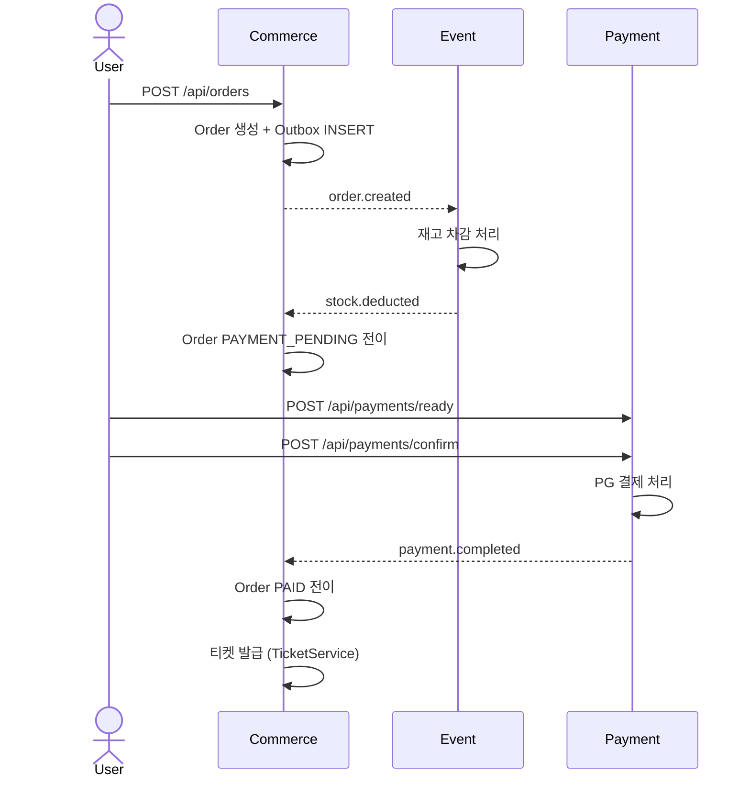
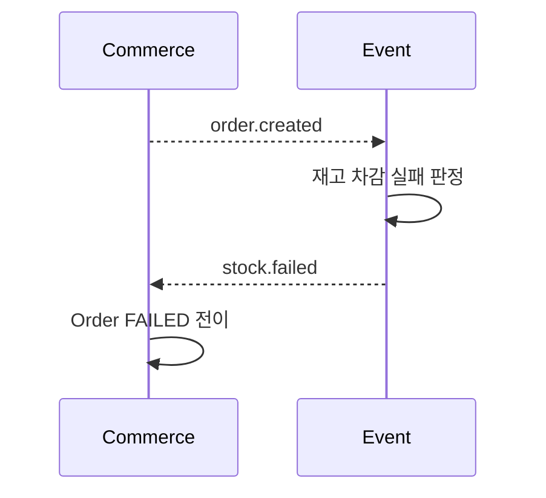
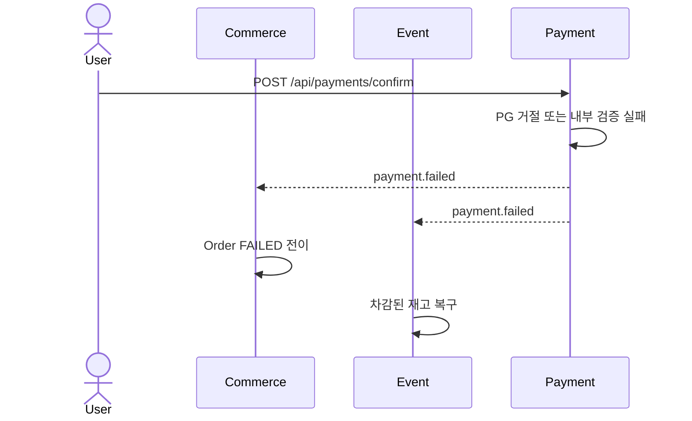
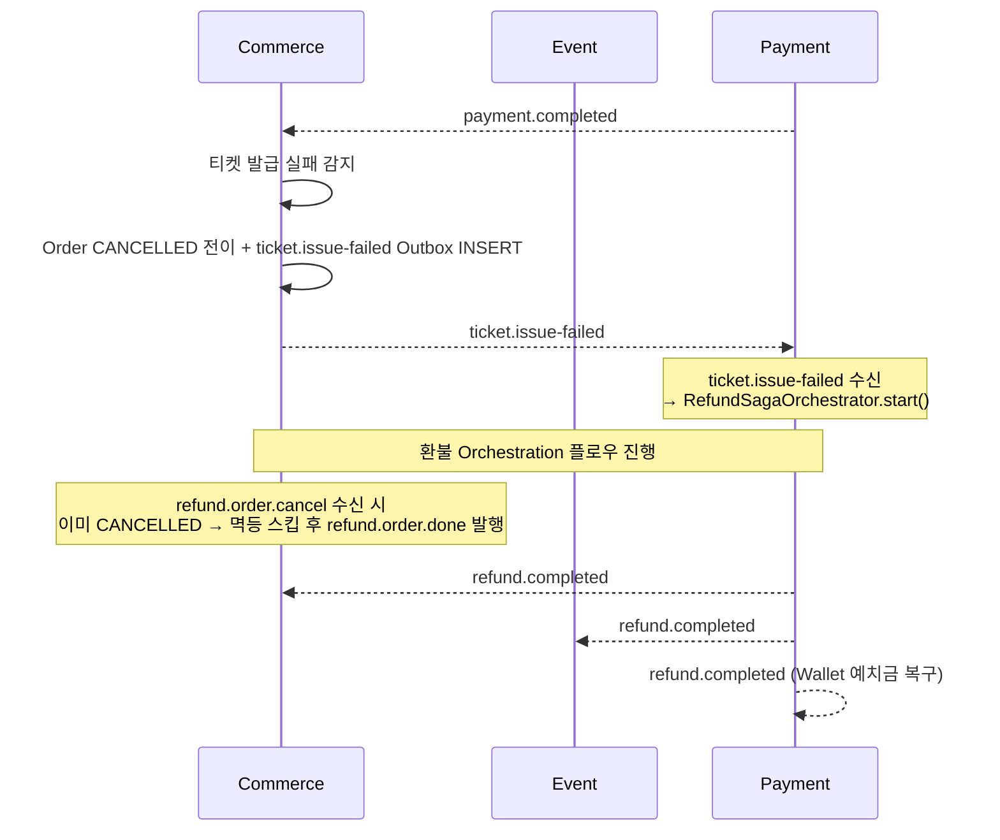
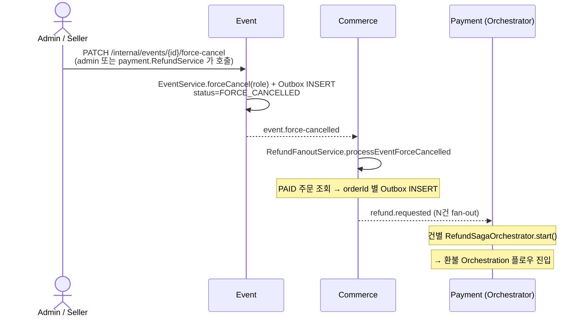
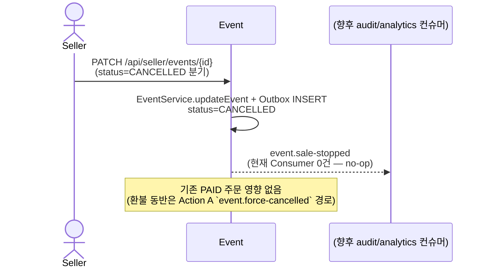
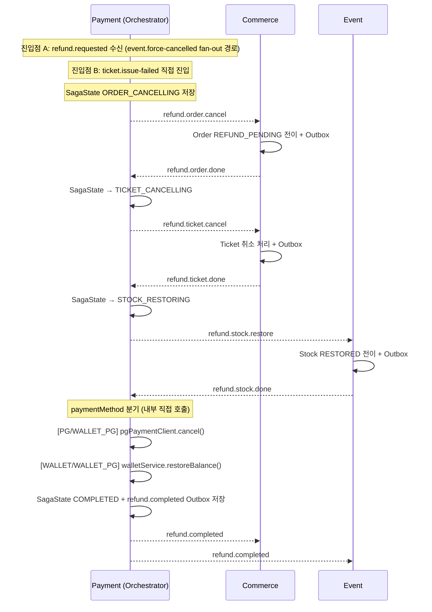
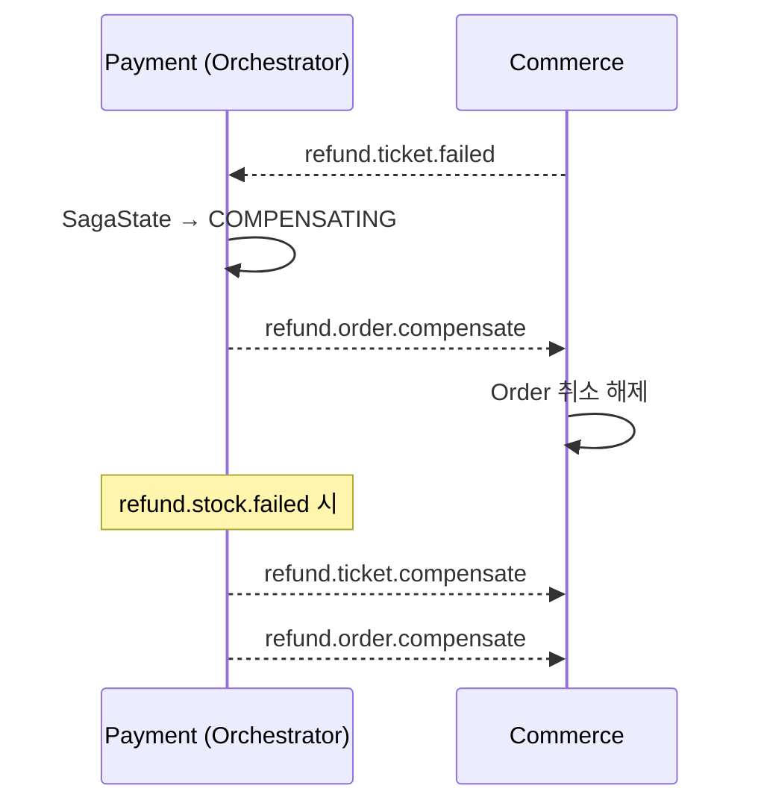

# DevTicket Kafka 구현 계획

**최종 업데이트**: 2026-04-16

**문서 성격**: 구현 계획 (PO 기준) — Outbox 정합 / Saga 단계별 흐름 / 서비스별 적용 체크리스트

**연결 문서**
- 상위 원칙 — [`kafka-sync-async-policy.md`](kafka-sync-async-policy.md) (Sync HTTP vs Async Kafka 통신 경계 + 1-B Outbox / 1-C fire-and-forget 분류)
- 토픽 정식 표기 — [`kafka-design.md`](kafka-design.md) §3
- Consumer 멱등성 원칙 — [`kafka-idempotency-guide.md`](kafka-idempotency-guide.md)
- 현재 운영 상태 카탈로그 — [`../ServiceOverview.md` §4](../ServiceOverview.md)

---

## 목차

1. [섹션 1 — 이벤트 전체 매트릭스 (조감도)](#섹션-1--이벤트-전체-매트릭스-조감도)
2. [섹션 2 — Saga 플로우](#섹션-2--saga-플로우)
  - [2-1 정상 흐름](#2-1-정상-흐름-happy-path)
  - [2-2 보상 — 재고 부족](#2-2-보상-흐름--재고-부족)
  - [2-3 보상 — 결제 실패](#2-3-보상-흐름--결제-실패)
  - [2-4 보상 — 티켓 발급 실패](#2-4-보상-흐름--티켓-발급-실패)
  - [2-5 운영 취소 — event.force-cancelled](#2-5-운영-취소-이벤트--eventforce-cancelled)
  - [2-6 운영 취소 — event.sale-stopped](#2-6-운영-취소-이벤트--eventsale-stopped)
  - [2-7 환불 Orchestration 플로우](#2-7-환불-orchestration-플로우-refund-saga)
3. [섹션 3 — 서비스별 구현 체크리스트](#섹션-3--서비스별-구현-체크리스트)
  - [3-1 Payment](#3-1-payment-기존-구현-수정)
  - [3-2 Commerce](#3-2-commerce-신규-적용)
  - [3-3 Event](#3-3-event-신규-적용)
4. [섹션 4 — 미결 사항 및 추후 처리 항목](#섹션-4--미결-사항-및-추후-처리-항목)
5. [섹션 5 — /docs 싱크 포인트](#섹션-5--docs-싱크-포인트)

---

## 섹션 1 — 이벤트 전체 매트릭스 (조감도)

Kafka를 통해 서비스 간에 오가는 모든 이벤트를 한 눈에 확인하는 테이블입니다.

> 📝 본 표의 구현 상태는 **2026-04-22 시점 작업 계획 기준**입니다. 이후 환불 Saga 전체(2026-04-25 ~ 04-28). 현재 운영 토픽 카탈로그는 [`../ServiceOverview.md` §4](../ServiceOverview.md) 또는 [`kafka-design.md` §3](kafka-design.md) 참조. 아래 표는 코드 검증 후 실제 상태로 갱신함.

| 이벤트 토픽 | Producer 서비스 | Consumer 서비스 | 트리거 조건 | DLT 여부 | 구현 상태 |
|------------|----------------|----------------|-----------|---------|---------|
| ~~`order.created`~~ | ~~Commerce~~ | ~~Event~~ | ~~주문 생성 + Outbox INSERT 커밋 시~~ | ~~`order.created.DLT`~~ | ⚠️ **비활성** — `OrderService.createOrderByCart`가 동기 REST(`PATCH /internal/events/stock-adjustments`)로 재고 차감 (`OrderService.java:116-117`). 발행 호출자 없음 |
| ~~`stock.deducted`~~ | ~~Event~~ | ~~Commerce~~ | ~~`order.created` 수신 후 재고 차감 성공 시~~ | ~~`stock.deducted.DLT`~~ | ⚠️ **비활성** — Event는 REST 응답으로 즉시 결과 반환. Producer 호출자 없음 |
| ~~`stock.failed`~~ | ~~Event~~ | ~~Commerce~~ | ~~`order.created` 수신 후 재고 부족 판정 시~~ | ~~`stock.failed.DLT`~~ | ⚠️ **비활성** — REST 4xx/예외로 동기 보고. Producer 호출자 없음 |
| `payment.completed` | Payment | Commerce | PG 승인 성공 + 내부 상태 반영 커밋 시 | `payment.completed.DLT` | Payment Producer (WALLET_PG) / Commerce Consumer |
| `payment.failed` | Payment | Commerce, Event | PG 승인 실패 또는 내부 검증 실패 시 | `payment.failed.DLT` | Payment Producer / Commerce Consumer / Event Consumer |
| `ticket.issue-failed` | Commerce | Payment | 결제 성공 후 티켓 발급 실패 감지 시 | `ticket.issue-failed.DLT` | Commerce Producer (Outbox) / Payment Consumer (`TicketIssueFailedConsumer`) |
| `refund.completed` | Payment | Commerce, Event, Payment, AI | Saga 마지막 단계 완료 후 Outbox 발행 | `refund.completed.DLT` | Payment Producer / Commerce Consumer / Event Consumer (`RefundCompletedService` — 모니터링 로깅 + dedup 마킹 / cancelledQuantity 누적은 Payment `OrderRefund.applyRefund`에서 처리) / Payment `WalletEventConsumer` (dedup 마킹 전용 — 잔액 복구는 `RefundSagaOrchestrator`가 직접 호출) |
| `event.force-cancelled` | Event | Commerce | Action A 강제취소 (admin/payment 호출 → `EventService.forceCancel`) | `event.force-cancelled.DLT` | Event Producer (Outbox) / Commerce Consumer (`RefundFanoutService`) |
| `event.sale-stopped` | Event | (없음) | Action B 판매중지 (`EventService.updateEvent` `status=CANCELLED`) | `event.sale-stopped.DLT` | Event Producer (Outbox) / ⚠ Consumer 0건 (의도된 no-op — 향후 audit/analytics 자리) |
| `refund.requested` | Commerce | Payment (Orchestrator) | `event.force-cancelled` 수신 → orderId별 fan-out 발행 | `refund.requested.DLT` | Commerce Producer (`RefundFanoutService`) / Payment Consumer (`RefundSagaConsumer`) |
| `refund.order.cancel` | Payment (Orchestrator) | Commerce | Saga Order 취소 명령 | — | Payment Producer / Commerce Consumer (`RefundOrderConsumer`) |
| `refund.order.done` / `refund.order.failed` | Commerce | Payment (Orchestrator) | Order 취소 처리 결과 | — | Commerce Producer / Payment Consumer |
| `refund.ticket.cancel` | Payment (Orchestrator) | Commerce | Saga Ticket 취소 명령 | — | Payment Producer / Commerce Consumer (`RefundTicketConsumer`) |
| `refund.ticket.done` / `refund.ticket.failed` | Commerce | Payment (Orchestrator) | Ticket 취소 처리 결과 | — | Commerce Producer / Payment Consumer |
| `refund.stock.restore` | Payment (Orchestrator) | Event | Saga Stock 복구 명령 | — | Payment Producer / Event Consumer (`RefundStockRestoreConsumer`) |
| `refund.stock.done` / `refund.stock.failed` | Event | Payment (Orchestrator) | Stock 복구 처리 결과 | — | Event Producer / Payment Consumer |
| `refund.order.compensate` | Payment (Orchestrator) | Commerce | Order 취소 보상 (롤백) | — | Payment Producer / Commerce Consumer |
| `refund.ticket.compensate` | Payment (Orchestrator) | Commerce | Ticket 취소 보상 (롤백) | — | Payment Producer / Commerce Consumer |
| `action.log` (analytics) | Event (VIEW/DETAIL_VIEW/DWELL_TIME), Commerce (CART_ADD/CART_REMOVE), **Log 자체 consume**(PURCHASE) | **Log 서비스** (Fastify, 별도 스택) | 각 API 호출 시 (`acks=0`, Outbox 미사용). PURCHASE는 Log 서비스가 `payment.completed` 수신 → `log.action_log` 직접 INSERT | **없음** (at-most-once — 손실 허용) | Log Consumer 확장 완료 / Event Producer (2026-04-23) / Commerce Producer (`CartService.publishCartActionLog` — `addToCart` / `clearCart` N회 / `updateTicket` 양·음수 분기) (상세: [actionLog.md](actionLog.md)) |

**구현 상태 범례**

| 기호 | 의미 |
|------|------|
| | 코드 구현 및 멱등성·Outbox 패턴 완전 적용 |
| 진행중 | 기본 코드는 있으나 멱등성 가드, Outbox 보완, DLT 설정 미완 |
| 미구현 | 해당 Consumer/Producer 코드 자체가 없거나 아직 착수 전 |

> 상세: kafka-design.md §1 서비스별 Kafka 역할 / §2 토픽 목록 참조

---

## 섹션 2 — Saga 플로우

각 이벤트가 어떤 순서로 서비스 간에 흐르는지 다이어그램으로 표현합니다.
정상 흐름과 각 실패 분기, 그리고 운영 취소 이벤트를 별도로 구분합니다.

### 2-1. 정상 흐름 (Happy Path)

### 2-2. 보상 흐름 — 재고 부족

### 2-3. 보상 흐름 — 결제 실패

### 2-4. 보상 흐름 — 티켓 발급 실패

### 2-5. 운영 취소 이벤트 — event.force-cancelled

> **구현 완료** — Action A 강제취소 (환불 동반). admin / payment(SellerRefund·AdminRefund) 가 `EventInternalController.forceCancel`(`X-User-Role` ADMIN/SELLER 분기)을 호출하면 Event 가 Outbox INSERT 후 `event.force-cancelled` 발행. Commerce `RefundFanoutService.processEventForceCancelled` 가 PAID 주문 fan-out 으로 `refund.requested` 발행 → Payment Saga 진입.

### 2-6. 운영 취소 이벤트 — event.sale-stopped

> **구현 완료** — Action B 판매 중지 (환불 없음). `EventService.updateEvent` `status=CANCELLED` 분기에서 Outbox INSERT 후 발행. Consumer는 의도적으로 0건 (향후 audit/analytics 자리). 기존 결제분에 대한 영향 없음 (신규 판매만 차단).

### 2-7. 환불 Orchestration 플로우 (Refund Saga)

**보상 흐름:**

> 상세: kafka-design.md §9-3 환불 Orchestration 플로우 참조

---

## 섹션 3 — 서비스별 구현 체크리스트

각 서비스가 Kafka 연동을 위해 완료해야 하는 구현 항목입니다.
미체크 항목은 Kafka 통합 테스트 진행 전에 완료되어야 합니다.

> **모든 Consumer 공통 처리 순서 (반드시 준수)**
> `isDuplicate()` → `canTransitionTo()` → 비즈니스 로직 → `markProcessed()` → `ack.acknowledge()`
> `markProcessed()`는 비즈니스 로직과 반드시 같은 `@Transactional` 경계 안에 위치해야 한다 — 상세: kafka-idempotency-guide.md §4

### 3-1. Payment (기존 구현 수정)

**기반 인프라**
- `JacksonConfig`: `JavaTimeModule`, `WRITE_DATES_AS_TIMESTAMPS=false`
- `ShedLockConfig`: JDBC provider 기반 ShedLock 설정

**DB 스키마**
- `outbox` 테이블
 - `aggregate_id` VARCHAR(36) 타입 변경, `aggregate_type` 컬럼 제거
 - `topic VARCHAR(128)`, `partition_key VARCHAR(36)`, `next_retry_at TIMESTAMP`, `sent_at TIMESTAMP` 추가
- `processed_message` 테이블 수정: `topic VARCHAR(128)` 컬럼
- `shedlock` 테이블 생성
- `payment` 엔티티 `version BIGINT` 컬럼 추가 (`@Version` — 낙관적 락)

**Outbox / 스케줄러**
- `Outbox`: 엔티티 필드 — `topic`, `partitionKey`, `nextRetryAt`, `sentAt` 포함, `create()` 파라미터 반영
- `OutboxScheduler`: `outbox.getTopic()` + `outbox.getPartitionKey()` 사용으로
- `OutboxRepository`: 스케줄러 쿼리에 `(next_retry_at IS NULL OR next_retry_at < :now) AND created_at < :graceCutoff` 3-인자 시그니처 (afterCommit publisher와 경합 회피)
- `OutboxScheduler`: ShedLock (`@SchedulerLock(name = "outbox-scheduler", lockAtMostFor = "5m", lockAtLeastFor = "5s")`, `@Scheduled(fixedDelayString="${outbox.poll-interval-ms:60000}")` = 60초) — 정상 흐름은 `OutboxAfterCommitPublisher`가 afterCommit 즉시 발행. Scheduler는 fallback. `lockAtMostFor`는 2026-04-21 결정 기준
- Outbox 발행 시 Partition Key 설정 — `outbox.getPartitionKey()` (fallback: aggregateId)
- `OutboxEventProducer`: Kafka 발행 시 `X-Message-Id` 헤더 세팅 — ProducerRecord 헤더에 Outbox messageId 포함

**Consumer 멱등성**
- `KafkaConsumerConfig`: FixedBackOff → ExponentialBackOff(2→4→8초, 3회)
- `WalletEventConsumer`: groupId `payment-wallet-group` → `payment-refund.completed`
- `WalletEventConsumer`: `markProcessed()`를 `RefundCompletedHandler`의 단일 `@Transactional`로 이동 — WalletServiceImpl에서 dedup 의존 제거
- `ProcessedMessage`: `topic VARCHAR(128)` 컬럼

**이벤트 DTO** *(타입)*
- `PaymentCompletedEvent`: record 타입, `UUID` / `PaymentMethod enum` / `Instant`
- `PaymentCompletedEvent`: `List<OrderItem> orderItems` 필드 — Log 서비스 PURCHASE 직접 INSERT(actionLog.md §2 #12) 지원. nested `OrderItem(UUID eventId, int quantity)` 정의. `@JsonIgnoreProperties(ignoreUnknown=true)` 적용으로 하위 Consumer DTO 복사본 동기화 지연 시 DLT 적재 방지
- `RefundCompletedEvent`: record 타입, `UUID` / `PaymentMethod enum` / `Instant`
- `EventForceCancelledEvent` / `EventSaleStoppedEvent`: 두 record 분리(Action A/B 의도 분리), Event 모듈에 정의 (`event/common/messaging/event/`). Commerce 측 record 사본은 `commerce/common/messaging/event/refund/EventForceCancelledEvent.java` (Consumer DTO). Payment 모듈 `wallet/application/event/EventCancelledEvent.java`는 사용처 없음 → 후속 정리
- `PaymentFailedEvent`: record

**PaymentCompletedEvent.orderItems 매핑 체크리스트** *(PURCHASE 수집 체인 블로커 해제)*
- `PaymentServiceImpl.confirmPgPayment()`: `order.orderItems()` → `PaymentCompletedEvent.OrderItem` 매핑 후 Outbox 저장
- `PaymentServiceImpl.readyPayment()` WALLET 분기: `order.orderItems()`을 `WalletService.processWalletPayment()`로 전달
- `WalletServiceImpl.processWalletPayment()`: 파라미터로 받은 `List<OrderItem>` 을 `PaymentCompletedEvent`에 포함하여 Outbox 저장 (null 방어)
- `WalletService` 인터페이스: `processWalletPayment()` 시그니처에 `List<PaymentCompletedEvent.OrderItem> orderItems` 파라미터 추가
- `WalletPgTimeoutHandler`: `PaymentFailedEvent`만 발행 (PaymentCompletedEvent 미발행) — 별도 수정 불필요
- `JacksonConfig`: `DeserializationFeature.FAIL_ON_UNKNOWN_PROPERTIES = false` 적용 — 글로벌 하위 호환성 보장
- [ ] **배포 순서 전제**: Commerce / Event DTO 복사본에 `orderItems` 필드 추가가 **Payment Producer 배포 이전에 선배포**되어야 한다 (actionlog 기능 구현 단계 발행 이슈 참조)

**비즈니스 로직**
- `WalletServiceImpl.processWalletPayment()`: Wallet 결제 완료 시 `payment.completed` Outbox 이벤트 발행으로 전환 — Commerce가 이벤트 수신하여 Order 상태 전이 처리 (Saga 설계 §9-1 기준)

**WALLET_PG 복합결제 (신규 구현)**

> 사용자가 지정한 예치금 금액을 먼저 차감하고 나머지 금액을 PG(토스)로 결제하는 방식.
> 예: 주문 10만원 → 예치금 3만원 차감 + PG 7만원 결제.

*도메인 변경*
- `PaymentMethod` enum에 `WALLET_PG`
- `Payment` 엔티티에 `walletAmount(Integer)`, `pgAmount(Integer)` 필드 — PG/WALLET 단독결제 시 각각 0 저장, WALLET_PG 시 양쪽 모두 값 저장. 기존 `amount`는 총 결제금액 유지
- `Payment.create()` 오버로딩 팩토리 — `create(orderId, userId, method, amount, walletAmount, pgAmount)` (기존 PG/WALLET 호출부 수정 없음)
- `PaymentReadyRequest`에 `walletAmount(Integer)` 필드 — WALLET_PG일 때만 사용
- `PaymentReadyResponse`에 `walletAmount(Integer)`, `pgAmount(Integer)` 필드 — 프론트 구성 표시 + Toss SDK에 pgAmount 전달용

*readyPayment 멱등성 가드 (PG/WALLET/WALLET_PG 공통)*
- `readyPayment()` 진입 시 orderId 기준 기존 Payment 조회 → READY(동일 method)면 기존 결과 반환, 그 외(method 불일치/SUCCESS/FAILED)는 `ALREADY_PROCESSED_PAYMENT` 에러 — `PaymentServiceImpl.java:64~76` (상세: front-server-idempotency-guide.md §4-2)
- WALLET_PG 동시성 2차 방어선: WalletTransaction transactionKey("USE_" + orderId) UNIQUE 제약 — DB 컬럼 `unique=true` (`WalletTransaction.java:38`) + `existsByTransactionKey` 사전 체크 (`WalletServiceImpl.java:313~315`)

*readyPayment WALLET_PG 분기*
- `readyPayment()` 내 `PaymentMethod.WALLET_PG` 분기 (`PaymentServiceImpl.java:78~118`)
- 입력값 검증 — `walletAmount > 0`, `walletAmount < totalAmount`, 잔액 >= walletAmount
- `pgAmount = totalAmount - walletAmount` 계산 적용
- `WalletService.deductForWalletPg(userId, orderId, walletAmount)` 호출 — 예치금 차감 + WalletTransaction(USE, "USE_" + orderId) 기록
- Payment 생성 (READY, WALLET_PG, walletAmount/pgAmount 저장)
- 응답에 pgAmount 포함 반환 (`PaymentReadyResponse`)

*confirmPgPayment 수정*
- `validatePaymentAmount()` WALLET_PG 분기 — WALLET_PG이면 `payment.getPgAmount()` 기준, 그 외는 `payment.getAmount()` (`PaymentServiceImpl.java:185~187`)

*failPgPayment 수정*
- `failPgPayment()` 내 WALLET_PG 분기: `WalletService.restoreForWalletPgFail(userId, walletAmount, orderId)` 호출 — 예치금 복구 + WalletTransaction(REFUND, "PG_WALLET_RESTORE_" + orderId) 기록 (`PaymentServiceImpl.java:213~216`)

*WalletService 메서드 추가*
- `WalletService.deductForWalletPg(UUID userId, UUID orderId, int walletAmount)`
- `WalletService.restoreForWalletPgFail(UUID userId, int walletAmount, UUID orderId)`
- `WalletServiceImpl` 위 두 메서드

*타임아웃 스케줄러 (WALLET_PG READY 방치 대응)*
- READY 상태 WALLET_PG 결제 **30분** 경과 시 자동 FAILED 처리 + 예치금 복구 — `WalletPgTimeoutScheduler.TIMEOUT_MINUTES = 30`
- ShedLock 기반 스케줄러 구현 — `@Scheduled(fixedDelay=60000)` + `@SchedulerLock(name="wallet-pg-timeout", lockAtMostFor="50s", lockAtLeastFor="10s")` (`WalletPgTimeoutScheduler.java:29~30`)
 * **lockAtMostFor=50s 산정 기준**: fixedDelay(60s)의 ~83%. Outbox 스케줄러(`fixedDelay=60s`/`lockAtMostFor=5m`=5배)와 다른 기준을 적용하는 이유는 타임아웃 처리가 외부 IO(Wallet 복구·OutboxService.save·CommerceInternalClient HTTP) + DB Tx 1회로 짧기 때문. lock 만료 후 다음 tick(여유 10s) 안에 안전 종료 의도
- 예치금 복구는 `restoreForWalletPgFail()` 재사용, transactionKey `"PG_WALLET_RESTORE_" + orderId`로 중복 복구 방지 (`WalletPgTimeoutHandler.java:38~40`, `WalletServiceImpl.java:342~344`)
- `payment.failed` Outbox 발행 (Commerce 주문 상태 FAILED 전이 + Event 재고 복구용) — `WalletPgTimeoutHandler.java:50~64` (orderItems는 `CommerceInternalClient.getOrderInfo`로 조회 후 매핑)

**Refund Saga Orchestrator (신규 구현) **
- `RefundSagaOrchestrator` 클래스 — `payment/refund/application/saga/RefundSagaOrchestrator.java`
- `saga_state` 테이블 + `SagaStateRepository` 구현 — `SagaState.java` 도메인 + `refund_id(PK)`, `order_id`, `payment_method`, `current_step`, `status` 등
- `start()`: `refund.requested` 수신 → SagaState ORDER_CANCELLING 저장 → `refund.order.cancel` Outbox 발행 + 멱등 upsert(`provisionRefundRecords`)
- `onOrderDone()`: SagaState TICKET_CANCELLING → `refund.ticket.cancel` Outbox 발행
- `onTicketDone()`: SagaState STOCK_RESTORING → `refund.stock.restore` Outbox 발행
- `onStockDone()` + `completeRefund()`: paymentMethod 분기(PG 취소 / Wallet 복구) → SagaState COMPLETED → `refund.completed` Outbox 발행
- `onOrderFailed()`: SagaState FAILED 저장 (보상 불필요)
- `onTicketFailed()`: `refund.order.compensate` Outbox 발행
- `onStockFailed()`: `refund.ticket.compensate` Outbox 발행
- `RefundSagaConsumer` 7개 `@KafkaListener` 전체에 `MessageDeduplicationService` dedup 적용 (`processed_message` 테이블)
- Orchestrator Consumer groupId 등록 — `payment-refund.requested` 외 6개
- `KafkaTopics` 상수 클래스에 Orchestration 토픽 12개 등록 — `payment/common/messaging/KafkaTopics.java`

**도메인 안전장치**
- `PaymentStatus.canTransitionTo()` 상태 전이 검증 — READY→(SUCCESS,FAILED,CANCELLED), SUCCESS→(REFUNDED,CANCELLED), 나머지 종단
- Payment 엔티티 `approve()` / `fail()` / `cancel()` / `refund()` 메서드 내부에 `validateTransition()` 가드 호출
- Payment 엔티티 낙관적 락 (`@Version`)
- [ ] Consumer 순서 역전 3분류 처리 구현 — ①이미 목표 상태(멱등 스킵+ACK) ②설명 가능한 역전(정책적 스킵+ACK) ③설명 불가능한 상태(throw→재시도→DLT) — 상세: kafka-design.md §5
- [ ] Outbox 스케줄러와 Consumer 동시 처리 충돌 방지 — `@Version` 낙관적 락 + 상태 전이 검증 양쪽 적용 (상세: kafka-design.md §11 Case 9)

> 설계 기준: kafka-design.md §12 참조 (이 문서가 상세 구현 체크리스트)

### 3-2. Commerce (신규 적용)

**DB 스키마**
- `Order` 엔티티 필드
 - `cart_hash VARCHAR(64)` — 장바구니 내용 해시 (eventId 정렬 후 SHA-256), 중복 주문 판단 기준 — (2026-04-19, `CartHashUtil`)
 - ~~`expires_at DATETIME`~~ **폐기** — `BaseEntity.updated_at` 재활용으로 대체 (`PAYMENT_PENDING` 진입 시각 기준, `OrderExpirationScheduler`). `created_at` 기준은 `stock.deducted` 지연 시 결제 시간 단축 문제 발생 → 폐기
 - `version BIGINT` — 낙관적 락 (`@Version`)
- `Order` 엔티티 인덱스 추가: `(user_id, cart_hash)` — `idx_order_user_cart_hash` (2026-04-19)
- `CartItem` 엔티티 UNIQUE 제약 추가: `(cart_id, event_id)` — `uk_cart_item_cart_event` — 광클 동시성 방어 + A안 매칭 차감 단순화
- `Order.create()` 수정: 초기 status `CREATED`로 설정 (`Order.java:111`). *`expires_at` 컬럼은 폐기 — `BaseEntity.updated_at` 재활용 방식으로 전환됨*
- `outbox` 테이블 신규 생성 — JPA `@Entity` 추가 시 ddl-auto 자동 생성
- `processed_message` 테이블 신규 생성 — JPA `@Entity` 추가 시 ddl-auto 자동 생성
- `shedlock` 테이블 생성 — 운영 DB 수동 CREATE (소스 트리 `schema.sql` 미포함)

**기반 인프라**
- [ ] **config 패키지 이전 (계획)** — `common/config/*` 8파일(`JacksonConfig`·`AsyncConfig`·`KafkaProducerConfig`·`KafkaConsumerConfig`·`ShedLockConfig`·`ActionLogKafkaProducerConfig`·`OpenApiConfig`·`TransactionConfig`) → **`infrastructure/config/*`** 로 이전 예정 (AGENTS.md §2.1 규정 정합). 2026-04-21 docs 선반영됐으나 **실제 코드 이전 미수행** — 현재도 8파일 모두 `common/config/`에 잔존 (실코드 대조 2026-04-23). Event·Payment 모듈은 scope 외 (추후 리팩터링 트랙)
- `JacksonConfig` 추가 (JavaTimeModule + WRITE_DATES_AS_TIMESTAMPS=false) — `common/config/JacksonConfig.java` *(infrastructure/config/* 이전 트랙 미수행, 위 항목 참조)*
- `KafkaTopics` 상수 클래스 생성 — `common/messaging/KafkaTopics.java` (Saga 핵심 토픽 + `ORDER_CANCELLED` + `ACTION_LOG` + 환불 1개 + 이벤트 관리 2개 + Orchestration 12개 = 총 22개. 비활성 토픽 `ORDER_CREATED` / `STOCK_DEDUCTED` / `STOCK_FAILED` 상수는 미정의 — REST 전환으로 폐기)

**이벤트 DTO**
- `OrderCreatedEvent` record 신규 생성 — `orderId(UUID)`, `userId(UUID)`, `orderItems(List<OrderItem{eventId, quantity}>)`, `totalAmount(int)`, `timestamp(Instant)` *(2026-04-14 합의: 리스트 구조)*
- `TicketIssueFailedEvent` record 신규 생성 — `orderId(UUID)`, `userId(UUID)`, `paymentId(UUID)`, `items(List<FailedItem{eventId, quantity}>)`, `totalAmount(int)`, `reason(String)`, `timestamp(Instant)`
- 공용 이벤트 DTO 복사본 생성 (Commerce 모듈) — `PaymentCompletedEvent`, `PaymentFailedEvent`, `StockDeductedEvent`, `StockFailedEvent`, `CancelledBy`

**Outbox 패턴**
- Outbox 패턴 구현 — `Outbox`, `OutboxService`, `OutboxEventProducer`, `OutboxRepository`, `OutboxStatus`, `OutboxEventMessage`, `OutboxPublishException` — 비즈니스 로직 + `outboxService.save()` 단일 `@Transactional` 경계 준수
- `OutboxScheduler` ShedLock 적용 (`lockAtMostFor=5m`, `lockAtLeastFor=5s`) — 2026-04-21 `30s → 5m` 확장 결정 반영 (최악 100s 대비 안전계수 3배)
- Outbox 발행 시 Partition Key 설정 — `ticket.issue-failed` → `orderId` *(`order.created` / `refund.*` 는 해당 Producer 스코프에서 적용)*
- `OutboxEventProducer`: Kafka 발행 시 `X-Message-Id` 헤더 세팅 (Outbox messageId 그대로 전달)
- ⚠️ **이력 정정**: 이전 doc에서 "REST → `order.created` Outbox 전환 완료"로 기록됐으나 현재 코드는 다시 **동기 REST** 로 되돌아간 상태입니다. `OrderService.createOrderByCart()` 가 `OrderToEventClient.adjustStocks()` 로 `PATCH /internal/events/stock-adjustments` 동기 호출 (`OrderService.java:116-117`, `Order.createPending` 으로 곧장 `PAYMENT_PENDING` 진입). `order.created` Outbox 발행 경로는 비활성. 토픽 폐지 vs 부활 여부는 별도 트랙

**Consumer 멱등성**
- `MessageDeduplicationService` 구현 + `processed_message` 테이블 생성 (`ProcessedMessage`, `ProcessedMessageRepository`)
- `KafkaConsumerConfig`: AckMode MANUAL, ExponentialBackOff (2→4→8초, 3회 재시도) + DLT Recoverer (`{topic}.DLT`)
- `payment.completed` Consumer dedup 적용 (`commerce-payment.completed`)
- `payment.failed` Consumer dedup 적용 (`commerce-payment.failed`)
- 나머지 Consumer dedup 적용 — Service 계층 패턴 (Consumer가 Service 호출, Service에서 `isDuplicate` → 비즈니스 → `markProcessed`)

> ⚠️ `stock.deducted` / `stock.failed` Consumer (`StockEventConsumer`) 는 REST 동기 차감 전환으로 폐기. 코드에 해당 클래스 없음. 두 토픽은 비활성.
 - `refund.*` (RefundOrderService / RefundTicketService 모두 dedup 적용)
 - `event.force-cancelled` (RefundFanoutService dedup 적용)
 - `ticket.issue-failed` 자체 소비 — 미사용 (의도적, payment 측에서만 소비)

**payment.completed / payment.failed Consumer 비즈니스 로직 (내 스코프 §8)**
- `PaymentCompletedConsumer` (`presentation.consumer`) — `X-Message-Id` 헤더 우선, 본문 `messageId` fallback, Outbox wrapper payload 추출
- `PaymentFailedConsumer` (`presentation.consumer`) — 동일 구조
- `OrderService.processPaymentCompleted()` — Dedup → `canTransitionTo(PAID)` → `completePayment()` → 티켓 발급 → 장바구니 삭제 → markProcessed (단일 `@Transactional`)
- `OrderService.processPaymentFailed()` — Dedup → `canTransitionTo(FAILED)` → `failPayment()` → markProcessed (단일 `@Transactional`)
- 티켓 발급 성공 경로 — `OrderItem × quantity` 만큼 `Ticket.create()` → `ticketRepository.saveAll()`
- 티켓 발급 실패 경로 — Order `cancel()` + `ticket.issue-failed` Outbox 발행 (경로 ① OrderItem 없음 / 경로 ② `saveAll()` 예외) *(추후 재검토: §4-3 참조)*
- 장바구니 매칭 차감 (A안, #427/#436) — `payment.completed` 수신 시 결제된 `OrderItem` × `CartItem(cart_id, event_id)` 매칭하여 `min(orderQty, cartQty)` 차감, 0 도달 시 row 삭제. 분기 없이 단일 경로 적용 (동시성 위험 제거)

**주문 만료 스케줄러 (내 스코프)**
- `OrderExpirationScheduler` — `@Scheduled(fixedDelay=60_000)` + `@SchedulerLock(name="order-expiration-scheduler", lockAtMostFor="2m", lockAtLeastFor="10s")`
 - `lockAtMostFor=2m` (fixedDelay의 2배) — PR #426 멘토 피드백 반영. `lockAtMostFor < fixedDelay`면 락 만료 후 타 인스턴스 중복 진입 가능
- 만료 조건: `PAYMENT_PENDING` 상태 + **`updated_at + 30분 경과`** (PAYMENT_PENDING 진입 시각 기준)
 - 기존 `created_at` 기준은 `CREATED` 진입 시각이라 `stock.deducted` 지연 시 결제 시간 단축 문제 발생 (PR #426 Codex P2 지적) → 폐기
 - `BaseEntity.updated_at` (`@LastModifiedDate`) 재활용 — `pendingPayment()` 호출 시 자동 갱신
 - ⚠️ 가정: PAYMENT_PENDING 상태에서 Order 엔티티 수정 경로 없음 (`Order.updateTotalAmount()` `@Deprecated(forRemoval=true)` 처리, `Order.java:121-133`). 향후 mutation 추가 시 `payment_pending_at` 전용 컬럼 신설로 이관 검토
- 만료 취소 시 재고 복구 — `OrderExpirationCancelService`에서 Order `CANCELLED` 전이 + OrderItem 조회 + `PaymentFailedEvent` Outbox INSERT를 단일 `@Transactional`로 보장, `payment.failed` Outbox 발행 (`reason="ORDER_TIMEOUT"`)
 - Event 모듈 `PaymentFailedConsumer`가 수신하여 재고 `DEDUCTED → RESTORED` 전이
 - `reason` 허용값 정의: `docs/kafka-design.md §3 PaymentFailedEvent` 참조
- 동시성 방어: `canTransitionTo(CANCELLED)` 선가드 + `ObjectOptimisticLockingFailureException` 재조회 후 종단 상태(PAID/FAILED/CANCELLED)면 스킵

**Refund Saga — Commerce 연동 (신규 구현) **
- `RefundOrderConsumer` (`order/presentation/consumer/`) — `refund.order.cancel` 수신 → `RefundOrderService.processOrderRefundCancel` (PAID/CANCELLED 멱등 분기) → `refund.order.done` Outbox 발행
- `RefundTicketConsumer` (`ticket/presentation/consumer/`) — `refund.ticket.cancel` 수신 → `RefundTicketService.processTicketRefundCancel` → `refund.ticket.done` / `refund.ticket.failed` Outbox 발행
- Order 보상 처리 — `RefundOrderConsumer` 가 `refund.order.compensate` 수신 → `RefundOrderService.processOrderCompensate` (Order 롤백)
- Ticket 보상 처리 — `RefundTicketConsumer` 가 `refund.ticket.compensate` 수신 → `RefundTicketService.processTicketCompensate` (Ticket 취소 해제)
- `RefundFanoutService` (`order/application/service/RefundFanoutService.java`) — `EventForceCancelledConsumer` 가 `event.force-cancelled` 수신 → `processEventForceCancelled` 가 PAID 주문 fan-out 으로 `refund.requested` Outbox 발행 (orderId 별 partition key)
- Refund 완료 후속 — `RefundOrderConsumer` 가 `refund.completed` 수신 → `RefundOrderService.processRefundCompleted` (통계 기록)

**도메인 안전장치**
- Order 엔티티 `canTransitionTo()` 상태 전이 검증 구현 — `CREATED→PAYMENT_PENDING`, `PAYMENT_PENDING→PAID/FAILED/CANCELLED`, `PAID→CANCELLED`
- Order 엔티티 낙관적 락 (`@Version`) 적용
- Consumer 순서 역전 3분류 처리 구현 (payment.completed / payment.failed) — ①이미 목표 상태(멱등 스킵+ACK) ②정책적 스킵(PAID 후 CANCELLED/FAILED 도착 등) ③이상 상태(throw→재시도→DLT)
- Outbox 스케줄러와 Consumer 동시 처리 충돌 방지 — payment.* Consumer 경로 `@Version` + `canTransitionTo()` 양쪽 가드 적용 (`OrderExpirationScheduler`도 동일)

**`action.log` Producer (analytics — 신규 적용) ** *(상세: [actionLog.md](actionLog.md) §4 — 구현 지시서)*
- 전용 `ActionLogKafkaProducerConfig` Bean 분리 — `commerce/common/config/ActionLogKafkaProducerConfig.java` (`acks=0`, `retries=0`, `enable.idempotence=false`, `linger.ms=10`, `compression.type=none`, `max.in.flight=5`). 기존 `kafkaTemplate` `@Primary` + 신규 `actionLogKafkaTemplate` `@Qualifier` 매칭
- `CART_ADD` 발행 — `CartService.addToCart` (`L85`) 트랜잭션 경계 밖에서 `publishCartActionLog(userId, eventId, CART_ADD, quantity)` 호출
- `CART_REMOVE` 발행 — `CartService.clearCart` (L126, N회 발행) / `CartService.deleteTicket` (L195) / `CartService.updateTicket` 음수 분기 (L172)
- `CART_ADD/REMOVE` 자동 분기 — `CartService.updateTicket` (L168-172): 양수→CART_ADD, 음수→CART_REMOVE, 0→미발행
- Outbox 미사용 확인 — `publishCartActionLog`가 `actionLogKafkaTemplate.send()` 직접 호출, Outbox 경로 우회
- 권장 구현 패턴 적용 — `ApplicationEventPublisher.publishEvent(ActionLogEvent)` → `@TransactionalEventListener(phase=AFTER_COMMIT)` + `@Async`
- 실패 허용 정책 — 발행 예외 시 `log.warn` 만, 장바구니 API 응답 영향 없음 (at-most-once)
- [ ] 테스트: Bean 격리 단위 테스트, 트랜잭션 롤백 시 action.log 미발행 통합 테스트 (별도 트랙)

> 설계 기준: kafka-design.md §12 참조, 통합 검증 항목 상세: [actionLog.md](actionLog.md) §4 ⑤

### 3-3. Event (신규 적용)

**DB 스키마**
- `event` 엔티티 `version BIGINT` 컬럼 (`@Version` — 낙관적 락) — `Event.java:87-88`
- `outbox` 테이블 — `@Entity Outbox`(`common/outbox/Outbox.java`) ddl-auto 자동 생성, schema=`event`, 필드: id/messageId(unique)/aggregateId/partitionKey/eventType/topic/payload/status/retryCount/nextRetryAt/createdAt/sentAt
- `processed_message` 테이블 — `topic VARCHAR` 컬럼 포함, schema=`event`
- [ ] `shedlock` 테이블 수동 CREATE (DDL 미실행)
- **합의 (2026-04-14)**: `OrderCreatedEvent` · `PaymentFailedEvent` 모두 `List<OrderItem>` 구조 채택 — Stock 신규 엔티티 추가 없음, 기존 event 테이블 `quantity` 컬럼 사용

**기반 인프라**
- `JacksonConfig` 빈 (`common/config/JacksonConfig.java`) — Jackson 2(`com.fasterxml.jackson`) 기반 `ObjectMapper` `@Primary`, `JavaTimeModule` + `WRITE_DATES_AS_TIMESTAMPS` disable
 > 참고: `StockRestoreService`는 Jackson 3(`tools.jackson.databind.json.JsonMapper`) 빈도 DI 받음. Spring Boot 4 auto-config이 Jackson 3 JsonMapper 자동 생성 — Jackson 2/3 공존 상태, 향후 통일 논의 필요
- `KafkaProducerConfig` 신규 생성 (`common/config/KafkaProducerConfig.java`) — `acks=all`, `enable.idempotence=true`, `retries=3`, `max.in.flight.requests=5`, `StringSerializer` (key/value)
- `ShedLockConfig` 신규 생성 (`common/config/ShedLockConfig.java`) — `JdbcTemplateLockProvider` + `.usingDbTime()`, 기본 `lockAtMostFor=30s`
- `KafkaTopics` 상수 클래스 (`common/messaging/KafkaTopics.java`) — `ORDER_CANCELLED`, `PAYMENT_FAILED`, `REFUND_COMPLETED`, `REFUND_STOCK_RESTORE`, `EVENT_FORCE_CANCELLED`, `EVENT_SALE_STOPPED`, `REFUND_STOCK_DONE`, `REFUND_STOCK_FAILED`, `ACTION_LOG` 9개. **`order.created` / `stock.deducted` / `stock.failed` 상수 미정의** — REST 동기 차감 전환으로 폐기됨
- `KafkaConsumerConfig` 신규 생성 — `ExponentialBackOff(2→4→8초, 3회)` + `AckMode.MANUAL`

**이벤트 DTO** *(신규 생성)*
- `EventForceCancelledEvent` record (`common/messaging/event/EventForceCancelledEvent.java`) — `eventId(UUID)`, `sellerId(UUID)`, `reason(String)`, `occurredAt(Instant)`
- `EventSaleStoppedEvent` record (`common/messaging/event/EventSaleStoppedEvent.java`) — `eventId(UUID)`, `sellerId(UUID)`, `occurredAt(Instant)`
- `PaymentFailedEvent` record (`common/messaging/event/PaymentFailedEvent.java`) — `List<OrderItem>(eventId, quantity)` 구조
- `RefundCompletedEvent` record — `refundId/orderId/userId/paymentId/paymentMethod/refundAmount/refundRate/timestamp`

> ⚠️ `OrderCreatedEvent` / `StockDeductedEvent` / `StockFailedEvent` record, `order.created` Consumer (`OrderCreatedConsumer` + `EventService.processOrderCreated()` + `saveStockFailed()`), `StockDeductionException` 모두 REST 동기 차감 전환으로 폐기. 코드에 해당 클래스/record 없음.

**Outbox 패턴**
- Outbox 패턴 — `common/outbox/` 전체 (`Outbox`, `OutboxStatus`, `OutboxEventMessage`, `OutboxRepository`, `OutboxService`, `OutboxScheduler`, `OutboxEventProducer`)
 - `OutboxService.save()`: `@Transactional(propagation=MANDATORY)` — 외부 트랜잭션 필수(단일 경계 강제)
 - `OutboxRepository.findPendingToPublish()`: `status=PENDING AND (nextRetryAt IS NULL OR nextRetryAt < now)`, `ORDER BY createdAt ASC`, `LIMIT 50` (메서드명·연산자 3모듈 통일 — Commerce 기준, 2026-04-22)
 - `OutboxEventProducer.publish()`: KafkaTemplate 동기 전송(2초 타임아웃 — 2026-04-21 공통값 결정) + `X-Message-Id` 헤더 세팅 + partition key 지정
- `OutboxScheduler` ShedLock — `@SchedulerLock(name="outbox-scheduler", lockAtMostFor="5m", lockAtLeastFor="5s")`, `@Scheduled(fixedDelayString="${outbox.poll-interval-ms:60000}")` (60초). 정상 흐름은 `OutboxAfterCommitPublisher` (afterCommit 즉시 발행) 가 처리 — Scheduler 는 fallback. 2026-04-21 `30s → 5m` 확장 결정 반영
 > 2026-04-21 결정: 지수 백오프 6회(즉시→1→2→4→8→16초)를 **스펙으로 확정**. Payment의 기존 선형 5회(`retryCount*60s`)는 본 정책으로 수렴 예정. `kafka-design.md §4 재시도 정책` 동기화
- Outbox 발행 시 Partition Key 설정 — 호출부가 `outboxService.save(aggregateId, partitionKey, ...)` 시그니처로 지정 (`event.force-cancelled` / `event.sale-stopped` = `eventId`, `refund.stock.done` / `refund.stock.failed` / `action.log` 등 활성 토픽)

**Consumer 멱등성**
- `MessageDeduplicationService` — `application/MessageDeduplicationService.java` (`isDuplicate()` + `markProcessed()`, 단일 `@Transactional` 경계)
- `payment.failed` Consumer — `presentation/consumer/PaymentFailedConsumer.java` + `application/StockRestoreService.java`
 - dedup 1차 방어선 (`isDuplicate`)
 - EventStatus 정책적 스킵 (CANCELLED / FORCE_CANCELLED)
 - 비관적 락 정렬 조회로 데드락 방지
 - `markProcessed()`를 비즈니스 트랜잭션 내부에 배치
 - `ObjectOptimisticLockingFailureException` / `DataIntegrityViolationException` 핸들링
 - groupId: `event-payment.failed`
- 잔여 Consumer dedup 패턴 — Service 계층 패턴
 - `refund.completed` Consumer (`RefundCompletedService.recordRefundCompleted` dedup 적용 — 모니터링 로깅 + dedup 마킹 / cancelledQuantity 누적은 Payment `OrderRefund.applyRefund`에서 수행)
 - `refund.stock.restore` Consumer (`RefundStockRestoreService.handleRefundStockRestore` dedup 적용)
 - `order.cancelled` Consumer (`OrderCancelledConsumer` + `OrderCancelledService` dedup 적용, groupId `event-order.cancelled`)

**Refund Saga — Event 연동 (신규 구현) **
- `RefundStockRestoreConsumer` (`presentation/consumer/RefundStockRestoreConsumer.java`) — `refund.stock.restore` 수신 → `RefundStockRestoreService.handleRefundStockRestore` (재고 `RESTORED` 전이 / CANCELLED·ENDED 정책적 스킵 + cancelledQuantity 누적) → `refund.stock.done` / `refund.stock.failed` Outbox 발행
- 벌크 처리 예외 정책 — `adjustStockBulk` 가 락 순서 고정 + 전체 성공/전체 실패 (락 정렬 후 비관락 일괄 차감)

**운영 취소 Producer **
- `event.force-cancelled` Outbox 발행 — `EventService.forceCancel(role)` 가 ADMIN/SELLER 모두에서 발행 (partitionKey=eventId). admin / payment(SellerRefund/AdminRefund) 호출 진입점.
- `event.sale-stopped` Outbox 발행 — `EventService.updateEvent` `status=CANCELLED` 분기에서 발행 (partitionKey=eventId). Action B 판매 중지, 환불 동반 없음, Consumer 0건(의도된 no-op)

**Stock 상태 관리 — 결정: 별도 엔티티 도입 안 함 (현 상태 유지)**
- 본 프로젝트는 별도 Stock 엔티티 없이 `Event.remainingQuantity` 단일 컬럼으로 재고 관리.
- 멱등성 방어선: **dedup (Service 계층) + EventStatus 정책적 스킵 (CANCELLED/FORCE_CANCELLED/ENDED) + Event `@Version` + 비관적 락 (락 순서 고정)** — Refund Saga 도입 후에도 정합성 충분히 보장됨이 검증되어 `StockStatus` enum / Stock 엔티티 도입은 미적용 결정.
- Consumer 순서 역전 3분류 처리 — payment.failed / refund.stock.restore Consumer 모두 멱등 스킵 + 정책적 스킵 + 이상 상태 throw 패턴 적용
- Outbox 스케줄러와 Consumer 동시 처리 충돌 방지 — `@Version` 낙관적 락 + 상태 전이 검증 양쪽 적용

**테스트 (참고)**
- `EventServiceKafkaTest` 신규 (+370라인) — `processOrderCreated` 시나리오 10종(중복 메시지 / 단건·다건 성공 / 재고 부족 / 이벤트 미존재 / 매진 / 판매 기간 외 / All-or-Nothing / `saveStockFailed`)
- `StockRestoreServiceTest` 업데이트 — `JacksonConfig` import, @DataJpaTest 기반

**`action.log` Producer (analytics — 신규 적용) (2026-04-23)** *(상세: [actionLog.md](actionLog.md) §4 — 구현 지시서)*
- 전용 `ActionLogKafkaProducerConfig` Bean 분리 — `acks=0`, `retries=0`, `enable.idempotence=false`, `linger.ms=10`, `compression.type=none`, `max.in.flight=5`. 구현: `event/src/main/java/com/devticket/event/common/config/ActionLogKafkaProducerConfig.java`. 기존 `kafkaTemplate`/`producerFactory` `@Primary` 부여 + 신규 `actionLogKafkaTemplate` `@Qualifier` 매칭
- `VIEW` 발행 — 이벤트 목록 조회 API 핸들러 내 트랜잭션 경계 **밖**에서 비동기 발행 (Partition Key: `userId`, `searchKeyword` / `stackFilter` nullable). 트리거: `EventService#logEventListView`
- `DETAIL_VIEW` 발행 — 이벤트 상세 조회 API 핸들러 내 트랜잭션 경계 **밖**에서 비동기 발행 (필수: `userId`/`eventId`/`actionType`/`timestamp`). 트리거: `EventService#logDetailView`
- `DWELL_TIME` 발행 — 이탈 시 호출 API 핸들러 내 트랜잭션 경계 **밖**에서 비동기 발행 (`dwellTimeSeconds` 필수). 트리거: `DwellController#reportDwell`
- **DWELL_TIME 전용 신규 API 엔드포인트 구현** — `POST /api/events/{eventId}/dwell`. 얇은 Controller(Path Variable `eventId` + Body `DwellRequest { dwellTimeSeconds: Integer }`) + `ApplicationEventPublisher.publishEvent(ActionLogDomainEvent)`. 응답 `204 No Content`. 비로그인(`X-User-Id` 미전달) 시 skip + 204
- **Producer 측 Bean Validation** — `DwellRequest.dwellTimeSeconds`에 `@NotNull @Positive` + Controller `@Valid`. 근거: `acks=0` + Consumer dedup 미적용 정책상 Producer validation이 `log.action_log` 오염 방지의 **최종 방어선**
- Outbox 미사용 확인 (비즈니스 트랜잭션에 INSERT 포함 금지) — Publisher가 `actionLogKafkaTemplate.send()` 직접 호출, `outboxService` 미호출
- 권장 구현 패턴 적용 — `ApplicationEventPublisher.publishEvent(ActionLogDomainEvent)` → `@TransactionalEventListener(phase = AFTER_COMMIT, fallbackExecution = true)` + `@Async` → `actionLogKafkaTemplate.send(...)`. `fallbackExecution=true`로 트랜잭션 밖 호출(DWELL_TIME Controller)도 발행 보장
- 실패 허용 정책 — `JsonProcessingException` / 기타 예외 시 `log.warn()` 만, 예외 전파 금지 (at-most-once)
- [ ] 테스트: Bean 격리 단위 테스트 (`actionLogKafkaTemplate` 주입 검증), 대량 VIEW 발행 시 목록 API p99 응답 지연 영향 없음 부하 테스트 (별도 트랙)

> 설계 기준: kafka-design.md §12 / §5 Stock 상태 전이 표 참조, 통합 검증 항목 상세: [actionLog.md](actionLog.md) §4 ⑤

### 3-4. Log 서비스 확장 (Fastify/TS — 별도 스택)

> **기반 이미 존재**: `fastify-log/` 브랜치(`develop/log`)에 `action.log` Consumer 파이프라인(kafkajs, DB 스키마 `log.action_log`, enum 7종). 본 항목은 **PURCHASE 처리를 위한 `payment.completed` 추가 구독 확장** (2026-04-21).
> 상세: [actionLog.md](actionLog.md) §1, §4

**확장 작업 **
- `payment.completed` 토픽 **추가 구독** — `fastify-log/src/consumer/action-log.consumer.ts` `dispatchMessage` topic 분기에서 `paymentCompletedService.save()` 직접 호출 (전용 consumer 파일 없이 평탄화, 1a469ce5)
- `payment.completed` payload → PURCHASE 레코드 매핑 (`userId`, `eventId`, `actionType=PURCHASE`, `quantity`, `totalAmount`, `timestamp`) — `service/payment-completed.service.ts` (`toActionLogs()`, 단건/다건 `totalAmount` 분배 정책은 [actionLog.md](actionLog.md) §3.2 참조)
- `log.action_log`에 **직접 INSERT** (Kafka 재발행 없이) — `repository/action-log.repository.ts` (`insertActionLogs` 원자적 다중 INSERT)
- 예외 처리: 스킵 + offset commit (at-most-once) — `consumer/action-log.consumer.ts` (`dispatchMessage`)
- `env.ts` 토픽 설정: `KAFKA_TOPIC_PAYMENT_COMPLETED` 추가 + `subscribe` 토픽 배열 확장 (`action-log.consumer.ts:15`)

**유지 (변경 없음)**
- groupId `log-group`
- `autoCommit=false`, 수동 offset commit
- dedup 미적용

---

## 섹션 4 — 미결 사항 및 추후 처리 항목

### 4-1. [Commerce] `OrderStatus.REFUND_PENDING` / `REFUNDED` — 옵션 A 채택·구현

`OrderStatus` 의 `REFUND_PENDING` / `REFUNDED` 사용 여부 결정 — **옵션 A (Order 상태로 추적) 채택**.

- `RefundOrderService.processOrderRefundCancel` (L66-67): `refund.order.cancel` 수신 시 `PAID → REFUND_PENDING` 전이 후 `refund.order.done` 발행 (이미 REFUND_PENDING 이면 멱등 스킵)
- `RefundOrderCancelEvent` 페이로드 정의: "Payment → Commerce: Order PAID → REFUND_PENDING 전이 요청"
- `OrderService.getSettlementData` (L298-300): 환불 집계 시 REFUND_PENDING / REFUNDED 모두 CANCELLED 와 동일하게 포함

> **관련 서비스:** `[Commerce]`, `[Payment]`

---

### 4-2. 📋 DLT 관련 추후 구현 (TODO)

> Kafka 통합 테스트 완료 후 순차 처리 예정. 현재 구현 블로커는 아닙니다.

- [ ] **DLT 알림 채널 연동** `[Commerce]` `[Event]` `[Payment]`
 현재 `log.error` 임시 처리 → Slack / PagerDuty 등 알림 채널 선택 후 `DefaultErrorHandler` DLT 핸들러 교체
 (DLT 도달 = 처리 못 한 주문/결제/재고 존재 → 운영팀 즉시 인지 필요)

- [ ] **DLT 재처리 Admin API 구현** `[Commerce]` `[Event]` `[Payment]`
 DLT에 쌓인 메시지를 원본 토픽으로 재발행하는 Admin API
 반드시 원본 `X-Message-Id` 헤더 보존 필수 (새 UUID 생성 시 Consumer dedup 우회 → 중복 처리 발생)

---

### 4-3. [Commerce] 티켓 발급 실패 처리 — 환불 Saga 정책 결정

> `OrderService.processPaymentCompleted()` 내부 티켓 발급 실패 경로 2종은 "CANCELLED + `ticket.issue-failed` Outbox 발행" 으로 구현됨 (`OrderService.java:405, 438`). 환불 Saga 구현 후 아래 3항목 정책 재검토 결과 정리.
> **관련 서비스:** `[Commerce]`, `[Payment]`

- **경로 ①(OrderItem 없음)** — Order `cancel()` + `TicketIssueFailedEvent(items=List.of())` Outbox 발행 유지. 데이터 정합성 이상 케이스이지만 운영 알림은 DLT 도달 시점에서 처리(§4-2 추후 트랙).
- **경로 ②(`ticketRepository.saveAll()` 예외)** — 모든 예외를 영구 실패로 분류, Order CANCELLED + Outbox 발행. 일시 장애로 인한 재시도는 Refund Saga 보상 흐름이 멱등 처리하므로 추가 분류 불필요로 결정.
- **빈 `failedItems` 정합성** — Payment Orchestrator(`RefundSagaOrchestrator`)가 단건 환불 진입(`ticket.issue-failed`) 시 빈 items 도 정상 스킵 처리. Stock 복구 단계는 대상 0건이면 즉시 done.

---

### 4-4. [Commerce] 장바구니 매칭 차감 (A안) —

> `OrderService.processPaymentCompleted()` 내부 장바구니 처리 — `(eventId, min(orderQty, cartQty))` 매칭 차감 A안. 분기 없이 단일 경로로 동시성 위험 제거.
> **관련 서비스:** `[Commerce]`

- **A안 매칭 차감** (#427/#436 머지)
 - 결제된 `OrderItem` 목록을 `eventId` 기준 그룹핑
 - 카트의 `(cart_id, event_id)`별로 매칭 — `min(orderQty, cartQty)`만큼 차감
 - 차감 후 `quantity = 0`이면 row 삭제, 그 외는 quantity 갱신
- **`CartItem (cart_id, event_id)` UNIQUE 제약 적용** — `uk_cart_item_cart_event` 광클 동시성 방어
- `CartService.addOrUpdateCartItem` race catch 보강
- **의존 관계 해소**: `Order.cart_hash` + 인덱스 + `CartHashUtil`

---

### 4-5. 📋 Outbox 정합 후속 트랙 — A파트 후 B·B6 잔여

> 상세: [outbox_fix.md](outbox_fix.md) — 3모듈 실코드 대조 기반 체크리스트
> 관련 PR (A파트): #482 Commerce / #483 Payment / #484 Event
> 관련 Issue: #481 (Parent) / #495 (F2 본문 정정 필요)

#### A파트 (머지 — 이중 발행 완화 3축)

- 3모듈 공통: ShedLock `lockAtMostFor=5m / lockAtLeastFor=5s`
- 3모듈 공통: ProducerConfig `delivery.timeout.ms=1500 / request.timeout.ms=1000 / max.block.ms=500`
- 3모듈 공통: `OutboxEventProducer.get(2s)` 타임아웃
- Payment/Event: Scheduler 트랜잭션 해소 + `processOne()` 별도 빈 분리 (Commerce는 선례)
- Commerce: 회귀 방지 테스트(`KafkaProducerConfigTest` + `OutboxSchedulerIntegrationTest`) — PR #482 `e1d53c8`

#### Commerce — 선례 모듈, 후속 없음

- 실코드 대조 결과 §2 통합 결정값 전 항목 이미 일치
- F2 실사 대상 포함 (`infrastructure.messaging` 하위 `Outbox*` 존재 여부 주기 확인)

#### Event 후속 (2026-04-22)

> 상세: [outbox_fix.md §3-B](outbox_fix.md) — B3 publish 시그니처 전환 / B5 Repo rename·`<`·markFailed 상수 내부화 / B6 회귀 방지 테스트 이식 / F2 `infrastructure/messaging/` 죽은 복사본 청소

#### Payment 후속 (2026-04-22, commits `4fc0a20` refactor / `c70ba7e` test)

> 상세: [outbox_fix.md §3-C](outbox_fix.md) — B1 (지수 6회 즉시/1/2/4/8/16s) / B2 (save 시그니처·MANDATORY) / B3 (publish) / B4-1 (schema) / B4-2 (messageId String) / B5 (Repo) / B6 (회귀 방지 테스트) / B7 (@Value 외부화) / T2 (MANDATORY 불변식 E2E) / T3 (Repo 경계 LIMIT)
> ⚠️ **별건 이슈**: Payment `outbox.message_id` UUID→VARCHAR(36) 운영 DB 마이그레이션 — `schema_plan.md §Payment 수정 표 + ⑦ ALTER`

#### F2 — 패키지 경로 `common.outbox` 현행 유지 확정

- **2026-04-22 결정**: #495 본문의 `common.outbox → infrastructure.messaging` 이동 방향 **번복**
- 표준 = `common.outbox` (3모듈 정착, 실사 기준 `infrastructure.messaging` 이동분 0건)
- **정책**: "발견 시 리팩토링" — 향후 `infrastructure.messaging` 하위 `Outbox*` 추가 발견 시 `common.outbox`로 되돌림
- [ ] #495 이슈 본문 F2 항목 방향 정정 코멘트 (별건 후속)

---

## 섹션 5 — /docs 싱크 포인트

> 📝 **본 섹션은 2026-04-22 작업 시점 싱크 항목입니다.** 이후 `api-overview.md`, `dto-overview.md`, `service-status.md`, `modules/*.md`, `ServiceOverview.md` 모두 코드 기반으로 갱신 완료. 현재 운영 카탈로그는 [`../ServiceOverview.md`](../ServiceOverview.md) 또는 [`../api/api-overview.md`](../api/api-overview.md) 참조.

| 이 문서의 항목 | 수정 대상 파일 | 처리 결과 |
|--------------|--------------|---------|
| Kafka Consumer 가 주문 상태 직접 전이 (payment.completed → PAID 등) | `api-overview.md` | 반영 — Internal API 표는 Kafka 트리거 명시 (api/summary/commerce-summary.md Kafka 섹션 참조) |
| dead REST `payment-completed` / `payment-failed` 미호출 미결 | `api-overview.md` | 정리 — b9be8434 로 dead REST endpoint 제거 (Kafka 단일 경로로 일원화) |
| Payment 이벤트 DTO 타입 / 신규 DTO 추가 | `dto-overview.md` | 반영 — `dto/summary/{module}-summary.md` 9개에 Kafka payload 절 포함 |
| `StockStatus` enum 신규 추가 | `dto-overview.md` | ⏸ 도입 안 함 결정 (§3-3 참조 — `Event.remainingQuantity` 단일 컬럼 + 멱등성 3중 방어선으로 충분) |
| `OrderStatus.REFUND_PENDING` / `REFUNDED` 사용 여부 미결 | `dto-overview.md` | 옵션 A 채택 — §4-1 참조 (`RefundOrderService` 가 PAID → REFUND_PENDING 전이) |
| Payment 서비스 Kafka 연동 | `service-status.md` | 반영 — service-status.md PaymentService / RefundService / WalletService 항목 갱신 완료 |
| Commerce·Event 서비스 Kafka 신규 적용 | `service-status.md` | 반영 — service-status.md Commerce/Event 섹션 추가 (총 7 모듈 + Refund Saga consumer 포함) |
| Outbox FAILED 수동 재발행 Admin API | `api-overview.md` | 미구현 (§4-2 DLT 재처리 Admin API 와 함께 추후 트랙) |